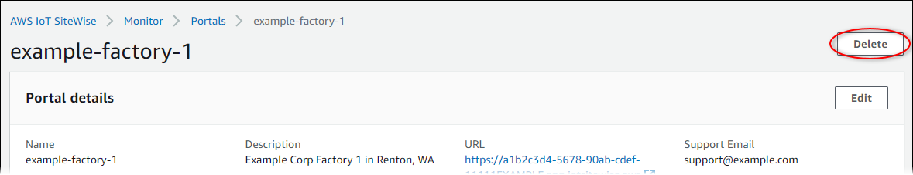

# Delete a portal in AWS IoT SiteWise

###### Note

The SiteWise Monitor feature is no longer available to new customers. Existing customers can continue to use the service as normal. For more information, see
[SiteWise Monitor availability change](../appguide/iotsitewise-monitor-availability-change.md "../appguide/iotsitewise-monitor-availability-change.md").

You might delete a portal if you created it for testing purposes or if you created a
duplicate of a portal that already exists.

###### Note

You must first manually delete all dashboards and projects in a portal before you can
delete a portal. For more information, see [Deleting
projects](../appguide/delete-projects.md "../appguide/delete-projects.md") and [Deleting
dashboards](../appguide/delete-dashboards.md "../appguide/delete-dashboards.md") in the _SiteWise Monitor Application Guide_.

1. On the portal details page, choose **Delete**.

###### Important

When you delete a portal, you lose all projects that the portal contains, and all
dashboards in each project. This action can't be undone. Your asset data isn't
affected.

 2. In the **Delete portals** dialog box, choose **Remove admins
and users**.

You must remove the administrators and users from a portal before you can delete it.
If your portal doesn't have administrators or users, the button doesn't appear, and you
can skip to the next step.

 3. If you're sure that you want to delete the entire portal, enter
`delete` in the field to confirm deletion.

 4. Choose **Delete**.
