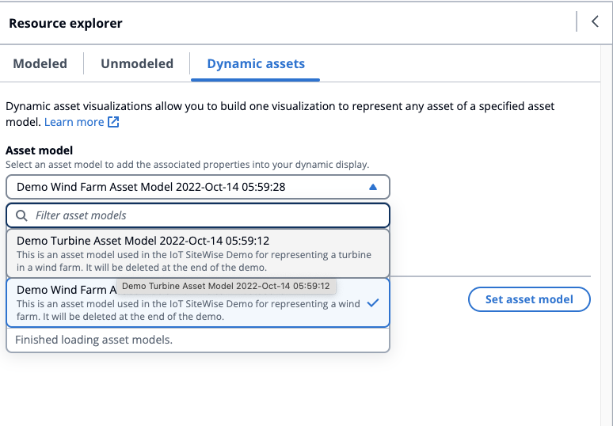

# Dynamic assets

###### Note

The SiteWise Monitor feature will no longer be open to new customers starting November 7, 2025 . If you would like to use SiteWise Monitor,
sign up prior to that date. Existing customers can continue to use the service as normal. For more information, see
[SiteWise Monitor availability change](../appguide/iotsitewise-monitor-availability-change.md "../appguide/iotsitewise-monitor-availability-change.md").

The new SiteWise Monitor allows customers to dynamically switch assets for a selected asset model. You can visualize properties from different assets by selecting from a drop down menu.

###### Dynamic assets visualization

1. Choose the **Dynamic assets** tab on the resource explorer.
2. Select an **Asset model** to list assets for from the drop down menu.
3. Select the **Default asset** from the drop down menu.
4. Choose **Set asset model** to select the asset model.
5. Save the dashboard. In the **Preview** mode, choose different assets from the drop down menu to monitor
   the properties under each asset, without reconstructing the data panels.

