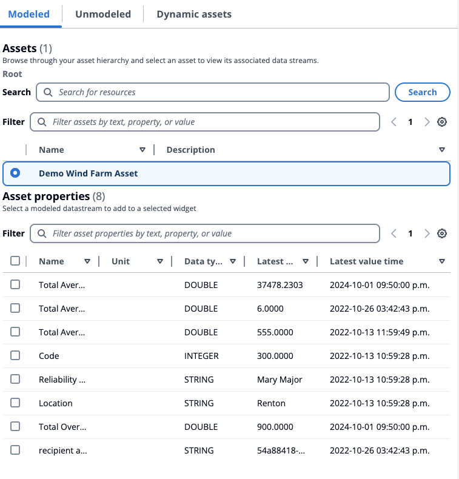

# Modeled

###### Note

The SiteWise Monitor feature will no longer be open to new customers starting November 7, 2025 . If you would like to use SiteWise Monitor,
sign up prior to that date. Existing customers can continue to use the service as normal. For more information, see
[SiteWise Monitor availability change](../appguide/iotsitewise-monitor-availability-change.md "../appguide/iotsitewise-monitor-availability-change.md").

This section describes the process of selecting and visualization of modeled assets.

## Selection of assets

Assets can be queried as follows:

- Search for an asset name. Use a wildcard `*`. For example, `Wind*` returns asset names that start with the text `Wind`. You must
  [integrate with AWS IoT TwinMaker](sql.md#prereqs "sql.md#prereqs") to avail this feature.
- All assets are listed by default.

From the assets listed, filter by name, description, ID, or asset model ID. Select one asset to list its properties (data streams) and alarms.

### Data stream selection

Data streams are listed below the **Data Streams** menu. Filter the data streams listed by
[Property](../APIReference/API_Property.md "../APIReference/API_Property.md") metadata in the *https://docs.aws.amazon.com/iot-sitewise/latest/APIReference/*.
Select one or more data streams depending on the selected widget.

- **KPI** and **Gauge** support only a single data stream.
- The remaining widgets support multiple data streams with multi-selection.

### Alarm selection

AWS IoT SiteWise alarms are listed below the **Alarm Data Streams** menu. Filter the alarm data streams listed by alarm metadata.
**name**, **input property**, and **composite model ID** are some metadata used for filtering.
Select one or more data streams depending on the selected widget.

- **KPI** and **Gauge** support only a single alarm.
- The remaining widgets support multiple alarms with multi-selection.

## Modeled assets visualization

1. Drag the widget to the canvas. Select the properties for each widget panel to construct a dashboard.
2. The **Filter** option filters the assets to choose the asset to visualize. Filtering is done by text, property or value. Filtering is for assets
   loaded into the browser, and not backend filtering.
3. **Search** to list an asset to add to your widget.
4. **Add** the asset to the widget in the canvas.
5. Choose **Reset** to select another asset, or make modifications to the asset chosen.
6. Save the dashboard. In the **Preview** mode, choose different assets from the drop down menu to monitor the properties under each asset without reconstructing the data panels.

###### Note

The configuration settings wheel on the right hand side displays **Preferences** for the user to choose like
**Page size**, **Sticky first columns**, **Sticky last columns**, and **Column preferences**.
Customize your preferences, and choose **Confirm** to apply the changes.

