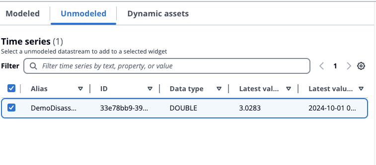

# Unmodeled

###### Note

The SiteWise Monitor feature will no longer be open to new customers starting November 7, 2025 . If you would like to use SiteWise Monitor,
sign up prior to that date. Existing customers can continue to use the service as normal. For more information, see
[SiteWise Monitor availability change](../appguide/iotsitewise-monitor-availability-change.md "../appguide/iotsitewise-monitor-availability-change.md").

This section describes searching for unmodeled data streams and adding them to the widgets to visualize.

###### Unmodeled data streams visualization

1. Drag the widget to the canvas. Select the properties for each widget panel to construct a dashboard.
2. Unmodeled data streams are listed under the **Time series** section. They have properties that are customizable.
3. The **Filter** option filters the data streams to visualize. Filtering is for data streams
   loaded into the browser, and not back end filtering.
4. **Add** the data stream to the widget in the canvas.
5. Choose **Reset** to deselect the data stream.
6. Save the dashboard. In the **Preview** mode, choose different assets from the drop down menu to monitor the properties under each asset without reconstructing the data panels.

###### Note

The configuration settings wheel on the right hand side displays **Preferences** for the user to choose like
**Page size**, **Sticky first columns**, **Sticky last columns**, and **Column preferences**.
Customize your preferences, and choose **Confirm** to apply the changes.

