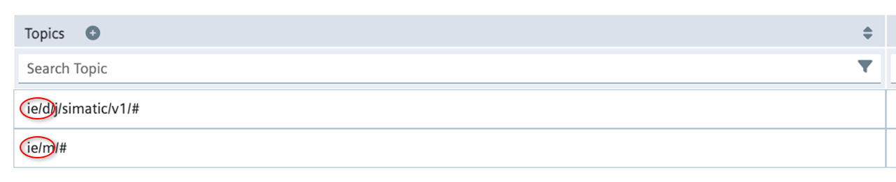

# Create a Siemens Databus user for the application

AWS IoT SiteWise Edge on Siemens Industrial Edge ingests data from the Siemens Databus
application. To connect SiteWise Edge to the Siemens Databus, you need a
Siemens Databus user that provides access to the data you want to securely transfer to AWS IoT SiteWise.
To start, create a Siemens Databus user and then provide the credentials to the SiteWise Edge
application.

###### To create a Siemens Databus user

1. In your Siemens Industrial Edge Management instance, choose **Edge Management** in the
   **Platform Applications** section.
2. Choose the **Data connections** icon.
3. Select **Databus**. A list of your connected devices appears.
4. Select the device to connect to the AWS IoT SiteWise Edge application.
5. Choose **Launch**. The Databus Configurator for your
   selected device appears.
6. Create a user for your Edge device under **Users**. For more
   information on creating a user, see [Users](https://docs.eu1.edge.siemens.cloud/get_started_and_operate/industrial_edge_management/operation/iam/03_user-management.html "https://docs.eu1.edge.siemens.cloud/get_started_and_operate/industrial_edge_management/operation/iam/03_user-management.html") in the _Siemens Industrial Edge Management_
   documentation.
7. Select the topics for which this Siemens Databus should have access. These topics
   restrict what AWS IoT SiteWise Edge can access.

###### Important

All topics that a Siemens Databus user has access to are published to AWS IoT SiteWise.

###### Note

Siemens Databus users need access to both data and metadata topics. Topics that
start with `ie/d` are data topics. And topics that start with
`ie/m` are metadata topics. Share topics in pairs so that SiteWise Edge has
access to both data and metadata for each respective topic.

 8. Set appropriate permissions for your Siemens Databus configuration.
After creating your Siemens Databus configuration, you can install the AWS IoT SiteWise Edge
application on your Siemens Industrial Edge Management. For more information, see [Install the application onto a Siemens
device](sa-install-app.md "sa-install-app.md").

You can also optionally configure destinations and path filters for your Siemens Industrial Edge
gateway. For more information, see [Destinations and path filters](gw-destinations.md "gw-destinations.md").
