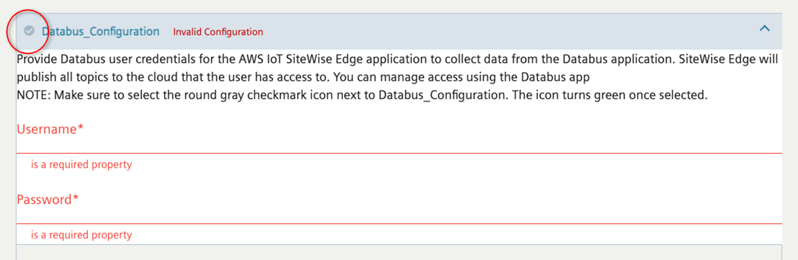
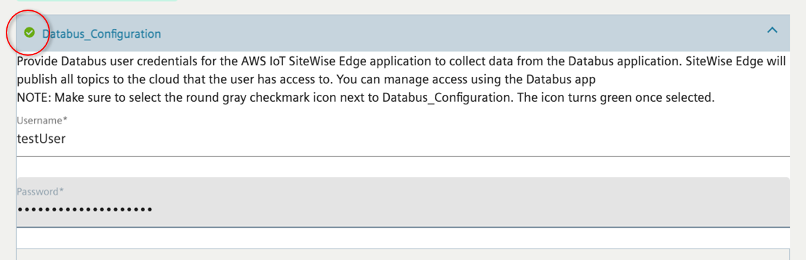

# Install the application onto a Siemens

device

After you gain access to the AWS IoT SiteWise Edge application by emailing the SiteWise Edge support team
for Siemens Industrial Edge, assign the application to an instance of Siemens Industrial Edge Management. Then, you can install
the AWS IoT SiteWise Edge application on your device.

###### To install the AWS IoT SiteWise Edge application

1. Verify that the Docker digest provided within Siemens Industrial Edge Management matches the
   latest version listed in the [AWS IoT SiteWise Edge application changelog](sitewise-edge-on-siemens.md#sa-changelog "sitewise-edge-on-siemens.md#sa-changelog").

For more information on locating the Docker digest value for Siemens,
see the [Managing an app](https://docs.eu1.edge.siemens.cloud/get_started_and_operate/industrial_edge_device/operation/management.html#managing-an-app "https://docs.eu1.edge.siemens.cloud/get_started_and_operate/industrial_edge_device/operation/management.html#managing-an-app") in the _Siemens Industrial Edge Device_ of the
Siemens documentation.

Siemens Industrial Edge Management supports one version of the AWS IoT SiteWise Edge application at a time. Take this
step to ensure that you're using the latest version of the application before installing
the AWS IoT SiteWise Edge application on your Siemens Industrial Edge device. 2. Assign the **AWS IoT SiteWise Edge** application to Siemens Industrial Edge Management. For more
information, see [Managing an app](https://docs.eu1.edge.siemens.cloud/get_started_and_operate/industrial_edge_management/how_to_setup_operate/vm/operation/my_installed_apps/managing_an_app.html "https://docs.eu1.edge.siemens.cloud/get_started_and_operate/industrial_edge_management/how_to_setup_operate/vm/operation/my_installed_apps/managing_an_app.html") in the _Industrial Edge Management_ section
of the Siemens documentation. 3. Within **Edge Management**, browse the catalog for the
**AWS IoT SiteWise Edge** and choose it. 4. Choose **Install**.

###### Note

If a **Contact Us** button displays, choose it, and follow the
steps to request access to the AWS IoT SiteWise Edge application on Siemens Industrial Edge. For more
information, see [Access the AWS IoT SiteWise Edge application](sa-get-app.md "sa-get-app.md"). 5. Select **Databus_Configuration** in the Schema Configurations
options. 6. Enter the **Username** and **Password** for the
Databus configuration. For more information on creating a Siemens Databus user, see [Create a Siemens Databus user for the application](sa-databus-user.md "sa-databus-user.md"). 7. Choose the small, round gray checkmark icon next to
**Databus_Configuration** to turn the icon color green.

###### Note

The input configurations only apply if the checkmark icon changes from gray to
green. Otherwise, the input configuration is ignored.

 8. Choose **Next** to move onto **Other
Configurations** where you can upload your gateway configuration file. 9. Choose **SiteWise_Edge_Gateway_Config** as the location to upload the
gateway configuration file.

###### Note

Ensure that you choose **SiteWise_Edge_Gateway_Config** rather than
**SiteWise_Edge_Support_Config_Optional**. 10. Select the device to install the application. 11. Choose **Install now**.
You can optionally configure the publisher component to export data to the AWS Cloud.
For more information, see [configure the AWS IoT SiteWise
publisher component](configure-publisher-component.md "configure-publisher-component.md").

To configure destinations for your Siemens Industrial Edge gateway, see [Destinations and path filters](gw-destinations.md "gw-destinations.md").
