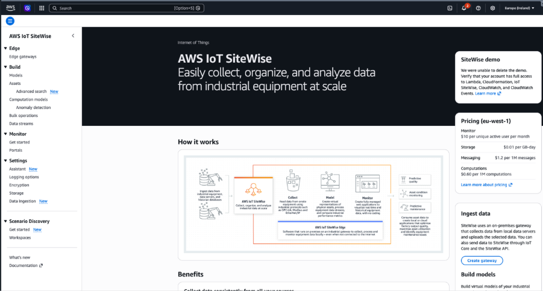
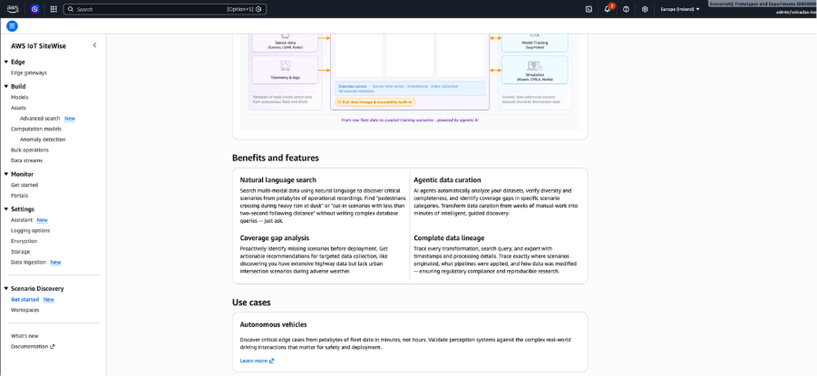
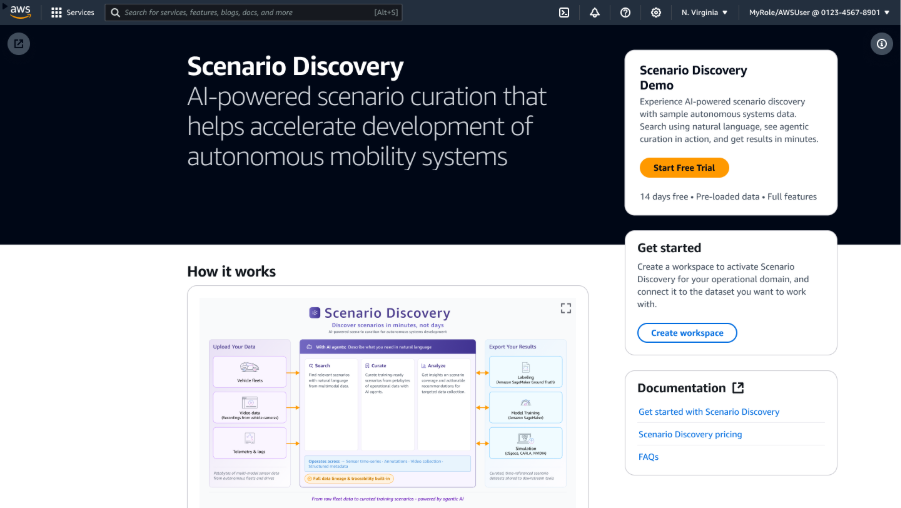
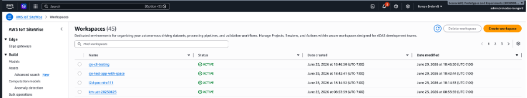
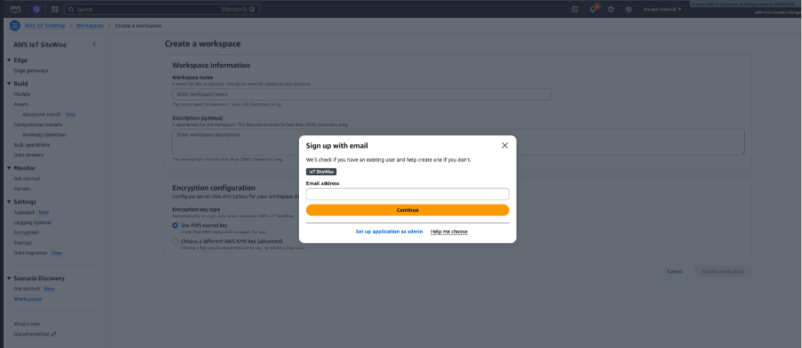
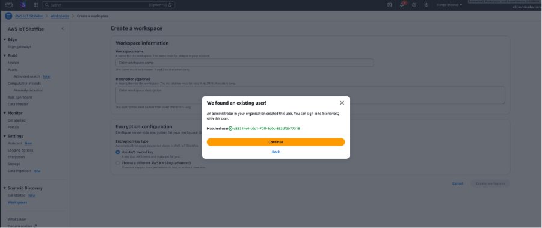
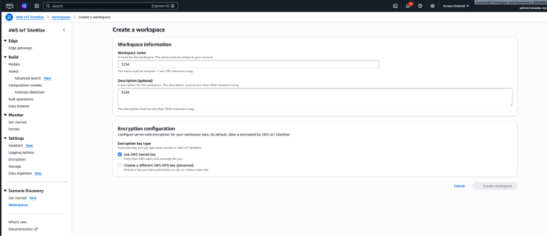
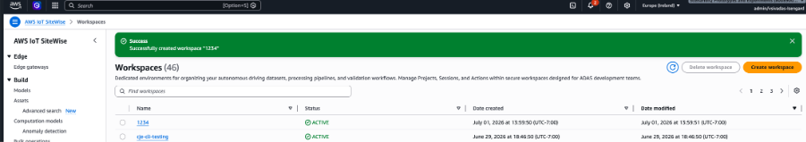
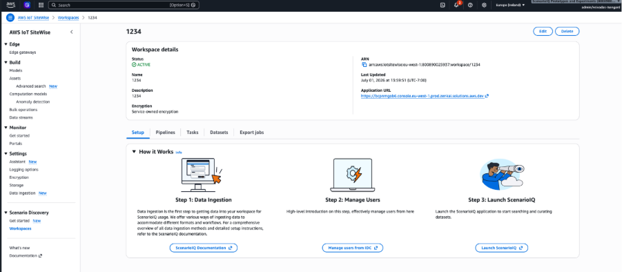

# Getting started: initial setup

This section walks you through the initial setup of Scenario Discovery: accessing the
console and creating a workspace.

## Accessing Scenario Discovery

You access Scenario Discovery through the AWS IoT SiteWise console. Navigate to AWS IoT SiteWise and open
Scenario Discovery from the left navigation menu near the bottom. Choose
**Get Started** to explore the benefits, features, use cases,
and how Scenario Discovery works.

You can now create a workspace.

## What is a workspace?

A workspace is a data tenancy concept that allows you to maintain multiple data-isolated
tenants within a single AWS account. You can use workspaces to track usage, billing,
resources, and datasets as they relate to your specific projects. You can identify resources,
storage, and usage on a per-project basis and develop, version, and maintain per-project
environments independently of one another, all within one AWS account.

## Creating your workspace

A workspace is your team's dedicated, isolated environment. Workspace Admins configure
access control, environment isolation, and data governance policies.

To create a workspace, complete the following steps:

1. From the Scenario Discovery console, choose **Create
   Workspace**.
2. Enter a workspace name and optional description.
3. Review and choose **Create workspace**.

For creating an encrypted workspace with your own KMS keys, see
[Encryption at rest](sd-encryption.md "sd-encryption.md") for instructions.

You have now created a workspace.
