# Manage data workflows

## Important data pipeline concepts in Scenario Discovery

This section covers important concepts related to data pipelines within Scenario
Discovery. Data pipelines, and their constituent tasks, give you a flexible, containerized
method to perform arbitrary tasks on your data and to store, retrieve, or interact with the
Scenario Discovery feature. You bind pipelines and tasks to a workspace and define them
there. Understanding these concepts enables you to use the system more efficiently.

### Pipelines

A pipeline is a series of data tasks you assemble in a directed acyclic graph (DAG).
Tasks, represented as nodes in the graph, are individual units of logic that perform some
kind of processing on their input data and can provide output data or metadata for use by
subsequent nodes. A pipeline can contain one or many nodes. You can assemble nodes in
parallel, in series, or in combinations of both. Execution proceeds level by level: all
tasks at a single level run until they reach a terminal state before the system proceeds
to the next layer in the DAG. If any single node fails in a level, execution for the
complete DAG stops.

### Enrichment

Enrichment is the process by which Scenario Discovery analyzes your onboarded video
data using domain-appropriate AI models to automatically extract meaningful behaviors and
objects. During enrichment, Scenario Discovery recognizes common industry video data formats
and applies AI-powered understanding to identify objects, events, environmental conditions,
and relationships within your data. Once enrichment is complete, your data becomes fully
searchable and discoverable, enabling you to use natural-language queries, receive proactive
recommendations, and leverage the full suite of Scenario Discovery curation
capabilities.

### Pipeline shared ephemeral storage

Pipeline tasks have access to shared ephemeral storage, mounted at
`/var/tmp/data`. This storage is available during pipeline execution and
provides shared access between tasks in the same pipeline. Data in shared storage is
temporary and does not persist after the pipeline completes.

### Tasks

Tasks are the base functional unit of a Scenario Discovery data pipeline. A task is
containerized software logic you use to process, retrieve, or otherwise interact with
Scenario Discovery functions. You package tasks as container images, and Scenario Discovery
requires the images to be accessible from AWS Elastic Container Registry
([https://aws.amazon.com/ecr/](https://aws.amazon.com/ecr/ "https://aws.amazon.com/ecr/")).

### Environment variables

You use environment variables in tasks and pipelines to pass parameters to
containerized images upon execution. You can define environment variables at creation time
and optionally modify them at execution time. You can define reusable atomic tasks with
templatized runtime inputs that you can further compose into templatized pipelines. The goal
is to define a series of useful processing actions once and reuse them repeatedly.
Environment variables in Scenario Discovery work the same way as in traditional
containerized applications.

### Environment variable precedence

The system resolves environment variables at runtime and records them in the execution
instance. Precedence follows this pattern: pipeline environment variables take precedence
over task environment variables, and execution-time changes take precedence over
creation-time definitions. For example, suppose you define a variable called
`S3_PATH` in a task called "load\_data." Next you define a pipeline called
"ingest\_processing" that contains this task and defines the same `S3_PATH`
environment variable. The final value used at runtime is the value from the pipeline's
`S3_PATH`, not the task's `S3_PATH` value. If at execution time you
change the task's `S3_PATH`, this takes precedence over the original pipeline's
`S3_PATH`. And if you modify `S3_PATH` at the pipeline level at
execution time, this takes precedence over any other definition of this environment
variable.

## Prerequisites to using containers, tasks and pipelines

### Transfer data from Amazon S3 to pipeline storage

Pipeline tasks access data from shared storage mounted at
`/var/tmp/data`. You must transfer your source data from Amazon S3 to this location
before your pipeline tasks can process it.

### Ingest your data from Amazon S3 into AWS IoT SiteWise

You use the `CreateBulkImportJob` API to ingest MP4 video, Parquet
telemetry, and OpenLABEL annotation files from Amazon S3 into AWS IoT SiteWise for Scenario Discovery.
Before you can call this API, you must enable the warm tier on your account (a one-time
setup per account/region) and configure two IAM roles: one that AWS IoT SiteWise assumes to read
your S3 objects and write error reports, and one that your calling identity uses to invoke
the API and pass the service role. You define consistent aliases for each file type so
Scenario Discovery can correlate video, telemetry, and annotations from the same event.
You can invoke the API through the AWS CLI, the boto3 Python SDK, or raw HTTPS (signed
with SigV4), and then verify job completion by polling
`DescribeBulkImportJob` for a terminal status. For step-by-step instructions,
IAM policy examples, request payloads, and code samples, see
[CreateBulkImportJob for Scenario Discovery](sd-bulk-import.md "sd-bulk-import.md").

### Enrich videos for search

You use the `CreateEnrichmentJob` API to analyze video time-series data
already ingested into AWS IoT SiteWise and generate embeddings that enable semantic
(natural-language) search over events in that video. This is the natural follow-on to
`CreateBulkImportJob`: after you land MP4 video in a Scenario Discovery dataset,
you call `CreateEnrichmentJob` to make that video queryable. Before you submit
the job, you need an active Scenario Discovery workspace and dataset containing the target
video, and your calling identity must have AWS IoT SiteWise enrichment-job permissions (plus KMS
decrypt access if the workspace uses a customer managed key). You scope each job to a
single video time series — identified by its property alias — and define a time window to
process. You can invoke the API through the AWS CLI, the boto3 Python SDK, or raw HTTPS
(signed with SigV4), and then verify completion by polling
`DescribeEnrichmentJob` until it reaches a terminal status. For step-by-step
instructions, IAM policy examples, request payloads, and code samples, see
[CreateEnrichmentJob for Scenario Discovery](sd-enrichment.md "sd-enrichment.md").

## Process and ingest data using tasks and pipelines

Scenario Discovery uses tasks and pipelines to process and ingest your data. A task runs
a container (your custom code) on managed compute. A pipeline chains multiple tasks together
into an automated workflow. This section walks you through creating tasks, building a
pipeline, running it, and verifying your data was ingested using examples.

### Step 1: Navigate to the Tasks tab

From your workspace, choose the **Tasks** tab. This is
where you manage all your container tasks. If you haven't created any tasks yet, the list
is empty.

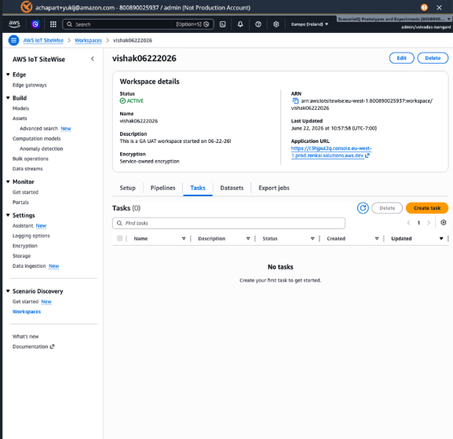

### Step 2: Create a new task

Choose **Create task** and fill in the basic details:
give your task a name (for example, "S3 to EFS"), add an optional description, and select
"Container" as the task type.

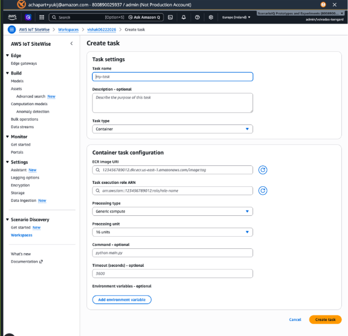

### Step 3: Configure the container image and execution role

Point the task to your container image by entering its ECR URI (your image address in
Amazon Elastic Container Registry). Then select the IAM execution role that grants the
container permission to access your AWS resources like S3 buckets.

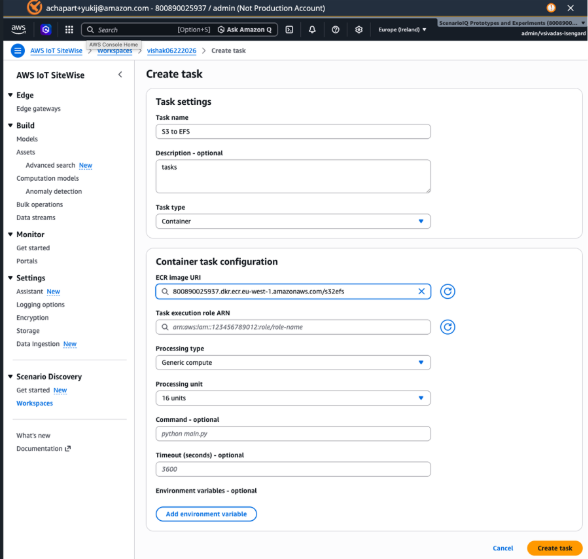

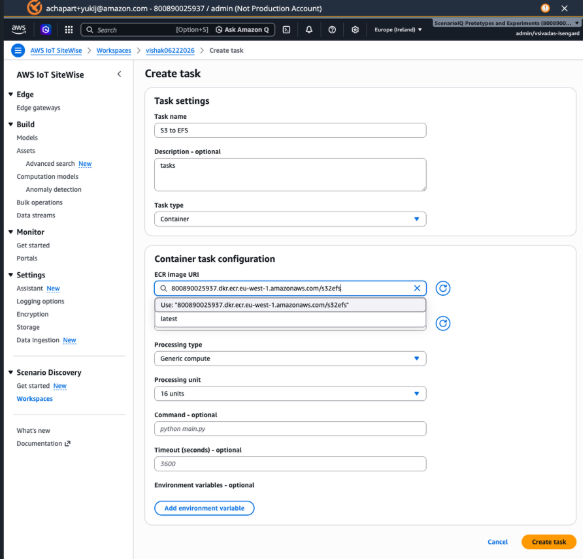

### Step 4: Set processing parameters

Choose how much compute your task needs. Select "Generic compute" for standard CPU
workloads or "Hardware accelerated" for GPU tasks. Pick a processing unit size (for example,
16 units), set the startup command (for example, "python main.py"), and specify a timeout
in seconds (for example, 3600 for one hour).

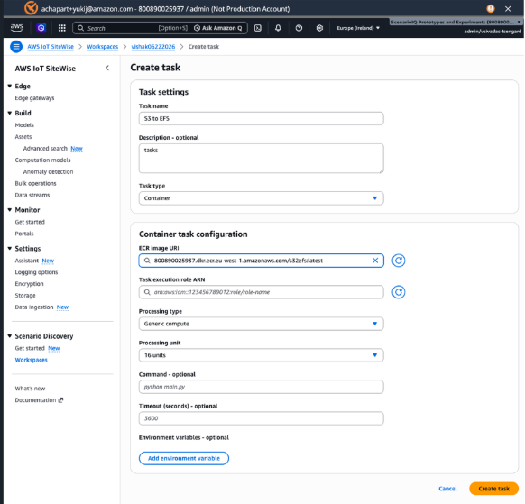

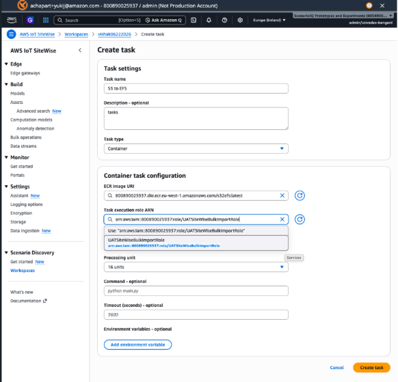

### Step 5: Add environment variables

Add any environment variables your container needs at runtime. Common examples include
the AWS region, S3 bucket paths, workspace name, and role ARNs. These are key-value pairs
that configure how your container behaves.

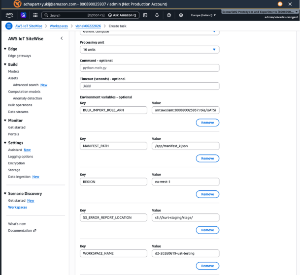

### Step 6: Review the created task

Choose **Create task** to finish. A green banner confirms
that the task was created successfully. You can review all your settings on the task details
page and use the Edit or Delete buttons if you need to make changes.

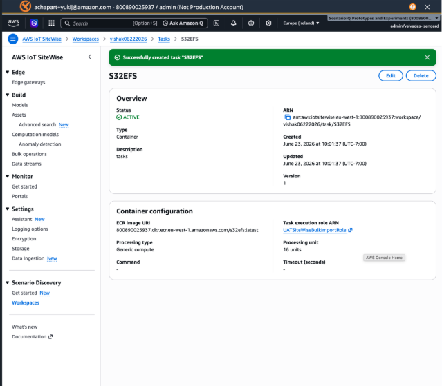

### Step 7: Create additional tasks

Create additional tasks as needed for your pipeline. For example, you might create a
separate "ingest" task that handles data ingestion into Scenario Discovery. Each task can
use a different container image and configuration.

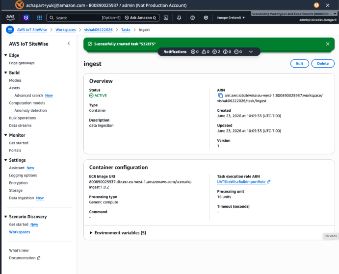

### Step 8: Navigate to the Pipelines tab

Go back to your workspace and choose the **Pipelines**
tab. Choose **Create pipeline** to start building a multi-step
workflow. Give your pipeline a name (for example, "ingestdatapipeline") and an optional
description.

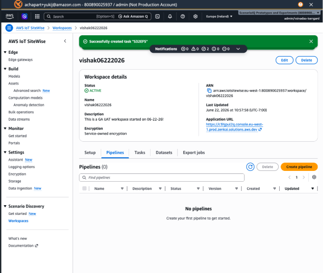

### Step 9: Add compute nodes to the pipeline

Choose **+ Add node** to add processing steps to your
pipeline. For each node, give it a name and select which task it should run. You can add
multiple nodes to chain tasks together (for example, first transfer data from S3, then
ingest it into Scenario Discovery).

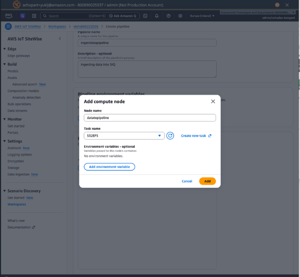

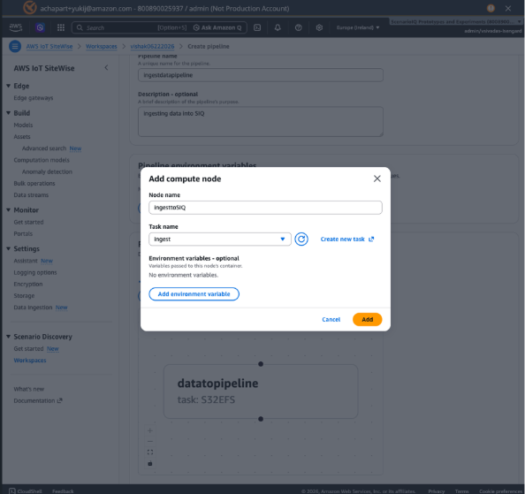

### Step 10: Define the pipeline graph and dependencies

The visual editor shows your pipeline as a flowchart. Connect nodes with arrows to
define the execution order. For example, the data transfer node runs first, and the
ingestion node starts only after it completes. Choose **Create
pipeline** when your graph looks correct.

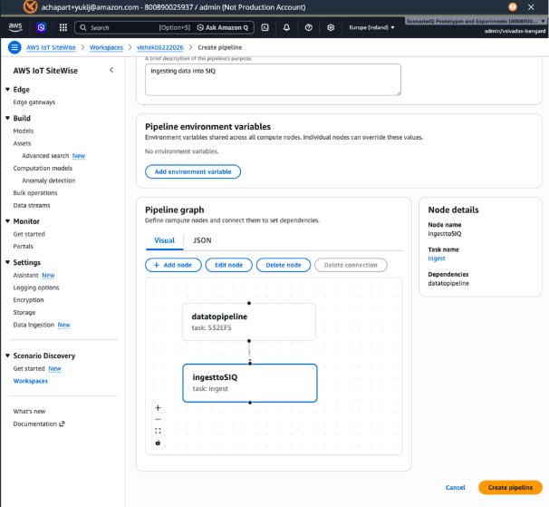

### Step 11: Review the created pipeline

Once created, the pipeline details page confirms that your pipeline is active and shows
its structure. You can see the node graph, execution history, and use the buttons at the
top to edit, delete, monitor, or execute the pipeline.

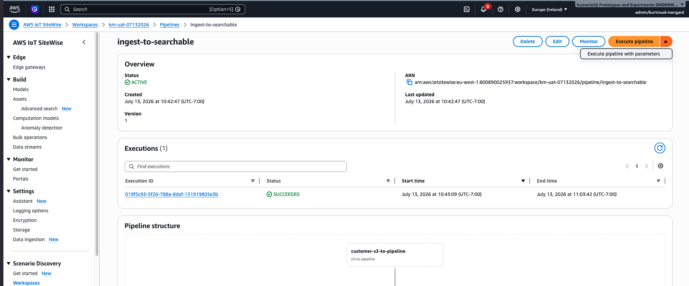

### Step 12: Monitor pipeline execution

The monitoring screen shows your pipeline's progress in real time. Each node is
color-coded: blue means running, green means completed, and red means failed. Choose any
node to see its details and access logs for troubleshooting.

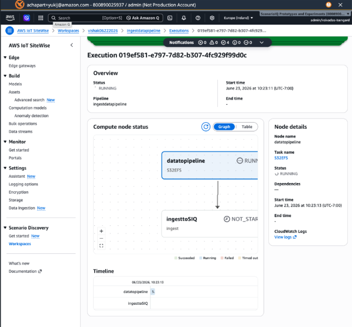

You can monitor the data pipeline by choosing **Monitor**.
The Monitor tab shows the execution history of the particular pipeline over time. You can
see how long different nodes in the pipeline take to execute, the number of successful
executions, failed executions, and when the pipeline was last executed. Additionally, the
monitor window gives you an indication of average execution time per node over many runs
throughout the pipeline usage.

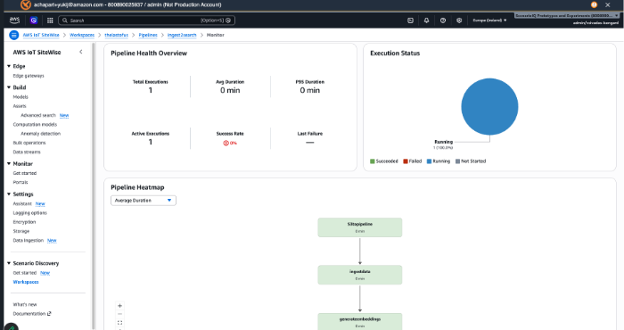

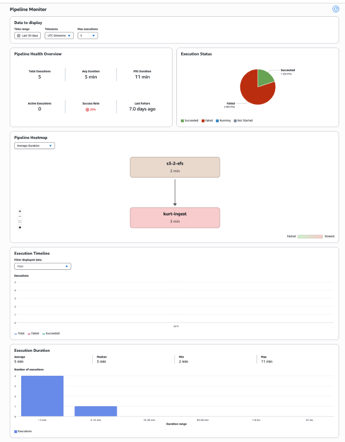

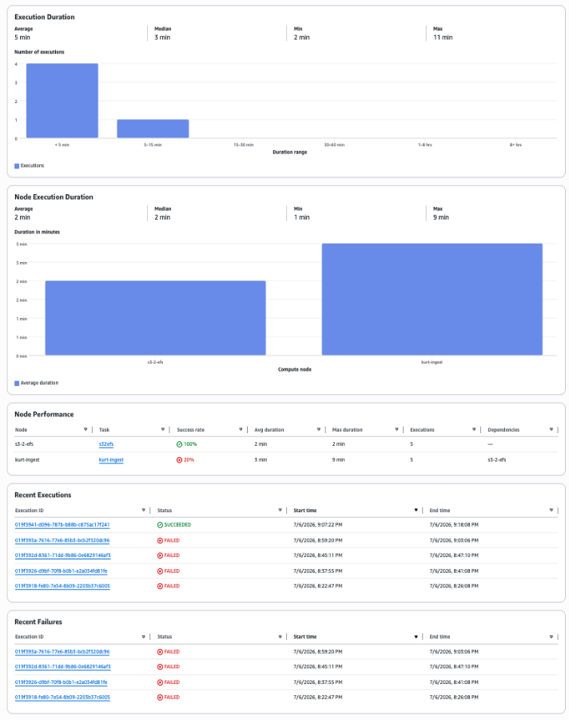

### Step 13: Verify pipeline completion

Once the pipeline finishes, go back to the Pipelines tab to confirm it ran
successfully. Your pipeline is listed with its status, and you can re-run it anytime.

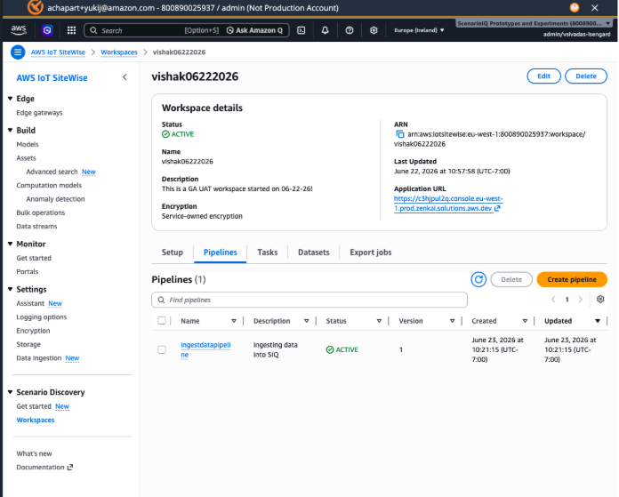

### Step 14: Verify session datasets

After ingestion completes, check the **Session datasets**
tab in your workspace to confirm your data is now available. You should see your recordings
listed with an ACTIVE status.

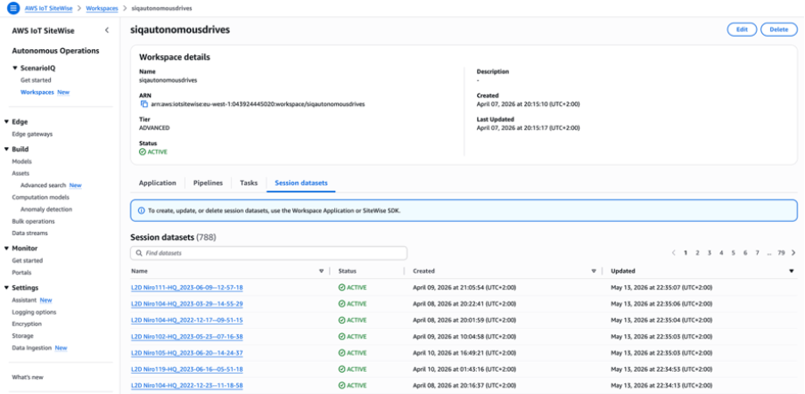
