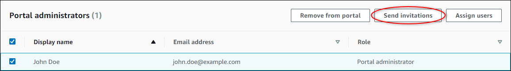

# Send email invitations to portal

administrators

###### Note

The SiteWise Monitor feature will no longer be open to new customers starting November 7, 2025 . If you would like to use SiteWise Monitor,
sign up prior to that date. Existing customers can continue to use the service as normal. For more information, see
[SiteWise Monitor availability change](../appguide/iotsitewise-monitor-availability-change.md "../appguide/iotsitewise-monitor-availability-change.md").

You can send email invitations to portal administrators.

1. On the portal details page, in the **Portal administrators** section,
   select the check boxes for the portal administrators.

 2. Choose **Send invitations**. Your email client opens, and an
invitation is populated in the message body.

You can customize the email before you send it to your portal administrators.
