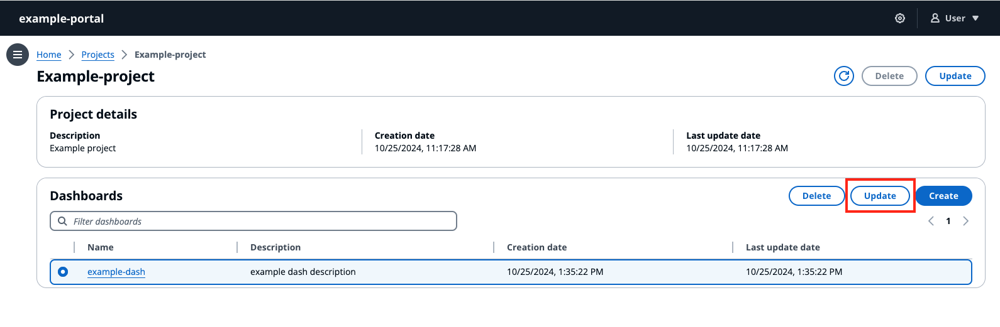
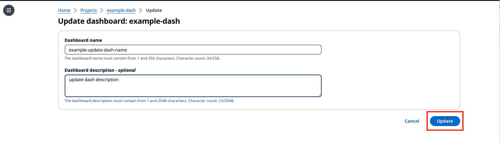

# Update a dashboard

###### Note

The SiteWise Monitor feature will no longer be open to new customers starting November 7, 2025 . If you would like to use SiteWise Monitor,
sign up prior to that date. Existing customers can continue to use the service as normal. For more information, see
[SiteWise Monitor availability change](../appguide/iotsitewise-monitor-availability-change.md "../appguide/iotsitewise-monitor-availability-change.md").

The **Dashboards** section lists the dashboards in the project. Select a dashboard from the list.

###### Update a dashboard

1. Select a dashboard to update.

 2. Update the **Dashboard name** and optionally the **Dashboard description**. Select **Update** to save changes.

