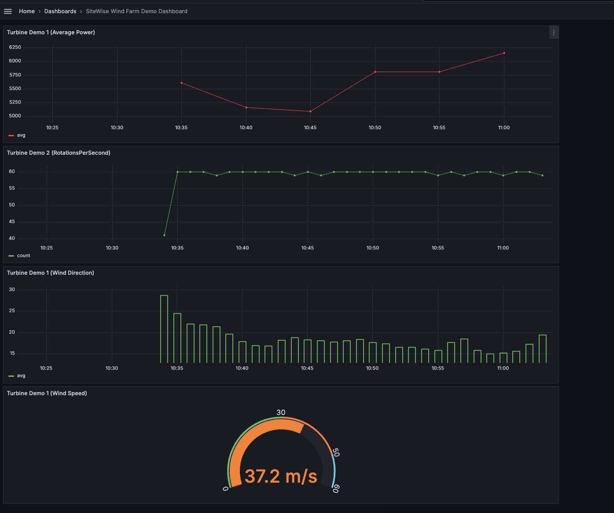

# Visualize and share data in Grafana

This tutorial guides you through configuring the AWS IoT SiteWise data source plugin with Grafana, a data visualization platform. With Grafana, you can create dashboards that visualize and monitor your industrial data. In this tutorial, a sample dataset from a wind farm demonstration is used to illustrate key concepts. After you become familiar with the process, you can repeat the tutorial with your own data.

After you complete this tutorial, you can do the following:

- Collect, query, and analyze data from industrial equipment
- Create interactive Grafana dashboards to visualize asset performance metrics
- Monitor operational data through a unified interface
- Share insights with your team using Grafana's collaboration features
- Combine AWS IoT SiteWise data with other AWS data sources such as [Amazon CloudWatch](https://aws.amazon.com/cloudwatch/ "https://aws.amazon.com/cloudwatch/") or [Amazon Timestream](https://aws.amazon.com/timestream/ "https://aws.amazon.com/timestream/")

###### Topics

- [Prerequisites](#grafana-tutorial-prerequisites "#grafana-tutorial-prerequisites")
- [Step 1: Configure your Amazon Managed Grafana workspace](#configure-workspace "#configure-workspace")
- [Step 2: Add AWS IoT SiteWise as a data source](#add-iot-data-source "#add-iot-data-source")
- [Step 3: Create a dashboard to explore and visualize your data](#explore-your-data "#explore-your-data")
- [(optional) Step 4: Set up alerts to monitor performance](#set-up-alerts "#set-up-alerts")
- [Step 5: Clean up resources after the tutorial](#clean_up_resources "#clean_up_resources")
- [Additional resources](#additional-resources "#additional-resources")

## Prerequisites

To complete this tutorial, you need the following:

- An AWS account. If you don't have one, see [Set up an AWS account](getting-started.md#set-up-aws-account "getting-started.md#set-up-aws-account").
- An AWS Identity and Access Management (IAM) user with administrator permissions. For detailed instructions, see [How AWS IoT SiteWise works with IAM](security_iam_service-with-iam.md "security_iam_service-with-iam.md").
- A running AWS IoT SiteWise demo.

###### Note

This tutorial requires the use of resources created in the [Use the AWS IoT SiteWise demo](getting-started-demo.md "getting-started-demo.md"). You must complete it before proceeding with this tutorial.

The demo typically takes around 3 minutes to create. If the demo fails to create, it might indicate insufficient permissions in your AWS account. In this case, switch to an account with administrative access. For more information about required permissions, see [How AWS IoT SiteWise works with IAM](security_iam_service-with-iam.md "security_iam_service-with-iam.md").

###### Important

Keep all demo resources until you complete this tutorial. Deleting any components might disrupt the demo's functionality and affect your ability to display data in Grafana.

## Step 1: Configure your Amazon Managed Grafana workspace

In this procedure, create and configure an Amazon Managed Grafana workspace to visualize your wind farm data.

1. Sign in to the [Amazon Managed Grafana console](https://console.aws.amazon.com/grafana/ "https://console.aws.amazon.com/grafana/").
2. Choose **Create workspace**.
3. Under **Workspace details**, enter a name for your workspace, such as `SiteWiseTutorialDemo`.
4. Under **Grafana version**, choose the latest version. Choose this version for the most up-to-date features and capabilities. For more information about different version sets, see [Differences between Grafana versions](../../../grafana/latest/userguide/version-differences.md "../../../grafana/latest/userguide/version-differences.md") in the _Amazon Managed Grafana User Guide_.
5. Choose **Next**.
6. Under **Authentication access**, choose **AWS IAM Identity Center**.
   - If AWS IAM Identity Center in your account isn't enabled, you will be prompted to set it up first. For detailed instruction about how to set up user access, see [Identity-based policy examples for Amazon Managed Grafana](../../../grafana/latest/userguide/security_iam_id-based-policy-examples.md#security_iam_id-based-policy-examples-create-workspace-standalone "../../../grafana/latest/userguide/security_iam_id-based-policy-examples.md#security_iam_id-based-policy-examples-create-workspace-standalone") in the _Amazon Managed Grafana User Guide_.

7. Under **Permission type**, choose **Service managed**. Amazon Managed Grafana automatically creates and configures the necessary IAM roles and permissions for any AWS data sources you choose to use in this workspace. For organizational member accounts, the Service managed option is only available if the account is designated as a delegated administrator. For information about setting up delegated administrator accounts, see [Register a delegated administrator member account](../../../AWSCloudFormation/latest/UserGuide/stacksets-orgs-delegated-admin.md "../../../AWSCloudFormation/latest/UserGuide/stacksets-orgs-delegated-admin.md") in the _CloudFormation User Guide_.
8. Under **Workspace configuration options**, take the following actions:
   1. Select **Turn Grafana alerting on**. With this setting, you can create and manage alerts through a centralized interface in your workspace. For more information, see [Working with Grafana alerting](../../../grafana/latest/userguide/alerts-overview.md "../../../grafana/latest/userguide/alerts-overview.md") in the _Amazon Managed Grafana User Guide_.
   2. Select **Turn plugin management on**. This allows you to install, update, and uninstall plugins in your workspace. For more information, see [Extend your workspace with plugins](../../../grafana/latest/userguide/grafana-plugins.md "../../../grafana/latest/userguide/grafana-plugins.md") in the _Amazon Managed Grafana User Guide_.###### Important

Be sure to enable plugin management. If you don't select this option, you cannot add AWS IoT SiteWise as a data source in the following step. 9. Under **Network access control**, choose **Open access**. You use demo data in this tutorial, so you can make the workspace publically available.

    * **Open access** – Allows your workspace to be publicly accessible.
    * **Restricted access** – Limits access to specific IP ranges or VPC endpoints. For more information, see [How VPC connectivity works](../../../grafana/latest/userguide/AMG-configure-vpc.md#AMG-VPC-how-it-works "../../../grafana/latest/userguide/AMG-configure-vpc.md#AMG-VPC-how-it-works") in the *Amazon Managed Grafana User Guide*.

10. Choose **Next**.
11. Under the **Service managed permission settings** page, choose **Current account** to have Amazon Managed Grafana automatically create policies and permissions for accessing AWS data within your account.
12. Under **Data sources**, select **AWS IoT SiteWise**. For more information, see [Connect to an AWS IoT SiteWise data source](../../../grafana/latest/userguide/using-iotsitewise-in-AMG.md "../../../grafana/latest/userguide/using-iotsitewise-in-AMG.md") in the _Amazon Managed Grafana User Guide_.
13. (Optional) Under **Notification channels**, select **Amazon SNS** to enable Grafana alerts to be sent through Amazon SNS, This creates an IAM policy that allows publishing to Amazon SNS topics with names starting with Grafana. You need to complete the notification channel setup later in your Grafana console within the workspace.
14. Confirm the workspace details, and choose **Create workspace**. This process takes a couple of minutes.
15. On the **Authentication** tab, under **AWS IAM Identity Center**. assign users or groups to your workspace by doing the following:
    1.  To assign the user who will manage AWS IoT SiteWise data, choose **Assign new user or group**. Then choose **Make admin** from the **Actions** dropdown list to grant them administrative privileges.

    ###### Important

    To manage the Grafana workspace, you must assign the `Admin` role to at least one user. This user will have full access to the Grafana workspace console.

You have now set up and configured your Grafana workspace. In the next step, you can add AWS IoT SiteWise as a data source and begin creating visualizations for your wind farm data. From your workspace, you can query, visualize, and analyze your industrial data in real time. For more information about Amazon Managed Grafana workspaces, see [Use your Grafana workspace](../../../grafana/latest/userguide/using-grafana-workspace.md "../../../grafana/latest/userguide/using-grafana-workspace.md") in the _Amazon Managed Grafana User Guide_.

## Step 2: Add AWS IoT SiteWise as a data source

To help you visualize your data, Amazon Managed Grafana includes the AWS Data Sources plugin, which simplifies the process of connecting to AWS services. This plugin comes pre-installed in your workspace and provides a unified interface for discovering and configuring AWS resources as data sources. For your wind farm visualization, you'll use this plugin to connect to AWS IoT SiteWise. For more information, see [Connect to an AWS IoT SiteWise data source](../../../grafana/latest/userguide/using-iotsitewise-in-AMG.md "../../../grafana/latest/userguide/using-iotsitewise-in-AMG.md") in the _Amazon Managed Grafana User Guide_.

Before you can start querying your wind farm data, the AWS Data Sources plugin needs the appropriate permissions to access your AWS IoT SiteWise resources. These permissions were automatically configured when you selected AWS IoT SiteWise as a data source in the previous step. For more information about plugin permissions, see [Required permissions](../../../grafana/latest/userguide/AMG-configure-permissions.md "../../../grafana/latest/userguide/AMG-configure-permissions.md") in the _Amazon Managed Grafana User Guide_.

**To connect AWS IoT SiteWise to your Grafana workspace**

1. Open the [Amazon Managed Grafana console](https://console.aws.amazon.com/grafana/ "https://console.aws.amazon.com/grafana/"). In your workspace details page, choose the URL displayed under **Grafana workspace URL**. The workspace URL opens the Grafana workspace console login page.
2. Choose **Sign in with AWS IAM Identity Center** and enter your credentials. These credentials only work if you responded to the email from Amazon Managed Grafana that prompted you to create a password for IAM Identity Center.
3. In the left navigation pane, choose **Apps**, then **AWS Data Sources**, and then select the **AWS services** tab.
4. Under **AWS IoT SiteWise**, choose **Install now** to install the latest version of the AWS IoT SiteWise plugin.
5. Navigate to the **Data sources** tab, and select **IoT SiteWise** as the service.
6. Under **Default region**, select the Region where you want to retrieve data from, for example, **US East (N. Virginia)**.
7. After specifying the parameters for the plugin, select **Add data source**.
8. Select **Go to settings**.
9. Under **Connection details**, select **Save and test** to verify that the service is working.

## Step 3: Create a dashboard to explore and visualize your data

In this step, create a Grafana dashboard to visualize the demo wind farm data that you created earlier. Dashboards help you monitor your data by displaying multiple visualizations in a single view. You can use dashboards to track metrics, analyze patterns, and gain insights from your industrial data. For more information, see [Create your first dashboard](../../../grafana/latest/userguide/getting-started-grafanaui.md "../../../grafana/latest/userguide/getting-started-grafanaui.md") in the _Amazon Managed Grafana User Guide_.

**To create your first dashboard in Grafana**

1. In the left navigation pane, select **Dashboards** and then choose **Create Dashboard** to start building your first dashboard.
2. Select **Add visualization**. This opens the panel editor where you can configure data sources, queries, and visualization settings.
3. Under the **Query** tab, select the AWS IoT SiteWise data source from the dropdown menu.
4. Under **Query type**, select **Get property value aggregates** from the dropdown menu to retrieve aggregated values for asset properties over time.
5. Select **Explore** to view available assets in your hierarchy. From the **Hierarchy** tab, select **Demo Wind Farm Asset**, and then select **Demo Turbine Asset 1**.
6. Under **Property**, select **Average Power** from the available properties. Select **Run queries** to run the query so you can preview the output. The visualization will update to show the average power data for `Demo Turbine Asset 1`.
7. In the right navigation pane, give the new panel a title, such as `Turbine Demo 1 (Average Power)`. Choose **Apply** to save your changes.

###### Warning

Whenever you make any changes to the dashboard, save the dashboard before refreshing the page or navigating away. Otherwise, you will lose your progress. 8. In the top-right corner, select **Save dashboard**. You will be prompted to enter a name for your dashboard, for example, `SiteWise Wind Farm Demo Dashboard`. 9. Choose **Save**.

For information about sharing dashboards, see [Sharing dashboards and panels](../../../grafana/latest/userguide/v10-dash-sharing.md "../../../grafana/latest/userguide/v10-dash-sharing.md") in the _Amazon Managed Grafana User Guide_.

**To add another panel to visualize the wind speed**

1. Select **Add visualization** to open a blank panel.
2. Under the **Query** tab, select the AWS IoT SiteWise data source from the dropdown menu.
3. Under **Query type**, select **Get property value** from the dropdown menu and under **Asset**, select `Demo Wind Farm Asset`, then `Demo Turbine Asset 1`.
4. Under **Property**, select **Wind Speed** from the available properties. Select **Run queries** to update the changes.
5. Under **Visualization**, select **Gauge**. Gauges work best for displaying single, real-time metrics like wind speed.
6. In the right navigation pane, give the new panel a title, such as `Turbine Demo 1 (Wind Speed)`.
7. Under **Standard options** from the Panel options, select **Unit**. Choose **Velocity**, and then choose **meters/second (m/s)**.
8. Choose **Apply** to save your changes.

The following image displays what your Grafana dashboards might look like when you complete this step.

## (optional) Step 4: Set up alerts to monitor performance

Alerts indicate state changes after they occur to identify performance issues with your industrial equipment. For more information, see [Amazon Managed Grafana alerting](../../../grafana/latest/userguide/alerts-overview.md "../../../grafana/latest/userguide/alerts-overview.md") in the _Amazon Managed Grafana User Guide_.

**To set up alerts in Grafana**

1. Under the **Rule** tab in the `Turbine Demo 1 (Average Power)`, set **Evaluate every** to `5m` and **For** to `15m`. This configuration evaluates the average power every 5 minutes and triggers an alert if the condition persists for longer than 15 minutes.
2. Under **Conditions**, select **IS BELOW** and enter `7,020` watts. This setting will notify you if average turbine conditions fall below 7,020 watts for longer than 5 minutes. For more information about creating alerts, see [Alert rule fields](../../../grafana/latest/userguide/old-create-alerts.md#old-alert-rule-fields "../../../grafana/latest/userguide/old-create-alerts.md#old-alert-rule-fields") in the _Amazon Managed Grafana User Guide_.

You have completed the tutorial. In this procedure, you created a Grafana workspace and configured it to visualize wind farm data from AWS IoT SiteWise. You built an interactive dashboard with multiple widget types, including a time-series graph for average power and a gauge for wind speed. You also set up alerts to monitor turbine performance, enabling you to identify potential issues before they disrupt production. You can continue to enhance your dashboard by adding more visualizations, creating additional alerts, or connecting other AWS data sources to gain deeper insights into your industrial operations.

## Step 5: Clean up resources after the tutorial

After you complete this tutorial about visualizing data with Grafana, clean up your resources to avoid incurring additional charges.

**To delete the AWS IoT SiteWise demo**

1. Navigate to the [AWS IoT SiteWise console](https://console.aws.amazon.com/iotsitewise/ "https://console.aws.amazon.com/iotsitewise/").
2. In the upper-right corner of the page, choose **Delete demo**.
3. In the confirmation dialog, enter `DELETE` and then choose **Delete**.

For more information, see [Delete the AWS IoT SiteWise demo](getting-started-demo.md#delete-getting-started-demo "getting-started-demo.md#delete-getting-started-demo").

If you delete an Amazon Managed Grafana, all the configuration data for that workspace is also deleted. This includes dashboards, data source configuration, alerts, and snapshots.

**To delete an Amazon Managed Grafana workspace**

1. Open the [Amazon Managed Grafana console](https://console.aws.amazon.com/grafana/ "https://console.aws.amazon.com/grafana/").
2. In the left navigation pane, choose the menu icon.
3. Choose **All workspaces**.
4. Choose the name of the workspace that you want to delete.
5. Choose **Delete**.
6. To confirm the deletion, enter the name of the workspace and choose **Delete**.

###### Note

This procedure deletes a workspace. Other resources may not be deleted. For example, IAM roles that were in use by the workspace are not deleted (but may be unlocked if they are no longer in use).

For more information, see [Delete an Amazon Managed Grafana workspace](../../../grafana/latest/userguide/AMG-edit-delete-workspace.md "../../../grafana/latest/userguide/AMG-edit-delete-workspace.md") in the _Amazon Managed Grafana User Guide_.

## Additional resources

For more information about visualizing data, see the following resources:

- [Troubleshooting Amazon Managed Grafana identity and access](../../../grafana/latest/userguide/security_iam_troubleshoot.md "../../../grafana/latest/userguide/security_iam_troubleshoot.md") in the _Amazon Managed Grafana User Guide_
- [Security best practices](../../../grafana/latest/userguide/AMG-Security-Best-Practices.md "../../../grafana/latest/userguide/AMG-Security-Best-Practices.md") in the _Amazon Managed Grafana User Guide_
- [Integrate AWS IoT SiteWise with Grafana](grafana-integration.md "grafana-integration.md")
- [Process and visualize data with SiteWise Edge and
  open-source tools](open-source-edge-integrations.md "open-source-edge-integrations.md")
- [Users, teams, and permissions](../../../grafana/latest/userguide/Grafana-administration-authorization.md "../../../grafana/latest/userguide/Grafana-administration-authorization.md") in the _Amazon Managed Grafana User Guide_
- [Amazon Managed Grafana permissions and policies for AWS data sources](../../../grafana/latest/userguide/AMG-manage-permissions.md "../../../grafana/latest/userguide/AMG-manage-permissions.md") in the _Amazon Managed Grafana User Guide_
