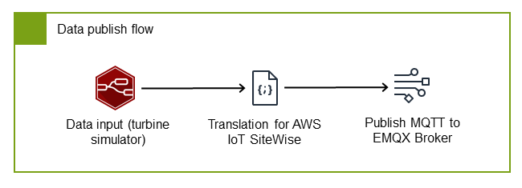

# Configure the data publish

flow

The data publish flow uses three nodes to create a pipeline that sends your industrial
data to the cloud. This flow is essential for enabling cloud-based analytics, long-term
storage, and integration with other AWS services. First, simulated device data is sent
to the SiteWise Edge MQTT broker. The gateway picks up the data from the broker which allows for
transmission to the AWS IoT SiteWise cloud, where you can leverage powerful analytics and
visualization capabilities.

- **Data input** - Receives device data from your
  industrial equipment or simulators
- **Data translator for AWS IoT SiteWise** - Translates data to
  AWS IoT SiteWise format to ensure compatibility with the SiteWise Edge gateway
- **MQTT publisher** - Publishes data to SiteWise Edge MQTT
  broker, making it available to both local and cloud consumers



## Configure the data input

node

In this example, the data input node uses a simulated wind turbine device that
generates wind speed data. This node serves as the entry point for your industrial data,
whether it comes from simulated sources (as in our example) or from actual industrial
equipment in production environments.

We use a custom JSON format for the data payload to provide a standardized structure
that works efficiently with both local processing tools and the AWS IoT SiteWise cloud service.
This format includes essential metadata like timestamps and quality indicators alongside
the actual measurement values, enabling comprehensive data management and quality
tracking throughout your pipeline. Import the inject node to receive simulated data in
this standardized JSON format with timestamps, quality indicators, and values.

For more information on the Node-RED inject node, see the [Inject](https://nodered.org/docs/user-guide/nodes#inject "https://nodered.org/docs/user-guide/nodes#inject") section in the
_Node-RED Documentation_.

The turbine simulator generates wind speed data every second in this standardized
JSON format:

###### Example: Turbine data payload

```
{
    name: string,         // Property name/identifier
    timestamp: number,    // Epoch time in nanoseconds
    quality: "GOOD" | "UNCERTAIN" | "BAD",
    value: number | string | boolean
}
```

This format provides several benefits:

- The `name` field identifies the specific property or measurement,
  allowing you to track multiple data points from the same device
- The `timestamp` in nanoseconds ensures precise time tracking for
  accurate historical analysis
- The `quality` indicator helps you filter and manage data based on its
  reliability
- The flexible `value` field supports different data types to
  accommodate various sensor outputs

###### Example: Inject node of a turbine simulator

```
[
    {
        "id": "string",
        "type": "inject",
        "z": "string",
        "name": "`Turbine Simulator`",
        "props": [
            {
                "p": "payload.timestamp",
                "v": "",
                "vt": "date"
            },
            {
                "p": "payload.quality",
                "v": "GOOD",
                "vt": "str"
            },
            {
                "p": "payload.value",
                "v": "$random()",
                "vt": "jsonata"
            },
            {
                "p": "payload.name",
                "v": "`/Renton/WindFarm/Turbine/WindSpeed`",
                "vt": "str"
            }
        ],
        "repeat": "1",
        "crontab": "",
        "once": false,
        "onceDelay": "",
        "topic": "",
        "x": 270,
        "y": 200,
        "wires": [
            [
                "string"
            ]
        ]
    }
]
```

## Configure a node for data

translation

The SiteWise Edge gateway requires data in a specific format to ensure compatibility with
AWS IoT SiteWise cloud. The translator node is an important component that converts your input
data to the required AWS IoT SiteWise payload format. This translation step ensures that your
industrial data can be properly processed, stored, and later analyzed in the AWS IoT SiteWise
cloud environment.

By standardizing the data format at this stage, you enable integration between your
edge devices and the cloud service where you can use asset modeling, analytics, and
visualization capabilities. Use this structure:

###### Example: Payload structure for SiteWise Edge data parsing

```
{
  "propertyAlias": "string",
  "propertyValues": [
    {
      "value": {
          "booleanValue": boolean,
          "doubleValue": number,
          "integerValue": number,
          "stringValue": "string"
     },
      "timestamp": {
          "timeInSeconds": number,
          "offsetInNanos": number
      },
      "quality": "GOOD" | "UNCERTAIN" | "BAD",
  }]
}
```

###### Note

Match the `propertyAlias` to your MQTT topic hierarchy (for example,
`/Renton/WindFarm/Turbine/WindSpeed`). This ensures that your data is
properly associated with the correct asset property in AWS IoT SiteWise. For more information,
see the "Data stream alias" concept in [AWS IoT SiteWise concepts](concept-overview.md "concept-overview.md").

1. Import the example function node for AWS IoT SiteWise payload translation. This function
   handles the conversion from your standardized input format to the AWS IoT SiteWise-compatible
   format, ensuring proper timestamp formatting, quality indicators, and value
   typing.

```
[
    {
        "id": "string",
        "type": "function",
        "z": "string",
        "name": "Translate to SiteWise payload",
        "func": "let input = msg.payload;\nlet output = {};\n\noutput[\"propertyAlias\"] = input.name;\n\nlet propertyVal = {}\n\nlet timeInSeconds = Math.floor(input.timestamp / 1000);\nlet offsetInNanos = (input.timestamp % 1000) * 1000000;\n\npropertyVal[\"timestamp\"] = {\n    \"timeInSeconds\": timeInSeconds,\n    \"offsetInNanos\": offsetInNanos,\n};\n\npropertyVal[\"quality\"] = input.quality\n\nlet typeNameConverter = {\n    \"number\": (x) => Number.isInteger(x) ? \"integerValue\" : \"doubleValue\",\n    \"boolean\": (x) => \"booleanValue\",\n    \"string\": (x) => \"stringValue\", \n}\nlet typeName = typeNameConverter[typeof input.value](input.value)\npropertyVal[\"value\"] = {}\npropertyVal[\"value\"][typeName] = input.value;\n\noutput[\"propertyValues\"] = [propertyVal]\n\nreturn {\n    payload: JSON.stringify(output)\n};",
        "outputs": 1,
        "timeout": "",
        "noerr": 0,
        "initialize": "",
        "finalize": "",
        "libs": [],
        "x": 530,
        "y": 200,
        "wires": [
            [
                "string"
            ]
        ]
    }
]
```

2. Verify that the JavaScript code translates wind speed data correctly. The
   function performs several important tasks:
   - Extracts the property name from the input and sets it as the
     propertyAlias
   - Converts the timestamp from milliseconds to the required seconds and
     nanoseconds format
   - Preserves the quality indicator for data reliability tracking
   - Automatically detects the value type and formats it according to AWS IoT SiteWise
     requirements

3. Connect the node to your flow, linking it between the data input node and the
   MQTT publisher.

For guidance on writing a function specific to your business needs, see [Writing Functions](https://nodered.org/docs/user-guide/writing-functions "https://nodered.org/docs/user-guide/writing-functions")
in the _Node-RED Documentation_

## Configure the MQTT

publisher

After translation, the data is ready for publication to the SiteWise Edge MQTT
broker.

Configure the MQTT publisher with these settings to send data to the SiteWise Edge MQTT
broker:

###### To import the MQTT out node

1. Import an MQTT out configuration node using `"type": "mqtt out"`.
   MQTT out nodes let you share a broker's configuration.
2. Enter key-value pairs for information relevant to MQTT broker connection and
   message routing.

Import the example `mqtt out` node.

###### Example

```
[
    {
        "id": "string",
        "type": "mqtt out",
        "z": "string",
        "name": "Publish to MQTT broker",
        "topic": "`/Renton/WindFarm/Turbine/WindSpeed`",
        "qos": "1",
        "retain": "",
        "respTopic": "",
        "contentType": "",
        "userProps": "",
        "correl": "",
        "expiry": "",
        "broker": "string",
        "x": 830,
        "y": 200,
        "wires": []
    },
    {
        "id": "string",
        "type": "mqtt-broker",
        "name": "emqx",
        "broker": "127.0.0.1",
        "port": "1883",
        "clientid": "",
        "autoConnect": true,
        "usetls": false,
        "protocolVersion": "5",
        "keepalive": 15,
        "cleansession": true,
        "autoUnsubscribe": true,
        "birthTopic": "",
        "birthQos": "0",
        "birthPayload": "",
        "birthMsg": {},
        "closeTopic": "",
        "closePayload": "",
        "closeMsg": {},
        "willTopic": "",
        "willQos": "0",
        "willPayload": "",
        "willMsg": {},
        "userProps": "",
        "sessionExpiry": ""
    }
]
```

The example MQTT out node creates the MQTT connection with the following
information:

- Server: `127.0.0.1`
- Port: `1883`
- Protocol: `MQTT V5`

Then, the MQTT out node configures message routing with the following
information:

- Topic: `/Renton/WindFarm/Turbine/WindSpeed`
- QoS: `1`

## Deploy and verify the nodes

After configuring the three data publish flow nodes, follow these steps to deploy
the flow and verify that data is being transmitted correctly to AWS IoT SiteWise

###### To deploy and verify connections

1. Connect the three nodes as shown in the data publish flow.

 2. Choose **Deploy** to apply all node connection
changes. 3. Navigate to the [AWS IoT SiteWise console](https://console.aws.amazon.com/iotsitewise/ "https://console.aws.amazon.com/iotsitewise/") and choose **Data
streams**. 4. Ensure **Alias prefix** is selected in the dropdown menu. Then,
search for the `/Renton/WindFarm/Turbine/WindSpeed` alias.

If you see the correct alias in your search, you have deployed the flow and verified
data transmission.
