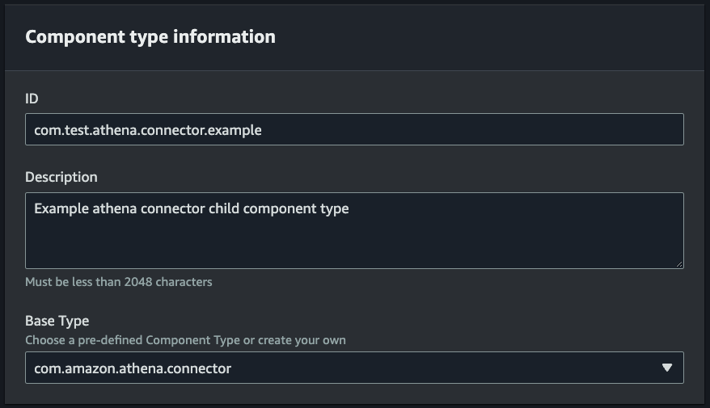
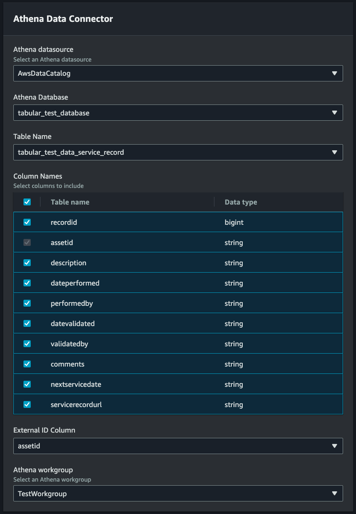
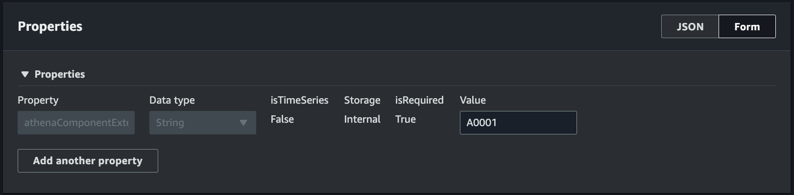
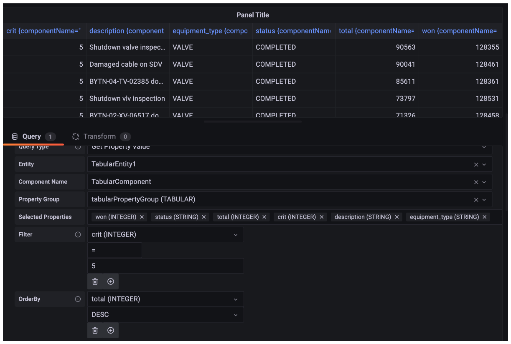

# AWS IoT TwinMaker Athena tabular data connector

With the Athena tabular data connector, you can access and use your Athena data stores
in AWS IoT TwinMaker. You can use your Athena data to build digital twins without an intensive data
migration effort. You can either use the prebuilt connector or create a custom Athena
connector to access data from your Athena data sources.

## AWS IoT TwinMaker Athena data

connector prerequisites

Before you use the Athena tabular data connector, complete the following prerequisites:

- Create managed Athena tables and their associated Amazon S3 resources. For
  information on using Athena, see the [Athena documentation](../../../athena/latest/ug/what-is.md "../../../athena/latest/ug/what-is.md").
- Create an AWS IoT TwinMaker workspace. You can create a workspace in the
  [AWS IoT TwinMaker console](https://console.aws.amazon.com/iottwinmaker/ "https://console.aws.amazon.com/iottwinmaker/").
- Update your workspace IAM role with Athena permissions. For more information,
  see [Modify your workspace IAM role to use the Athena data connector](twinmaker-gs-service-role.md#athena-tabular-data-connector-ws-IAM "twinmaker-gs-service-role.md#athena-tabular-data-connector-ws-IAM").
- Become familiar with AWS IoT TwinMaker's entity-component system and how to create
  entities. For more information, see [Create your first entity](twinmaker-gs-entity.md "twinmaker-gs-entity.md").
- Become familiar with AWS IoT TwinMaker's data connectors. For more information, see
  [AWS IoT TwinMaker data connectors](data-connector-interface.md "data-connector-interface.md").

## Using the Athena data connector

To use the Athena data connector, you must create a component, using the Athena
connector as the component type. Then you attach the component to an entity within
your scene for use in AWS IoT TwinMaker.

**Create a component type with the Athena data connector**

Use this procedure to create an AWS IoT TwinMaker component type with the Athena tabular data connector:

1. Navigate to the [AWS IoT TwinMaker console](https://console.aws.amazon.com/iottwinmaker/ "https://console.aws.amazon.com/iottwinmaker/").
2. Open an existing workspace or
   [create a new one](twinmaker-gs-workspace.md "twinmaker-gs-workspace.md").
3. From the left side navigation menu, choose **Component types**, and select
   **Create component type** to
   open the component type creation page.
4. On the **Create component type** page, fill in the
   **ID** field with an ID that matches your use case.

 5. Choose the **Base type**. From the dropdown list, select the
Athena tabular data connector which is labeled as **com.amazon.athena.connector**. 6. Configure the component type's **Data source**
by choosing Athena resources for the following fields:

    * Choose an **Athena datasource**.
    * Choose an **Athena database**.
    * Choose a **Table name**.
    * Choose a **Athena workGroup**.

7. Once you have selected the Athena resources you want to use as the data source, choose which
   columns from the table you want to include.
8. Select an **External ID column name**. Select a column from the
   previous step to serve as the external ID column. The external Id is the id that's used
   to represent an Athena asset and map it to an AWS IoT TwinMaker entity.

 9. **(Optional)** Add AWS tags to these resources,
so you can group and organize them. 10. Choose **Create component type** to finish creating
the component type.

**Create a component with the Athena data connector type and
attach it to an entity**

Use this procedure to create an AWS IoT TwinMaker component with the Athena tabular data
connector and attach it to an entity:

###### Note

You must have an existing component type that uses the Athena tabular data
connector as a data source in order to complete this procedure. See the previous
procedure **Create a component type with the Athena data
connector** before starting this walkthrough.

1. Navigate to the [AWS IoT TwinMaker console](https://console.aws.amazon.com/iottwinmaker/ "https://console.aws.amazon.com/iottwinmaker/").
2. Open an existing workspace or
   [create a new one](twinmaker-gs-workspace.md "twinmaker-gs-workspace.md").
3. From the left side navigation menu choose **Entities**,
   and select the entity you want to add the component to or create a new entity.
4. [Create a new entity](twinmaker-gs-entity.md "twinmaker-gs-entity.md").
5. Next select **Add component.**,
   fill in the **Component name**
   field with a name that match your use case.
6. From the **Component type** drop down menu select the
   **component type ID** that you created in the previous procedure.
7. Enter **Component information**, a **Component Name**, and
   select the child ComponentType created previously. This is the
   ComponentType you created with the Athena data connector.
8. In the **Properties** section, enter the
   **athenaComponentExternalId** for the component.

 9. Choose **Add component** to finish creating the
component.

You have now successfully created a component with the Athena data connector as the
component type and attached it to an entity.

## Using the Athena

tabular data connector JSON reference

The following example is the full the JSON reference for the Athena tabular data
connector. Use this as a resource to create custom data connectors and component
types.

```
{
    "componentTypeId": "com.amazon.athena.connector",
    "description": "Athena connector for syncing tabular data",
    "workspaceId":"AmazonOwnedTypesWorkspace",
    "propertyGroups": {
        "tabularPropertyGroup": {
            "groupType": "TABULAR",
            "propertyNames": []
        }
    },
    "propertyDefinitions": {
        "athenaDataSource": {
            "dataType": { "type": "STRING" },
            "isRequiredInEntity": true
        },
        "athenaDatabase": {
            "dataType": { "type": "STRING" },
            "isRequiredInEntity": true
        },
        "athenaTable": {
            "dataType": { "type": "STRING" },
            "isRequiredInEntity": true
        },
        "athenaWorkgroup": {
            "dataType": { "type": "STRING" },
            "isRequiredInEntity": true
        },
        "athenaExternalIdColumnName": {
            "dataType": { "type": "STRING" },
            "isRequiredInEntity": true,
            "isExternalId": false
        },
        "athenaComponentExternalId": {
            "dataType": { "type": "STRING" },
            "isStoredExternally": false,
            "isRequiredInEntity": true,
            "isExternalId": true
        }
    },
    "functions": {
        "tabularDataReaderByEntity": {
            "implementedBy": {
                "isNative": true
            }
        }
    }
}
```

## Using the Athena data connector

You can surface your entities that are using Athena tables in Grafana. For more information, see [AWS IoT TwinMaker Grafana dashboard integration](grafana-integration.md "grafana-integration.md").

Read the [Athena
documentation](../../../athena/latest/ug/what-is.md "../../../athena/latest/ug/what-is.md") for information on creating and using Athena tables to
store data.

### Troubleshooting the Athena data connector

This topic covers common issues you may encounter when configuring the Athena data connector.

Athena workgroup location:

When creating Athena connector componentType, an Athena workgroup has to have output location setup. See [How workgroups work](../../../athena/latest/ug/user-created-workgroups.md "../../../athena/latest/ug/user-created-workgroups.md").

Missing IAM role permissions:

The AWS IoT TwinMaker; workspace role may be missing Athena API access permission
when creating a componentType, adding a Ca component to an entity, or
running the GetPropertyValue API. To update IAM permissions see
[Create and manage a service role for AWS IoT TwinMaker](twinmaker-gs-service-role.md "twinmaker-gs-service-role.md").

## Visualize Athena tabular data in Grafana

A Grafana plugin is also available to visualize your tabular data on Grafana a dashboard
panel with additional features such as sorting and filtering based on selected properties
without making API calls to AWS IoT TwinMaker, or interactions with Athena. This topic shows you how
to configure Grafana to visualize Athena tabular data.

### Prerequisites

Before configuring a Grafana panel for visualizing Athena tabular data, review the
following prerequisites:

- You have set up a Grafana environment. For more information see,
  [AWS IoT TwinMaker Grafana integration](grafana-integration.md "grafana-integration.md").
- You can configure a Grafana datasource. For more information see,
  [Grafana AWS IoT TwinMaker](https://github.com/grafana/grafana-iot-twinmaker-app/blob/main/src/datasource/README.md "https://github.com/grafana/grafana-iot-twinmaker-app/blob/main/src/datasource/README.md").
- You are familiar with creating a new dashboard and add a new panel.

### Visualize Athena tabular data in Grafana

This procedure shows you how to setup a Grafana panel to visualize Athena tabular data.

1. Open your AWS IoT TwinMaker Grafana dashboard.
2. Select the **Table** panel in the panel settings.
3. Select your datasource in the query configuration.
4. Select the **Get Property Value** query.
5. Select an entity.
6. Select a component that has a componentType that extends the
   **Athena base component type**.
7. Select the property group of your Athena table.
8. Select any number of properties from the property group.
9. Configure the tabular conditions through a list of filters and property orders.
   With the following options:
   - **Filter**: define an expression for a property value
     to filter your data.
   - **OrderBy**: specify whether data should be returned
     in ascending or descending order for a property.


