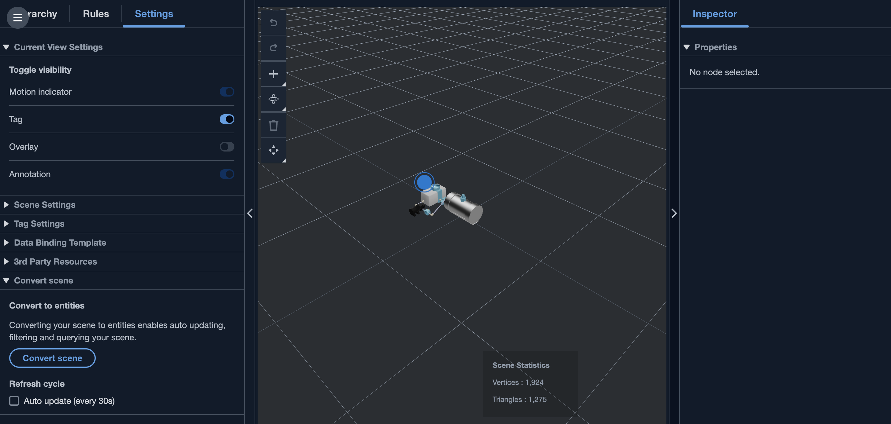

# Dynamic scenes

AWS IoT TwinMaker scenes unlock the power of the [knowledge graph](tm-knowledge-graph.md "tm-knowledge-graph.md")
by storing scene nodes and settings in an entity component. Use the AWS IoT TwinMaker console to create
**dynamic scenes** to more easily manage, build, and render 3D scenes.

**Key features:**

- All 3D scene node objects, settings, and data bindings are rendered "dynamically"
  based on knowledge graph queries.
- If you use the read-only Scene Viewer in a Grafana or custom application, you can get
  updates to your scenes on a 30 second interval.

## Static versus dynamic scenes

**Static scenes** are composed of a scene JSON file stored in S3
that has details of all scene nodes and settings. Any change to the scene must be made to the JSON
document and saved to S3. A static scene is the only option if you have a [basic pricing plan](https://aws.amazon.com/iot-twinmaker/pricing/ "https://aws.amazon.com/iot-twinmaker/pricing/").

**Dynamic scenes** are composed of a scene JSON file that has
global settings for the scene, while all other scene nodes and node settings are stored as
entity components in the knowledge graph. Dynamic scenes are only supported in standard and
tiered bundle pricing plans. See [Switch AWS IoT TwinMaker pricing modes](tm-pricing-mode.md "tm-pricing-mode.md")
for information on how to upgrade your pricing plan).

You can convert an existing static scene to a dynamic scene by following these steps:

- Navigate to your scene in the [AWS IoT TwinMaker console](https://console.aws.amazon.com/iottwinmaker/ "https://console.aws.amazon.com/iottwinmaker/").
- On the left hand panel, click the **Settings** tab.
- Expand the **Convert scene** section at the bottom of the panel.
- Click the **Convert scene** button, then click
  **Confirm**.

###### Warning

The conversion from a static to dynamic scene is irreversible.

## Scene component types and entities

In order to create scene-specific entity components, the following 1P component types are
supported:

- **com.amazon.iottwinmaker.3d.component.camera**
  A component type that stores the settings of a [camera
  widget](scenes-camera.md "scenes-camera.md").
- **com.amazon.iottwinmaker.3d.component.dataoverlay**
  A component type that stores the settings for an [overlay](scenes-ee.md#scenes-ee-overlay "scenes-ee.md#scenes-ee-overlay") of an annotation or tag widget.
- **com.amazon.iottwinmaker.3d.component.light**
  A component type that stores the settings of a light widget.
- **com.amazon.iottwinmaker.3d.component.modelref**
  A component type that stores the settings and S3 location of a 3D model used in a
  scene.
- **com.amazon.iottwinmaker.3d.component.modelshader**
  A component type that stores the settings of a [model shader](scenes-editing-add-color-widget.md "scenes-editing-add-color-widget.md") on a 3D model.
- **com.amazon.iottwinmaker.3d.component.motionindicator**
  A component type that stores the settings of a motion indicator widget.
- **com.amazon.iottwinmaker.3d.component.submodelref**
  A component type that stores the settings of a [submodel](scenes-ee.md#scenes-ee-submodel "scenes-ee.md#scenes-ee-submodel") of a 3D model.
- **com.amazon.iottwinmaker.3d.component.tag**
  A component type that stores the settings of a [tag widget](scenes-editing-add-tags.md "scenes-editing-add-tags.md").
- **com.amazon.iottwinmaker.3d.node**
  A component type that stores the basic settings of a scene node like its 3D transform,
  name, and generic properties.

## Dynamic scene concepts

Dynamic scene entities are stored under a global entity labelled `$SCENES`.
Each scene is made up of a root entity and a hierarchy of children entities that match the
scene node hierarchy. Each scene node under the root has a
**com.amazon.iottwinmaker.3d.node** component and a component
for the type of node (3D model, widget, and so on).

###### Warning

Do not manually delete any scene entities or your scene may be in a broken state.
If you want to partially or fully delete a scene, use the scene composer page to add and delete
scene nodes, and use the scenes page to select and delete a scene.
