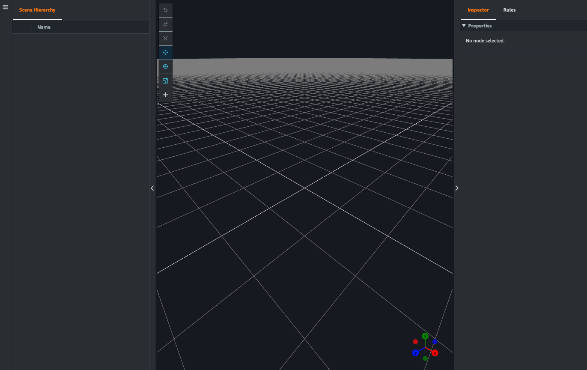
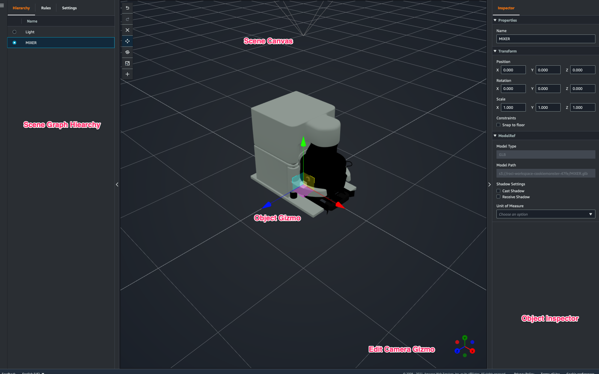

# Create your scenes

In this section, you'll set up a scene so that you can edit your digital twin. You can import
a 3D model that was uploaded to the [resource
library](scenes-using-resource-library.md "scenes-using-resource-library.md"), then add widgets and bind property data to objects to complete your digital twin.
Scene objects can include an entire building or space, or individual pieces of equipment positioned
in their physical location.

###### Note

Before you create a scene, you must create a workspace.

Use the following procedure to create your scene in AWS IoT TwinMaker.

1. To open the scene pane, in the left navigation of your workspace, choose
   **Scenes**.
2. Choose **Create scene**. The new scene creation pane
   opens.
3. In the scene creation pane, enter a name and description for your new scene. If you
   have a standard or tiered bundle pricing plan, you can select your scene type. It is
   recommended to use a [dynamic scene](dynamic-scenes.md "dynamic-scenes.md").
4. When you're ready to create the scene, choose **Create scene**. The new
   scene opens and is ready for you to work with it.

## Use 3D navigation in your AWS IoT TwinMaker in scenes

The AWS IoT TwinMaker scene has a set of navigation controls that you can use to navigate
efficiently through your scene's 3D space. To interact with the 3D space and objects
represented by your scene, you use the following widgets and menu options.

- **Inspector**: Use the Inspector window to view and edit
  properties and settings of a selected entity or component in your
  hierarchy.
- **Scene
  Canvas**:
  The Scene Canvas is the 3D space where you can position and orient any 3D
  resources you want to use.
- **Scene Graph Hierarchy**: You can use this panel to see all
  of the entities present in your scene. It appears on the left side of the
  window.
- **Object gizmo**: Use this gizmo to move objects around the
  canvas. It appears at the center of a selected 3D object in the Scene Canvas.
- **Edit Camera gizmo**: Use the Edit Camera gizmo to quickly
  view the scene view camera’s current orientation and modify the viewing angle.
  You can find this gizmo in the lower-right corner of the scene view.
- **Zoom controls**: To navigate on the Scene Canvas, use right
  click and drag in the direction you want to move. To rotate , left click and
  drag to rotate. To zoom, use the scroll wheel on your mouse, or pinch and move
  your fingers apart on the track pad of your laptop.

The scene buttons on the hierarchy pane have the following functions listed, in order
of the buttons' layout:

- **Undo**: Undo your last change in the scene.
- **Redo**: Redo your last change in the scene.
- **Plus (+)**: Use this button to gain access to the following
  actions: **Add empty node**, **Add 3D model**,
  **Add tag**, **Add light**, and
  **Add model shader**.
- **Change navigation method**: Gain access to the scene camera
  navigation options, **Orbit** and
  **Pan**.
- **Trashcan (delete)**: Use this button to delete a selected
  object in your scene.
- **Object manipulation tools**: Use this button to translate,
  rotate, and scale the selected object.
