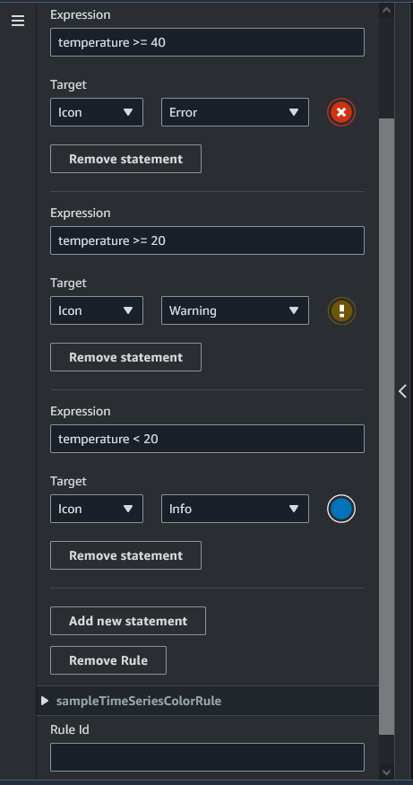
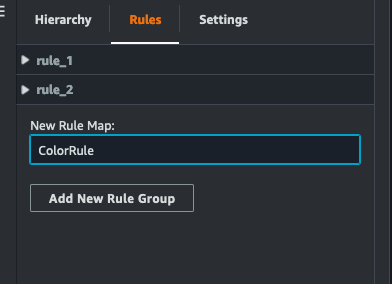

# Add model shader augmented UI widgets

to your scene

Model shader widgets can change the color of an object under conditions that you define.
For example, you can create a color widget that changes the color of a cookie mixer in
your scene based on the mixer's temperature data.

Use the following procedure to add model shader widgets to a selected object.

1. Select an object in the hierarchy that you want to add a widget to. Press the
   **+** button and then choose **Model Shader**.
2. To add a new visual rule group, first follow the instructions below to create the
   ColorRule, then in the Inspector panel for the object of the Rule ID, choose
   **ColorRule**.
3. Select the entityID, ComponentName, and PropertyName you want to bind the model
   shader to.

## Create visual rules for your

scenes

You can use visual rule maps to specify the data driven conditions that change the
visual appearance of an augmented UI widget, such as a tag or a model shader. There
are sample rules provided, but you can also create your own. The following example
shows a visual rule.

The image above shows a rule for when a previously defined
data property with ID 'temperature' is checked against a certain value.
For example, if the 'temperature' is greater than or equal to 40, the
state will change the appearance of the tag to a red circle. The **target**,
when chosen in the Grafana dashboard, populates a detail panel that is configured to use
the same data source.

The following procedure shows you how to add a new visual rule group for the mesh
colorization augmented UI layer.

1. Under the rules tab in the console, enter a name such as ColorRule in the
   text field and choose **Add New Rule Group**.

 2. Define a new rule for your use case. For example, you can create one based
on the data property 'temperature', where the reported value is less than 20.
Use the following syntax for rule expressions: Less than is **<**,
greater than is **>**, less than or equal is **<=**,
greater than or equal is **>=**, and equal is
**==**. (For more information, see the [Apache
Commons JEXL syntax](https://commons.apache.org/proper/commons-jexl/reference/syntax.html "https://commons.apache.org/proper/commons-jexl/reference/syntax.html").) 3. Set the target to a color. To define a color, such as `#fcba03`,
use hex values. (For more information about hex values, see [Hexadecimal](https://en.wikipedia.org/wiki/Hexadecimal "https://en.wikipedia.org/wiki/Hexadecimal").)
