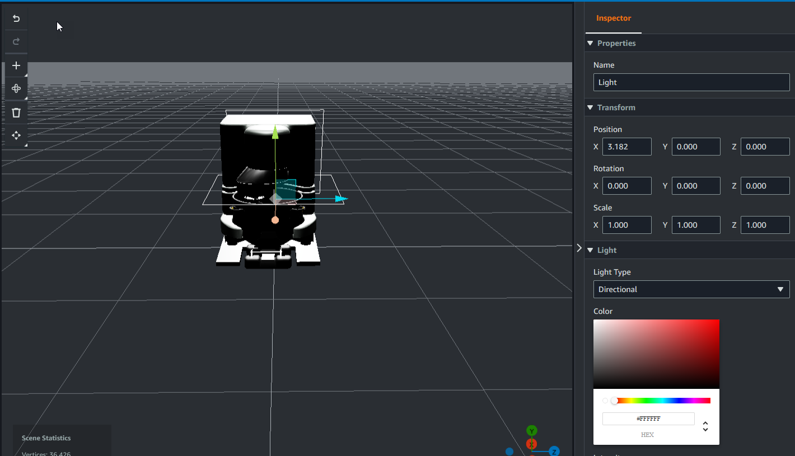

# Add models to your scenes

To add models to your scene, use the following procedure.

###### Note

To add models in your scene, you must first upload the models to the AWS IoT TwinMaker
Resource Library. For more information, see [Upload resources to the AWS IoT TwinMaker Resource
Library](scenes-using-resource-library.md "scenes-using-resource-library.md").

1. On the scene composer page, choose the plus (**+**) sign, and
   then choose **Add 3D model**.
2. On the **Add resource from resource library** window, choose
   the **CookieFactorMixer.glb** file, and then choose
   **Add**. Scene composer opens.
3. **Optional**: Choose the plus (**+**) sign,
   and then choose **Add light**.
4. Choose each light option to see how they affect the scene.

###### Note

Scenes have default ambient lighting. To avoid frame rate loss, consider
limiting the number of additional lights placed in your scene.
