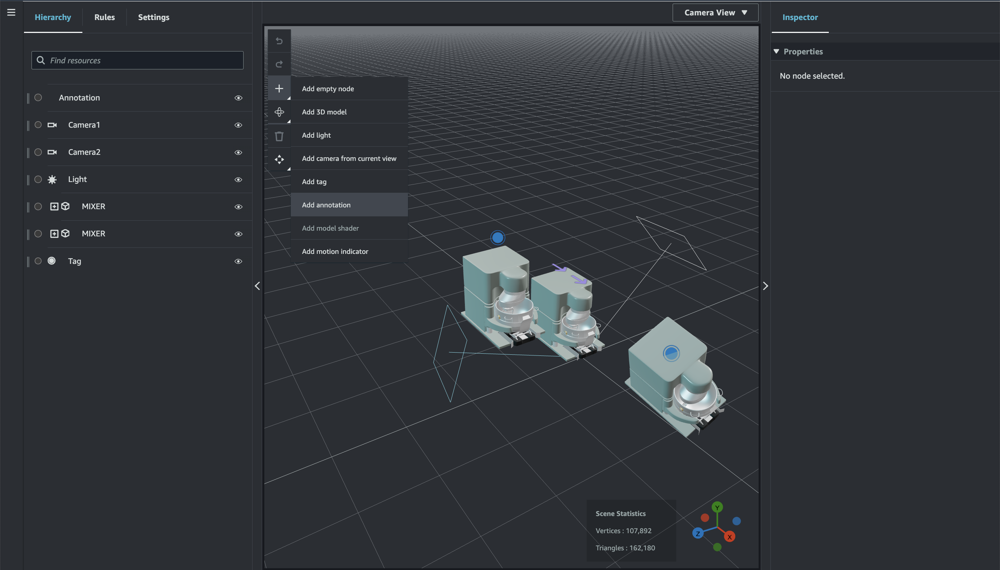
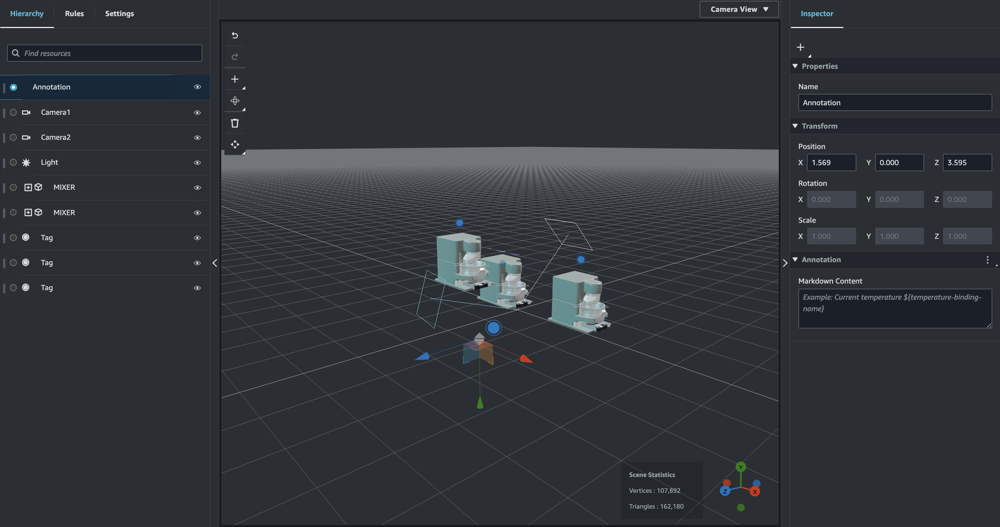
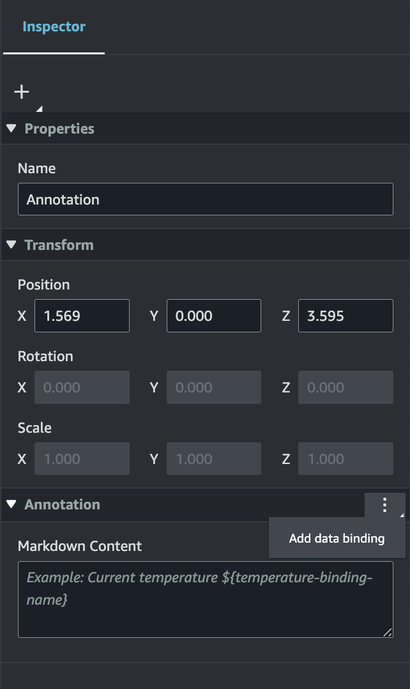
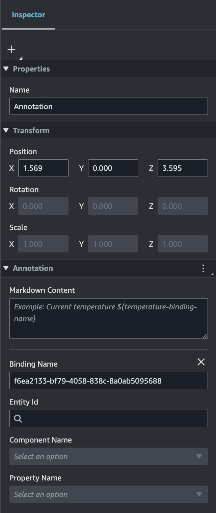
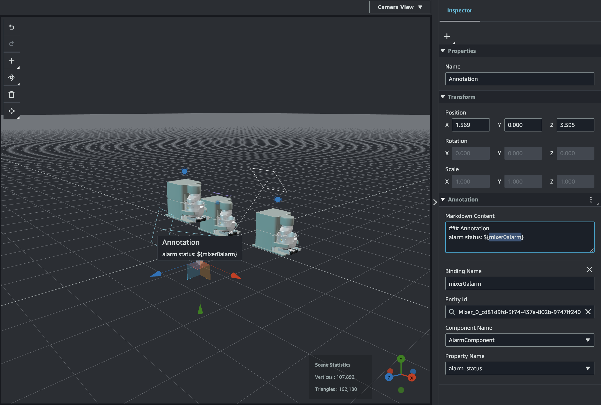
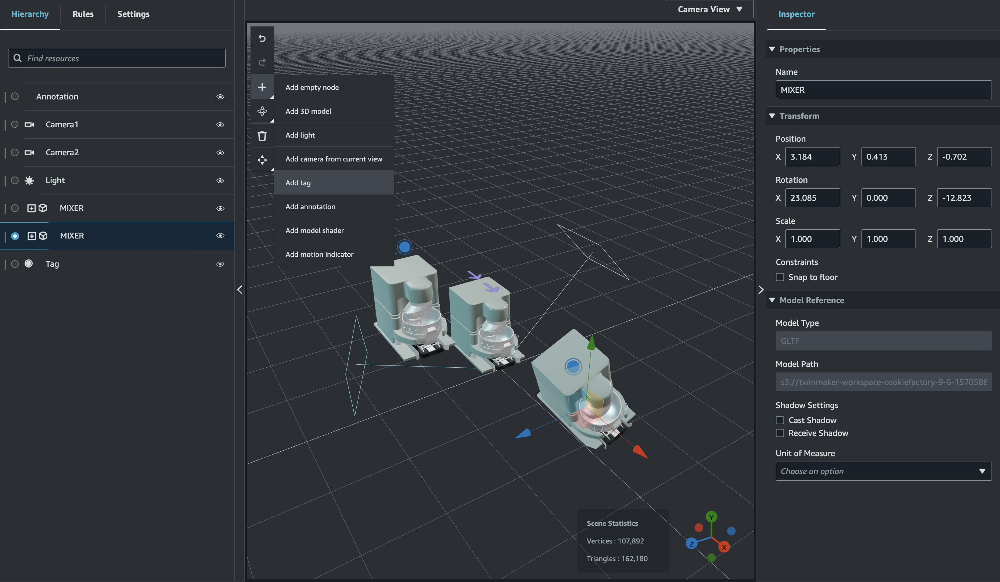
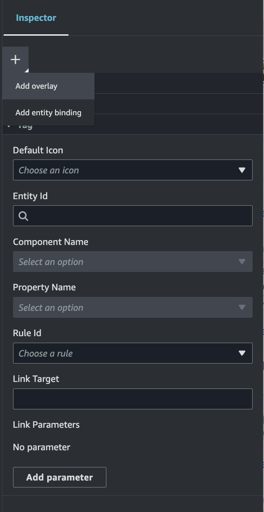
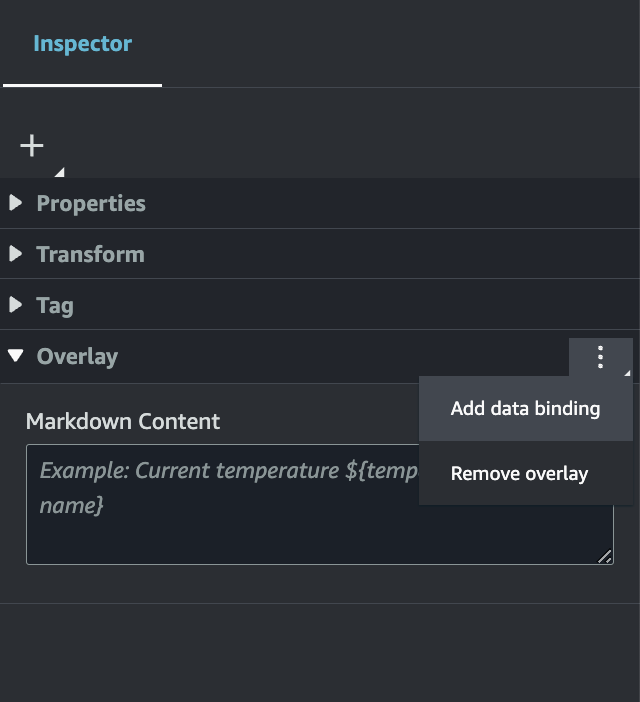
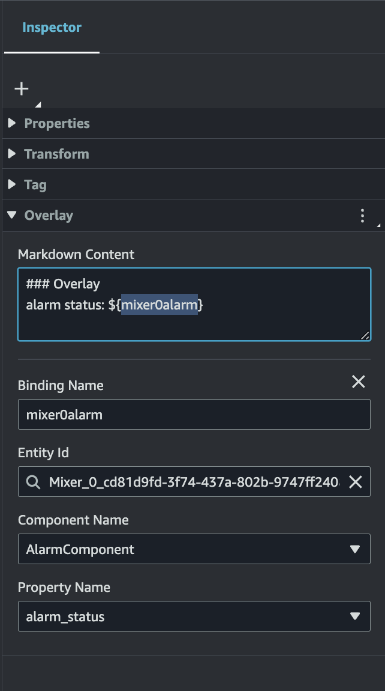
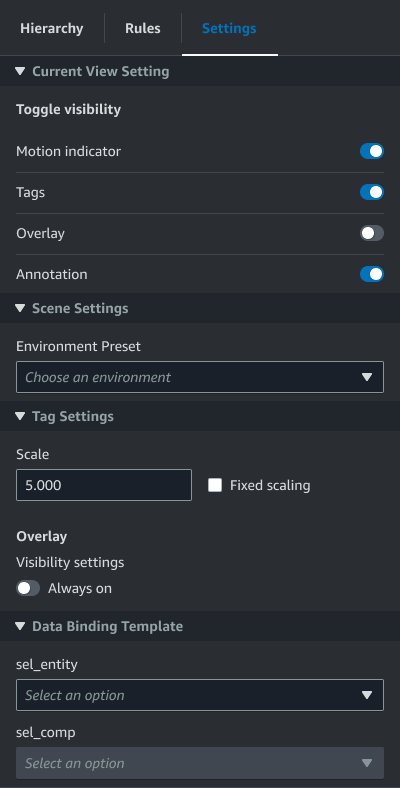

# Scene enhanced editing

AWS IoT TwinMaker scenes feature a set of tools for enhanced and editing and manipulation of resources present in your scene.

The following topics teach you how to used the enhanced editing features in your AWS IoT TwinMaker scenes.

- [Targeted placement of scene objects](#scenes-ee-placement "#scenes-ee-placement")
- [Submodel selection](#scenes-ee-submodel "#scenes-ee-submodel")
- [Edit entities in the scene hierarchy](#scenes-ee-hierarchy "#scenes-ee-hierarchy")

## Targeted placement of scene objects

AWS IoT TwinMaker allows you to precisely place and add objects into your scene. This enhanced editing feature gives you greater control of where you're placing tags, entities lights and models in your scene.

1. Navigate to your scene in the [AWS IoT TwinMaker console](https://console.aws.amazon.com/iottwinmaker/ "https://console.aws.amazon.com/iottwinmaker/").
2. Press the **+** button, and from the drop down options select one of the options. This could be a model, a light, a tag, or anything from the **+** menu.

When you move your cursor in the 3d space of your scene you should see a target around your cursor . 3. Use the target to precisely place elements in your scene.

## Submodel selection

AWS IoT TwinMaker lets you select submodels of 3d models in scenes and apply standard properties to them, such as tags, lights, or rules.

3d model file formats contain metadata that can specify sub areas of the model as submodels within the larger model. For example a model could be a filtration system, individual parts of the system like tanks, pipes, or a motor are marked as submodels of the filtration's 3d model.

**Supported 3D file formats in scenes**: GLB, and GLTF.

1. Navigate to your scene in the [AWS IoT TwinMaker console](https://console.aws.amazon.com/iottwinmaker/ "https://console.aws.amazon.com/iottwinmaker/").
2. If you have no models in your scene, make sure to add one by selecting the option from the **+** menu.
3. Select model listed in your scene hierarchy, once selected the hierarchy should display any submodels beneath the model.

###### Note

If you do not see any submodels listed then it is likely the model was not configured to have any submodels. 4. To toggle the visibility of a submodel, press the eye icon, located to the right of the submodel's name in the hierarchy. 5. To edit submodel data, such as its name or position, the scene inspector will open when a submodel is selected. Use the inspector menu to update or change submodel data. 6. To add tags, lights, rules, or other properties to submodels, press the **+**, while the submodel is selected in the hierarchy.

## Edit entities in the scene hierarchy

AWS IoT TwinMaker scenes let you directly edit properties of entities within the hierarchy table. The following procedure shows you which actions you can perform on an entity through the hierarchy menu.

1. Navigate to your scene in the [AWS IoT TwinMaker console](https://console.aws.amazon.com/iottwinmaker/ "https://console.aws.amazon.com/iottwinmaker/").
2. Open the scene hierarchy, and select a sub element of an entity you wish to manipulate.
3. Once the element is selected, press the **+** button, and from the drop down select one of the options:
   - **Add empty node**
   - **Add 3D model**
   - **Add light**
   - **Add camera from current view**
   - **Add tag**
   - **Add model shader**
   - **Add motion indicator**

4. After selecting one of the options from the drop down, the selection will be applied to the scene as child of the selected element from step 2.
5. You can reorder child elements and reparent elements, by selecting a child element and dragging in the hierarchy to a new parent.

## Add annotations to entities

The AWS IoT TwinMaker scene composer lets you annotate any element in your scene hierarchy. The annotation is
authored in markdown.

For more information on writing in Markdown, see the official documentation on markdown syntax,
[Basic Syntax](https://www.markdownguide.org/basic-syntax/ "https://www.markdownguide.org/basic-syntax/").

###### Note

AWS IoT TwinMaker annotations and overlay Markdown syntax only and not HTML.

###### Add an annotation to an entity

1. Navigate to your scene in the [AWS IoT TwinMaker console](https://console.aws.amazon.com/iottwinmaker/ "https://console.aws.amazon.com/iottwinmaker/").
2. Select an element from the scene hierarchy that you want to annotate.
   If no element in the hierarchy is selected, then you can add annotation to the root.
3. Press the plus **+** button and choose the **Add
   annotation** option.

 4. In the **Inspector** window on the left,
scroll down to the **annotation** section.
Using Markdown syntax, write the text you want your annotation to display.

For more information on writing in Markdown, see the official documentation on markdown syntax,
[Basic Syntax](https://www.markdownguide.org/basic-syntax/ "https://www.markdownguide.org/basic-syntax/").

 5. To bind your AWS IoT TwinMaker scene data to an annotation choose **Add data
binding**, add the **Entity Id**, then select the
**Component Name** and **Property Name** of the
entity you wish to surface data from. You can update the binding name to use it as
a Markdown variable, and surface the data in the annotation.

 6. The **Binding Name** is used to represent the annotation's
variable.

Enter a **Binding Name** to surface the latest historical
value of an entities time-series in the annotation through AWS IoT TwinMaker's variable
syntax: `${`variable-name`}`

As an example, this overlay displays the value of the `mixer0alarm`,
in the annotation with the syntax `${mixer0alarm}`.

## Add overlays to Tags

You can create overlays for your AWS IoT TwinMaker scenes.
Scene overlays are associated with tags and can be used to surface critical data associated
with your scene entities. The overlay is authored and rendered in Markdown.

For more information on writing in Markdown, see the official documentation on markdown
syntax, [Basic
Syntax](https://www.markdownguide.org/basic-syntax/ "https://www.markdownguide.org/basic-syntax/").

###### Note

By default, an **Overlay** is visible in a scene only when
the tag associated with it is selected. You can toggle this in the scene
**Settings** so that all **Overlays** are visible
at once.

1. Navigate to your scene in the [AWS IoT TwinMaker console](https://console.aws.amazon.com/iottwinmaker/ "https://console.aws.amazon.com/iottwinmaker/").
2. The AWS IoT TwinMaker **overlay** is associated with a tag scene,
   you can update an existing tag or add a new one.

Press the plus **+** button and choose the
**Add tag** option.

 3. In the **Inspector** panel on the right, select the
**+** (plus symbol) button then select **Add overlay**.

 4. In Markdown syntax, write the text you want your overlay to display.

For more information on writing in Markdown, see the official documentation on markdown syntax,
[Basic Syntax](https://www.markdownguide.org/basic-syntax/ "https://www.markdownguide.org/basic-syntax/"). 5. To bind your AWS IoT TwinMaker scene data to an overlay, select
**Add data binding**.

Add the **Binding name** and **Entity Id**,
then select the **Component Name** and **Property Name**
of the entity you wish to surface data from. 6. You can surface the latest historical value of an entities time-series data in the overlay
through AWS IoT TwinMaker's variable syntax: `${`variable-name`}`.

As an example, this overlay displays the value of the `mixer0alarm`, in the overlay
with the syntax `${mixer0alarm}`.

 7. To enable **Overlay** visibility, open the **Settings**
tab in the top left, and make sure the toggle for **Overlay** is
switched on so that all **Overlays** are visible at once.

###### Note

By default, an **Overlay** is visible in a scene only when
the tag associated with it is selected.

