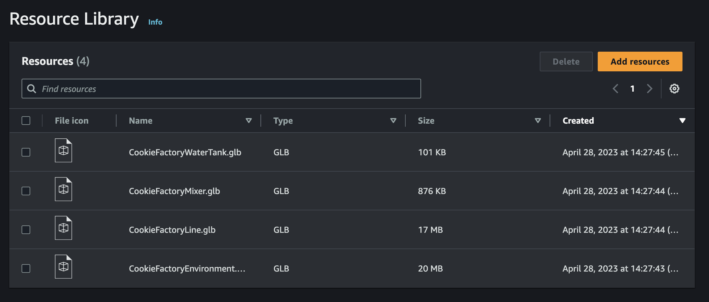

# Upload resources to the AWS IoT TwinMaker Resource

Library

You can use the Resource Library to control and manage any resource you want to place into
scenes for your digital twin application. To make AWS IoT TwinMaker aware of the resources, upload
them using the Resource Library console page.

## Upload files to the Resource Library

using the console

###### Follow these steps to add files to the Resource Library using the AWS IoT TwinMaker console.

1. In the left navigation menu, under **Workspaces**, select
   **Resource Library**.
2. Select **Add resources** and choose the files you want to upload.

