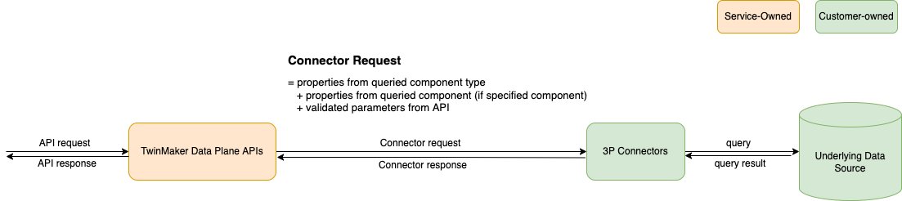

# Developing AWS IoT TwinMaker time-series data

connectors

This section explains how to develop a time-series data connector in a step-by-step
process. Additionally, we present an example time-series data connector based of the
entire cookie factory sample, which includes 3D models, entities, components, alarms,
and connectors. The cookie factory sample source is available on the [AWS IoT TwinMaker samples GitHub repository](https://github.com/aws-samples/aws-iot-twinmaker-samples " https://github.com/aws-samples/aws-iot-twinmaker-samples") .

###### Topics

- [AWS IoT TwinMaker time-series data connector
  prerequisites](#time-series-data-connectors-prereqs "#time-series-data-connectors-prereqs")
- [Time-series data
  connector background](#time-series-data-connectors-background "#time-series-data-connectors-background")
- [Developing a time-series data connector](#time-series-data-connectors-develop "#time-series-data-connectors-develop")
- [Improving your data
  connector](#time-series-data-connectors-improve "#time-series-data-connectors-improve")
- [Testing your connector](#time-series-data-connectors-test "#time-series-data-connectors-test")
- [Security](#time-series-data-connectors-security "#time-series-data-connectors-security")
- [Creating AWS IoT TwinMaker resources](#time-series-data-connectors-resources "#time-series-data-connectors-resources")
- [What's next](#time-series-data-connectors-wn "#time-series-data-connectors-wn")
- [AWS IoT TwinMakercookie
  factory example time-series connector](time-series-data-connectors-example.md "time-series-data-connectors-example.md")

## AWS IoT TwinMaker time-series data connector

prerequisites

Before developing your time-series data connector, we recommend that you complete the
following tasks:

- Create an [AWS IoT TwinMaker workspace](twinmaker-gs-workspace.md "twinmaker-gs-workspace.md").
- Create [AWS IoT TwinMaker
  component types](twinmaker-component-types.md "twinmaker-component-types.md").
- Create [AWS IoT TwinMaker
  entities](twinmaker-gs-entity.md "twinmaker-gs-entity.md").
- (Optional) Read [Using
  and creating component types](twinmaker-component-types.md "twinmaker-component-types.md").
- (Optional) Read [AWS IoT TwinMaker
  data connector interface](data-connector-interface.md "data-connector-interface.md") to get a general understanding of
  AWS IoT TwinMaker data connectors.

###### Note

For an example of a fully implemented connector, see our cookie factory example
implementation.

## Time-series data

connector background

Imagine you are working with a
factory that has a set of cookie mixers and a water tank.
You would like to build AWS IoT TwinMaker digital twins of
these physical entities so that you can monitor their operational states by checking various time-series metrics.

You have on-site sensors set up and you are already streaming measurement data into a
Timestream database. You want to be able to view and organize the measurement data in
AWS IoT TwinMaker with minimal overhead. You can accomplish this task by using a
time-series data connector. The following image shows an example telemetry table,
which is populated through the use of a time-series connector.

.png>)

The datasets and the Timestream table used in this screenshot are available in the [AWS IoT TwinMaker samples GitHub repository](https://github.com/aws-samples/aws-iot-twinmaker-samples "https://github.com/aws-samples/aws-iot-twinmaker-samples"). Also see the [cookie factory example connector](time-series-data-connectors-example.md "time-series-data-connectors-example.md")
for the implementation, which produces the result shown in the preceding screenshot.

### Time-series data

connector data flow

For data plane queries, AWS IoT TwinMaker fetches the corresponding properties of both
components and component types from components and component types definitions.
AWS IoT TwinMaker forwards properties to AWS Lambda functions along with any
API query parameters in the query.

AWS IoT TwinMaker uses Lambda functions to access and resolve queries from data sources and
return the results of those queries. The Lambda functions use the component and
component type properties from the data plane to resolve the initial
request.

The results of the Lambda query are mapped to an API response and returned to
you.

AWS IoT TwinMaker defines the data connector interface and uses that to interact with Lambda
functions. Using data connectors, you can query your data source from AWS IoT TwinMaker
API without any data migration efforts. The following image outlines the basic
data flow described in the previous paragraphs.



## Developing a time-series data connector

The following procedure outlines a development model that incrementally builds up to a functional time-series data connector. The basic steps are as follows:

1. **Create a valid basic component type**

In a component type, you define common properties that are shared across
your components. To learn more about defining component types, see [Using
and creating component types](twinmaker-component-types.md "twinmaker-component-types.md").

AWS IoT TwinMaker uses an [entity-component modeling pattern](https://en.wikipedia.org/wiki/Entity_component_system "https://en.wikipedia.org/wiki/Entity_component_system") so each component is attached
to an entity. We recommend that you model each physical item as an entity
and model different data sources with their own component types.

The following example shows a Timestream template component type with one
property:

```
{"componentTypeId": "com.example.timestream-telemetry",
    "workspaceId": "MyWorkspace",
    "functions": {
        "dataReader": {
            "implementedBy": {
                "lambda": {
                    "arn": "lambdaArn"
                }
            }
        }
    },
    "propertyDefinitions": {
        "telemetryType": {
            "dataType": { "type": "STRING" },
            "isExternalId": false,
            "isStoredExternally": false,
            "isTimeSeries": false,
            "isRequiredInEntity": true
        },
        "telemetryId": {
            "dataType": { "type": "STRING" },
            "isExternalId": true,
            "isStoredExternally": false,
            "isTimeSeries": false,
            "isRequiredInEntity": true
        },
        "Temperature": {
            "dataType": { "type": "DOUBLE" },
            "isExternalId": false,
            "isTimeSeries": true,
            "isStoredExternally": true,
            "isRequiredInEntity": false
        }
    }
}
```

The key elements of the component type are the following:

    * The `telemetryId` property identifies the unique key of
     the physical item in the corresponding data source. The data connector uses
     this property as a filter condition to only query values associated with the
     given item. Additionally, if you include the
     `telemetryId` property value in the data plane API
     response, then the client side takes the ID and can perform a
     reverse lookup if necessary.
    * The `lambdaArn` field identifies the Lambda function
     with which the component type engages.
    * The `isRequiredInEntity` flag enforces the ID creation.
     This flag is required so that when the component is created, the
     item's ID is also instantiated.
    * The `TelemetryId` is added to the component type
     as an external id so that the item can be identified
     in the Timestream table.

2. **Create a component with the component type**

To use the component type you created, you must create a component and attach
it to the entity from which you wish to retrieve data. The following steps
detail the process of creating that component:

    1. Navigate to the [AWS IoT TwinMaker console](https://console.aws.amazon.com/iottwinmaker/ "https://console.aws.amazon.com/iottwinmaker/").
    2. Select and open the same workspace in which you created the component types.
    3. Navigate to the entity page.
    4. Create a new entity or select an existing entity from the table.
    5. Once you have selected the entity you wish to use, choose **Add component**
     to open the **Add component** page.
    6. Give the component a name and for the **Type**, choose the component type you
     created with the template in **1. Create a valid basic component type**.

3. **Make your component type call a Lambda connector**

The Lambda connector needs to access the data source and generate the query
statement based on the input and forward it to the data source. The
following example shows a JSON request template that does this.

```
{
  "workspaceId": "MyWorkspace",
  "entityId": "MyEntity",
  "componentName": "TelemetryData",
  "selectedProperties": ["Temperature"],
  "startTime": "2022-08-25T00:00:00Z",
  "endTime": "2022-08-25T00:00:05Z",
  "maxResults": 3,
  "orderByTime": "ASCENDING",
  "properties": {
      "telemetryType": {
          "definition": {
              "dataType": { "type": "STRING" },
              "isExternalId": false,
              "isFinal": false,
              "isImported": false,
              "isInherited": false,
              "isRequiredInEntity": false,
              "isStoredExternally": false,
              "isTimeSeries": false
          },
          "value": {
              "stringValue": "Mixer"
          }
      },
      "telemetryId": {
          "definition": {
              "dataType": { "type": "STRING" },
              "isExternalId": true,
              "isFinal": true,
              "isImported": false,
              "isInherited": false,
              "isRequiredInEntity": true,
              "isStoredExternally": false,
              "isTimeSeries": false
          },
          "value": {
              "stringValue": "item_A001"
          }
      },
      "Temperature": {
          "definition": {
              "dataType": { "type": "DOUBLE", },
              "isExternalId": false,
              "isFinal": false,
              "isImported": true,
              "isInherited": false,
              "isRequiredInEntity": false,
              "isStoredExternally": false,
              "isTimeSeries": true
          }
      }
  }
}
```

The key elements of the request:

    * The `selectedProperties` is a list you populate with
     the properties for which you want Timestream measurements.
    * The `startDateTime`, `startTime`,
     `EndDateTime`, and `endTime` fields
     specify a time range for the request. This determines the sample
     range for the measurements returned.
    * The `entityId` is the name of the entity from which you
     are querying data.
    * The `componentName` is the name of the component from
     which you are querying data.
    * Use the `orderByTime` field to organize the order in
     which the results are displayed.

In the preceding example request, we would expect to get a series of
samples for the selected properties during the given time window for the
given item, with the selected time order. The response statement can be
summarized as the following:

```
{
  "propertyValues": [
    {
      "entityPropertyReference": {
        "entityId": "MyEntity",
        "componentName": "TelemetryData",
        "propertyName": "Temperature"
      },
      "values": [
        {
          "time": "2022-08-25T00:00:00Z",
          "value": {
            "doubleValue": 588.168
          }
        },
        {
          "time": "2022-08-25T00:00:01Z",
          "value": {
            "doubleValue": 592.4224
          }
        },
        {
          "time": "2022-08-25T00:00:02Z",
          "value": {
            "doubleValue": 594.9383
          }
        }
      ]
    }
  ],
  "nextToken": "..."
}
```

4. **Update your component type to have two properties**

The following JSON template shows a valid component type with two properties:

```
{
    "componentTypeId": "com.example.timestream-telemetry",
    "workspaceId": "MyWorkspace",
    "functions": {
        "dataReader": {
            "implementedBy": {
                "lambda": {
                    "arn": "lambdaArn"
                }
            }
        }
    },
    "propertyDefinitions": {
        "telemetryType": {
            "dataType": { "type": "STRING" },
            "isExternalId": false,
            "isStoredExternally": false,
            "isTimeSeries": false,
            "isRequiredInEntity": true
        },
        "telemetryId": {
            "dataType": { "type": "STRING" },
            "isExternalId": true,
            "isStoredExternally": false,
            "isTimeSeries": false,
            "isRequiredInEntity": true
        },
        "Temperature": {
            "dataType": { "type": "DOUBLE" },
            "isExternalId": false,
            "isTimeSeries": true,
            "isStoredExternally": true,
            "isRequiredInEntity": false
        },
        "RPM": {
            "dataType": { "type": "DOUBLE" },
            "isExternalId": false,
            "isTimeSeries": true,
            "isStoredExternally": true,
            "isRequiredInEntity": false
        }
    }
}
```

5. **Update the Lambda connector to handle the second property**

The AWS IoT TwinMaker data plane API supports querying multiple properties in a single
request, and AWS IoT TwinMaker follows a single request to a connector by providing a
list of `selectedProperties`.

The following JSON request shows a modified template that now supports a
request for two properties.

```
{
  "workspaceId": "MyWorkspace",
  "entityId": "MyEntity",
  "componentName": "TelemetryData",
  "selectedProperties": ["Temperature", "RPM"],
  "startTime": "2022-08-25T00:00:00Z",
  "endTime": "2022-08-25T00:00:05Z",
  "maxResults": 3,
  "orderByTime": "ASCENDING",
  "properties": {
      "telemetryType": {
          "definition": {
              "dataType": { "type": "STRING" },
              "isExternalId": false,
              "isFinal": false,
              "isImported": false,
              "isInherited": false,
              "isRequiredInEntity": false,
              "isStoredExternally": false,
              "isTimeSeries": false
          },
          "value": {
              "stringValue": "Mixer"
          }
      },
      "telemetryId": {
          "definition": {
              "dataType": { "type": "STRING" },
              "isExternalId": true,
              "isFinal": true,
              "isImported": false,
              "isInherited": false,
              "isRequiredInEntity": true,
              "isStoredExternally": false,
              "isTimeSeries": false
          },
          "value": {
              "stringValue": "item_A001"
          }
      },
      "Temperature": {
          "definition": {
              "dataType": { "type": "DOUBLE" },
              "isExternalId": false,
              "isFinal": false,
              "isImported": true,
              "isInherited": false,
              "isRequiredInEntity": false,
              "isStoredExternally": false,
              "isTimeSeries": true
          }
      },
      "RPM": {
          "definition": {
              "dataType": { "type": "DOUBLE" },
              "isExternalId": false,
              "isFinal": false,
              "isImported": true,
              "isInherited": false,
              "isRequiredInEntity": false,
              "isStoredExternally": false,
              "isTimeSeries": true
          }
      }
  }
}
```

Similarly, the corresponding response is also updated, as shown in the
following example:

```
{
  "propertyValues": [
    {
      "entityPropertyReference": {
        "entityId": "MyEntity",
        "componentName": "TelemetryData",
        "propertyName": "Temperature"
      },
      "values": [
        {
          "time": "2022-08-25T00:00:00Z",
          "value": {
            "doubleValue": 588.168
          }
        },
        {
          "time": "2022-08-25T00:00:01Z",
          "value": {
            "doubleValue": 592.4224
          }
        },
        {
          "time": "2022-08-25T00:00:02Z",
          "value": {
            "doubleValue": 594.9383
          }
        }
      ]
    },
    {
      "entityPropertyReference": {
        "entityId": "MyEntity",
        "componentName": "TelemetryData",
        "propertyName": "RPM"
      },
      "values": [
        {
          "time": "2022-08-25T00:00:00Z",
          "value": {
            "doubleValue": 59
          }
        },
        {
          "time": "2022-08-25T00:00:01Z",
          "value": {
            "doubleValue": 60
          }
        },
        {
          "time": "2022-08-25T00:00:02Z",
          "value": {
            "doubleValue": 60
          }
        }
      ]
    }
  ],
  "nextToken": "..."
}
```

###### Note

In terms of the pagination for this case, the page size in the request
applies to all properties. This means that with five properties in the
query and a page size of 100, if there are enough data points in the
source, you should expect to see 100 data points per property, with 500
data points in total.

For an example implementation, see [Snowflake connector sample](https://github.com/aws-samples/aws-iot-twinmaker-samples-snowflake/blob/main/src/modules/snowflake/data-connector/lambda_connectors/data_reader_by_entity.py "https://github.com/aws-samples/aws-iot-twinmaker-samples-snowflake/blob/main/src/modules/snowflake/data-connector/lambda_connectors/data_reader_by_entity.py") on GitHub.

## Improving your data

connector

### Handling

exceptions

It is safe for the Lambda connector to throw exceptions. In the data plane API
call, the AWS IoT TwinMaker service waits for the Lambda function to return a response. If
the connector implementation throws an exception, AWS IoT TwinMaker translates the
exception type to be `ConnectorFailure`, making the API client aware
that an issue happened inside the connector.

### Handling

pagination

In the example, Timestream provides a [utility function](https://boto3.amazonaws.com/v1/documentation/api/latest/reference/services/timestream-query.html#TimestreamQuery.Client.query "https://boto3.amazonaws.com/v1/documentation/api/latest/reference/services/timestream-query.html#TimestreamQuery.Client.query") which can help support pagination natively.
However, for some other query interfaces, such as SQL, it might need extra
effort to implement an efficient pagination algorithm. There is a [Snowflake](https://github.com/aws-samples/aws-iot-twinmaker-samples-snowflake/blob/main/src/modules/snowflake/data-connector/lambda_connectors/data_reader_by_entity.py "https://github.com/aws-samples/aws-iot-twinmaker-samples-snowflake/blob/main/src/modules/snowflake/data-connector/lambda_connectors/data_reader_by_entity.py") connector example that handles pagination in an SQL
interface.

When the new token is returned to AWS IoT TwinMaker through the connector response
interface, the token is encrypted before being returned to the API client. When
the token is included in another request, AWS IoT TwinMaker decrypts it before forwarding
it to the Lambda connector. We recommend that you avoid adding sensitive
information to the token.

## Testing your connector

Though you can still update the implementation after you link the connector to the
component type, we strongly recommend you verify the Lambda connector before
integrating with AWS IoT TwinMaker.

There are multiple ways to test your Lambda connector: you can test the Lambda connector
in the Lambda console or locally in the AWS CDK.

For more information on testing your Lambda functions, see [Testing
Lambda functions](../../../lambda/latest/dg/testing-functions.md "../../../lambda/latest/dg/testing-functions.md") and [Locally testing AWS CDK applications](../../../serverless-application-model/latest/developerguide/serverless-cdk-testing.md "../../../serverless-application-model/latest/developerguide/serverless-cdk-testing.md").

## Security

For documentation on security best practices with Timestream, see [Security in Timestream](../../../timestream/latest/developerguide/security.md "../../../timestream/latest/developerguide/security.md").

For an example of SQL injection prevention, see the following [Python script](https://github.com/aws-samples/aws-iot-twinmaker-samples/blob/main/src/libs/udq_helper_utils/udq_utils/sql_detector.py "https://github.com/aws-samples/aws-iot-twinmaker-samples/blob/main/src/libs/udq_helper_utils/udq_utils/sql_detector.py") in AWS IoT TwinMaker Samples GitHub Repository.

## Creating AWS IoT TwinMaker resources

Once you have implemented the Lambda function, you can create AWS IoT TwinMaker resources such as
component types, entities, and components through the [AWS IoT TwinMaker console](https://console.aws.amazon.com/iottwinmaker/ "https://console.aws.amazon.com/iottwinmaker/") or
API.

###### Note

If you follow the setup instructions in the GitHub sample, all AWS IoT TwinMaker resources are available
automatically. You can check the component type definitions in the [AWS IoT TwinMaker GitHub sample](https://github.com/aws-samples/aws-iot-twinmaker-samples/tree/main/src/workspaces/cookiefactory/component_types "https://github.com/aws-samples/aws-iot-twinmaker-samples/tree/main/src/workspaces/cookiefactory/component_types"). Once the component type is used by any
components, the property definitions and functions of the component type cannot
be updated.

### Integration testing

We recommend having an integrated test with AWS IoT TwinMaker to verify the data plane query
works end-to-end. You can perform that through [GetPropertyValueHistory](../apireference/API_GetPropertyValueHistory.md "../apireference/API_GetPropertyValueHistory.md")
API or easily in [AWS IoT TwinMaker console](https://console.aws.amazon.com/iottwinmaker/ "https://console.aws.amazon.com/iottwinmaker/").

.png>)

In the AWS IoT TwinMaker console, go to **component details** and then under the
**Test**, you’ll see all the
properties in the component are listed there. The **Test** area of the
console allows you to test time-series properties as well as non-time-series properties.
For time-series properties you can also use the [GetPropertyValueHistory](../apireference/API_GetPropertyValueHistory.md "../apireference/API_GetPropertyValueHistory.md") API and for non-time-series properties use
[GetPropertyValue](../apireference/API_GetPropertyValue.md "../apireference/API_GetPropertyValue.md") API. If your Lambda connector supports multiple property query,
you can choose more than one property.

.png>)

## What's next

You can now set up an [AWS IoT TwinMaker Grafana
dashboard](grafana-integration.md "grafana-integration.md") to visualize metrics. You can also explore other data
connector samples in the [AWS IoT TwinMaker samples GitHub repository](https://github.com/aws-samples/aws-iot-twinmaker-samples/tree/main/src/modules/s3 "https://github.com/aws-samples/aws-iot-twinmaker-samples/tree/main/src/modules/s3") to see if they fit your use
case.
