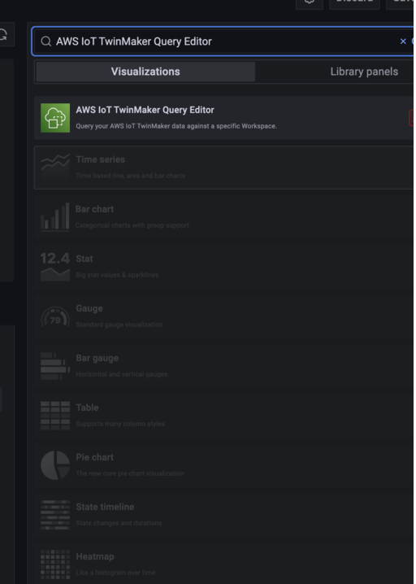
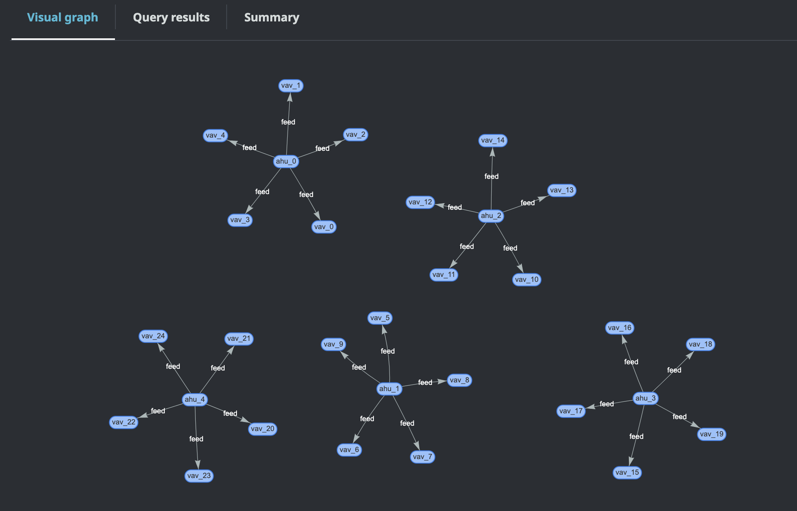
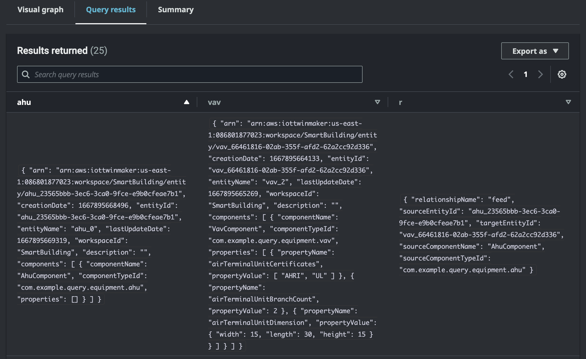
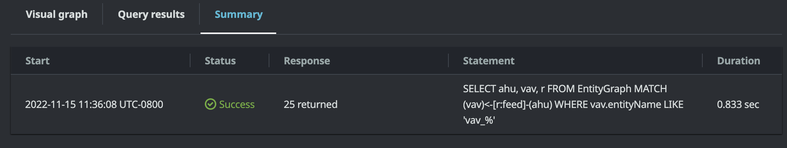

# How to use AWS IoT TwinMaker knowledge graph with Grafana

This section shows you how to add a query editor panel to your AWS IoT TwinMaker Grafana dashboard
to run and display queries.

## AWS IoT TwinMaker query editor prerequisites

Before you use the AWS IoT TwinMaker knowledge graph in Grafana, complete the following prerequisites:

- Create an AWS IoT TwinMaker workspace. You can create a workspace in the
  [AWS IoT TwinMaker console](https://console.aws.amazon.com/iottwinmaker/ "https://console.aws.amazon.com/iottwinmaker/").
- Configure AWS IoT TwinMaker for use with Grafana. For instructions, see
  [AWS IoT TwinMaker
  Grafana dashboard integration](grafana-integration.md "grafana-integration.md").

###### Note

To use the AWS IoT TwinMaker knowledge graph, you need to be in either the
**standard** or **tiered bundle** pricing
modes. For more information, see [Switch AWS IoT TwinMaker pricing modes](tm-pricing-mode.md "tm-pricing-mode.md").

## AWS IoT TwinMaker query editor permissions

To use the AWS IoT TwinMaker query editor in Grafana, you must have an IAM role
with permission for the action `iottwinmaker:ExecuteQuery`. Add that
permission to your workspace dashboard role, as shown in this example:

JSON

```
`{
 "Version":"2012-10-17",
 "Statement": [
 {
 "Effect": "Allow",
 "Action": [
 "s3:GetObject"
 ],
 "Resource": [
 "arn:aws:s3:::`amzn-s3-demo-bucket`",
 "arn:aws:s3:::`amzn-s3-demo-bucket`/*"
 ]
 },
 {
 "Effect": "Allow",
 "Action": [
 "iottwinmaker:GetEntity",
 "iottwinmaker:ListEntities",
 "iottwinmaker:ExecuteQuery"
 ],
 "Resource": [
 "arn:aws:iottwinmaker:`us-east-2`:`111122223333`:workspace/`workspaceId`",
 "arn:aws:iottwinmaker:`us-east-2`:`111122223333`:workspace/`workspaceId`/*"
 ]
 },
 {
 "Effect": "Allow",
 "Action": "iottwinmaker:ListWorkspaces",
 "Resource": "*"
 }
 ]
}`

```

###### Note

When you configure your AWS IoT TwinMaker Grafana data source, make sure to use the role
with this permission for the **Assume role ARN** field. After you add it,
you can select your workspace from the dropdown next to **Workspace**.

For more information, see [Creating a dashboard IAM role](dashboard-IAM-role.md#dashboard-IAM-role.title "dashboard-IAM-role.md#dashboard-IAM-role.title").

### Set up the AWS IoT TwinMaker query editor panel

###### To set up a new Grafana dashboard panel for knowledge graph

1. Open your AWS IoT TwinMaker Grafana dashboard.
2. Create a new **dashboard panel**. For detailed steps
   on how to create a panel, see [Create a dashboard](https://grafana.com/docs/grafana/latest/dashboards/build-dashboards/create-dashboard/ "https://grafana.com/docs/grafana/latest/dashboards/build-dashboards/create-dashboard/") in the Grafana documentation.
3. From the list of visualizations, select **AWS IoT TwinMaker Query Editor**.

 4. Select the data source to run queries against. 5. **(Optional)** Add a name for the new panel in the
provided field. 6. Select **Apply** to save and confirm your new panel.

The knowledge graph panel works in a similar way as the query editor provided in
the AWS IoT TwinMaker console. You can run, write, and clear queries you make in the
panel. For more information on how to write queries, see [AWS IoT TwinMaker knowledge graph additional
resources](tm-knowledge-graph-resources.md "tm-knowledge-graph-resources.md").

#### How to use the AWS IoT TwinMaker query editor

The results of your queries are displayed in three ways, as shown in the
following images: visualized in a graph, listed in a table, or presented as
a run summary.

- **Graph visualization:**



The visual graph only displays data for queries that have at least one
relation in the result. The graph displays entities as nodes and relationships
as directed edges in the graph.

- **Tabular data:**



The tabular data format displays the data for all queries. You can
search the table for specific results or subsets of the results. The
data can be exported in JSON or CSV format.

- **Run summary**



The run summary displays the query and metadata about the status
of the query.
