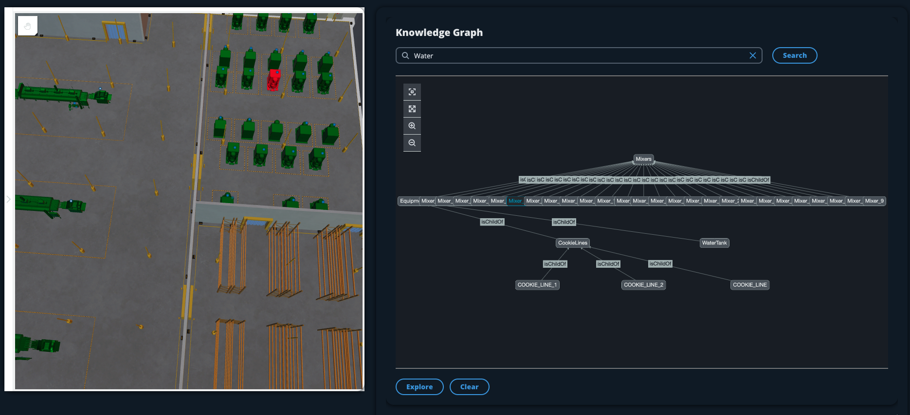
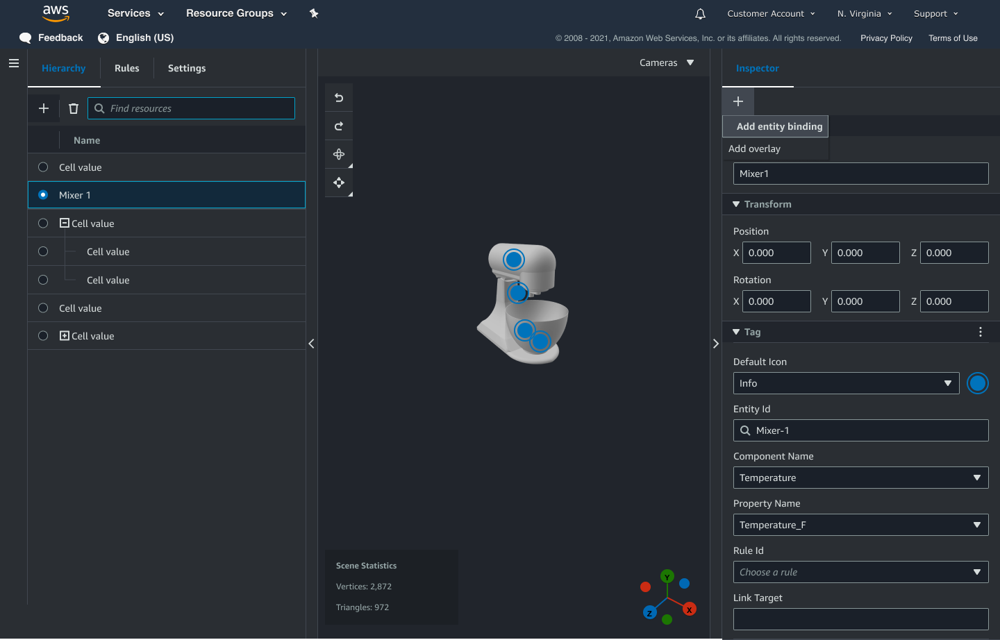
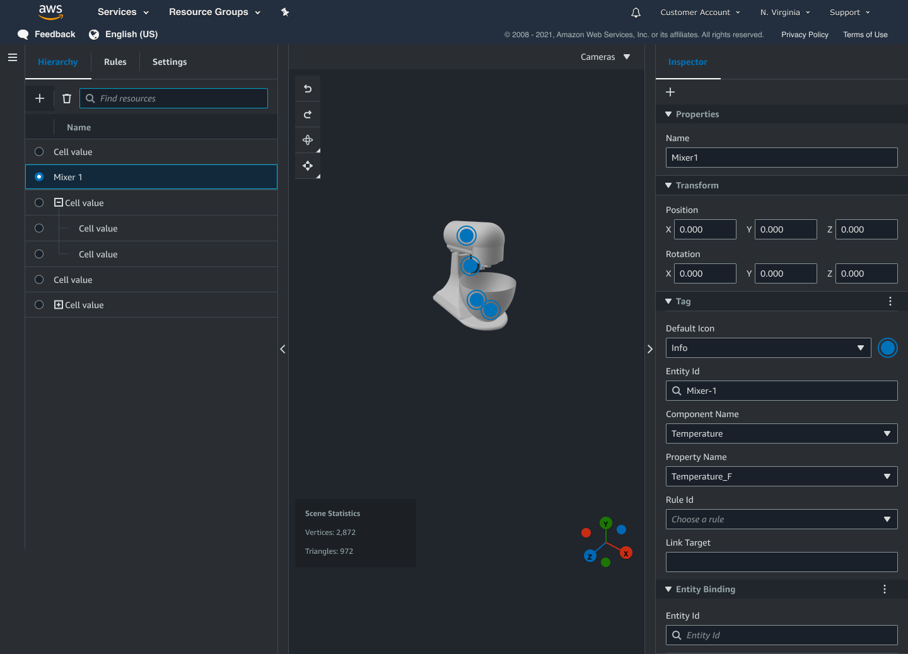
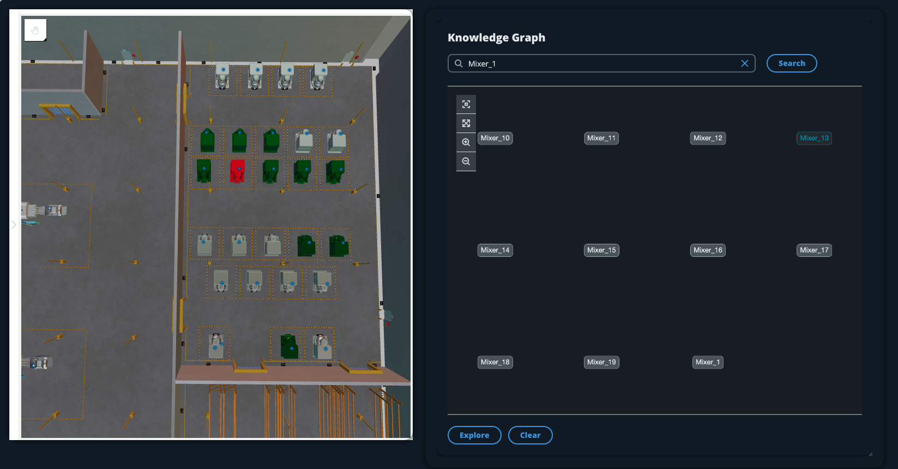
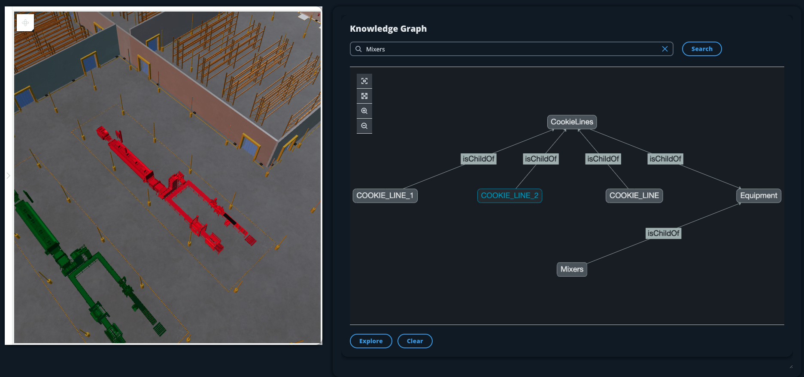

# Knowledge graph scene integration

You can use AWS IoT app kit components to build a web application that integrates knowledge graph
into your AWS IoT TwinMaker scenes. This allows you to generate graphs based on the 3D nodes (the 3D models
which represent your equipment or systems) that are present within your scene. To create an
application that graphs 3D nodes from your scene, first bind the 3D nodes to entities in your
workspace. With this mapping, AWS IoT TwinMaker graphs the relationships between the 3D models present
in your scene and the entities in your workspace. Then you can create a web application, select
3D models with your scene, and explore their relationships to other entities in a graph format.

For an example of a working web application that utilizes the AWS IoT app kit components to
generate graphs in an AWS IoT TwinMaker scene, see the [AWS IoT TwinMaker sample react app](https://github.com/awslabs/iot-app-kit/blob/3DKG_Demo/examples/react-app/src/components/index.tsx "https://github.com/awslabs/iot-app-kit/blob/3DKG_Demo/examples/react-app/src/components/index.tsx") on github.

## AWS IoT TwinMaker scene graph prerequisites

Before you create a web app that uses AWS IoT TwinMaker knowledge graph in your scenes, complete the
following prerequisites:

- Create an AWS IoT TwinMaker workspace. You can create a workspace in the
  [AWS IoT TwinMaker console](https://console.aws.amazon.com/iottwinmaker/ "https://console.aws.amazon.com/iottwinmaker/").
- Become familiar with AWS IoT TwinMaker's entity-component system and how to create
  entities. For more information, see [Create your first entity](twinmaker-gs-entity.md "twinmaker-gs-entity.md").
- Create an AWS IoT TwinMaker scene populated with 3D models.
- Become familiar with AWS IoT TwinMaker's AWS IoT app kit components. For more information
  on the AWS IoT TwinMaker components, see [Create a customized web application using AWS IoT TwinMaker UI Components](tm-app-kit.md "tm-app-kit.md").
- Become fimalliar with knowledge graph concepts and key terminology. See
  [AWS IoT TwinMaker knowledge graph core concepts](tm-knowledge-graph.md#tm-knowledge-graph-concepts "tm-knowledge-graph.md#tm-knowledge-graph-concepts").

###### Note

To use the AWS IoT TwinMaker knowledge graph and any related features, you need to be
in either the **standard** or **tiered bundle** pricing
modes. For more information on AWS IoT TwinMaker pricing, see [Switch AWS IoT TwinMaker pricing modes](tm-pricing-mode.md "tm-pricing-mode.md").

## Bind 3D nodes in your scene

Before you create a web app that integrates knowledge graph with your scene, bind
the 3D models, referred to as 3D nodes, that are present in your scene to the associated
workspace entity. For example, if you have a model of mixer equipment in a scene, and a
corresponding entity called `mixer_0`, create a **data binding**
between the model of the mixer and the entity representing the mixer– so that the
model and entity can be graphed.

###### To perform a data binding action

1. Log in to the [AWS IoT TwinMaker console](https://console.aws.amazon.com/iottwinmaker/ "https://console.aws.amazon.com/iottwinmaker/").
2. Open your workspace and select a scene with the 3D nodes you wish to bind.
3. Select a node (3D model) in the scene composer. When you select a node, it
   will open an inspector panel on the right side of the screen.
4. In the inspector panel, navigate to the top of the panel and select the
   **+** button. Then choose the **Add entity binding**
   option. This will open a drop-down where you can select an entity to bind to your
   currently selected node.

 5. From the data binding drop-down menu, select the entity id you want to map
to the 3D model. For the **Component name** and
**Property name** fields, select the components and properties you
want to bind.

Once you have made selections for the **Entity Id**,
**Component Name** and **Property Name** fields,
the binding is complete. 6. Repeat this process for all models and entities you want to graph.

###### Note

The same data binding operation can be performed on your scene tags,
simply select a tag instead of an entity and follow the same process to bind
the tag to a node.

## Create a web application

After you bind your entities, use the AWS IoT app kit library to build a web app with
a knowledge graph widget that lets you view your scene and explore the relationships
between your scene nodes and entities.

Use the following resources to create your own app:

- The AWS IoT TwinMaker sample react app github [Readme](https://github.com/awslabs/iot-app-kit/blob/3DKG_Demo/examples/react-app/README.md "https://github.com/awslabs/iot-app-kit/blob/3DKG_Demo/examples/react-app/README.md") documentation.
- The AWS IoT TwinMaker sample react app [source](https://github.com/awslabs/iot-app-kit/blob/3DKG_Demo/examples/react-app/src/components/index.tsx "https://github.com/awslabs/iot-app-kit/blob/3DKG_Demo/examples/react-app/src/components/index.tsx") on github.
- The AWS IoT app kit [Getting started](https://awslabs.github.io/iot-app-kit/?path=/docs/overview-getting-started--docs "https://awslabs.github.io/iot-app-kit/?path=/docs/overview-getting-started--docs") documentation.
- The AWS IoT app kit [Video Player component](https://awslabs.github.io/iot-app-kit/?path=/docs/components-videoplayer--docs "https://awslabs.github.io/iot-app-kit/?path=/docs/components-videoplayer--docs") documentation.
- The AWS IoT app kit [Scene Viewer
  component](https://awslabs.github.io/iot-app-kit/?path=/docs/components-sceneviewer--docs "https://awslabs.github.io/iot-app-kit/?path=/docs/components-sceneviewer--docs") documentation.

The following procedure demonstrates the functionality of the scene viewer component
in a web app.

###### Note

This procedure is based on the implementation of the AWS IoT app kit scene viewer
component in the AWS IoT TwinMaker sample react app.

1. Open the scene viewer component of the AWS IoT TwinMaker sample react app. In the
   search field type an entity name or partial entity name (case sensitive search) then
   select the **Search** button. If a model is bound to the entity id,
   then the model in the scene will be highlighted and a node of the entity will be shown
   in the scene viewer panel.

 2. To generate a graph of all relationships, select a node in the scene
viewer widget and select the **Explore** button.

 3. Press the **Clear** button to clear your current graph
selection and start over.
