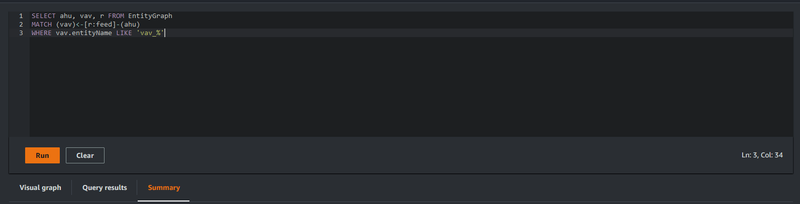
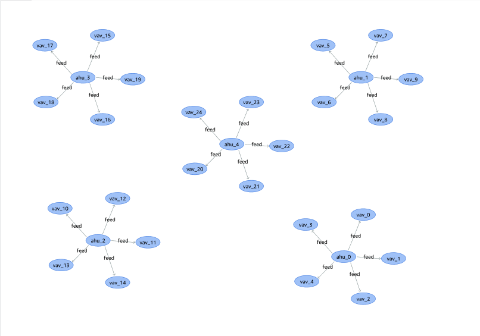

# How to Run AWS IoT TwinMaker knowledge graph queries

Before you use the AWS IoT TwinMaker knowledge graph, make sure you have completed the
following prerequisites:

- Create an AWS IoT TwinMaker workspace. You can create a workspace in the [AWS IoT TwinMaker console](https://console.aws.amazon.com/iottwinmaker/ "https://console.aws.amazon.com/iottwinmaker/").
- Become familiar with AWS IoT TwinMaker's entity-component system and how to create
  entities. For more information, see [Create your first entity](twinmaker-gs-entity.md "twinmaker-gs-entity.md").
- Become familiar with AWS IoT TwinMaker's data connectors. For more information,
  see [AWS IoT TwinMaker data connectors](data-connector-interface.md "data-connector-interface.md").

###### Note

In order to use the AWS IoT TwinMaker knowledge graph, you need to be in either the
**standard** or **tiered bundle** pricing modes. For
more information, see [Switch AWS IoT TwinMaker pricing modes](tm-pricing-mode.md "tm-pricing-mode.md").

The following procedures show you how to write, run, save, and edit queries.

**Open the query editor**

###### To navigate to the knowledge graph query editor

1. Open the [AWS IoT TwinMaker console](https://console.aws.amazon.com/iottwinmaker/ "https://console.aws.amazon.com/iottwinmaker/").
2. Open the workspace in which you wish to use knowledge graph.
3. In the left navigation menu, choose **Query editor**.
4. The query editor opens. You are now ready to run queries on
   your workspace's resources.

**Run a query**

###### To run a query and generate a graph

1. In the query editor, choose the **Editor** tab
   to open the syntax editor.
2. In the editor space, write the query you wish to run against
   your workspace's resources.



In the example shown, the request searches for entities that contain
`vav_%` in their name, then organizes these entities by the
`feed` relationship between them, using the following code.

```
SELECT ahu, vav, r FROM EntityGraph
MATCH (vav)<-[r:feed]-(ahu)
WHERE vav.entityName LIKE 'vav_%'
```

###### Note

The knowledge graph syntax uses [PartiQL](https://partiql.org/ "https://partiql.org/"). For information on
this syntax, see [AWS IoT TwinMaker knowledge graph additional
resources](tm-knowledge-graph-resources.md "tm-knowledge-graph-resources.md"). 3. Choose **Run query** to run the request you created.

A graph is generated based on your request.



The example graph shown above is based on the query example in
step 2. 4. The results of the query are also presented in a list. Choose
**results** to view the query results in a
list. 5. Optionally, choose **Export as** to export
the query results in JSON or CSV format.

This covers the basic use of knowledge graph in the console. For more information
and examples demonstrating the knowledge graph syntax, see [AWS IoT TwinMaker knowledge graph additional
resources](tm-knowledge-graph-resources.md "tm-knowledge-graph-resources.md").
