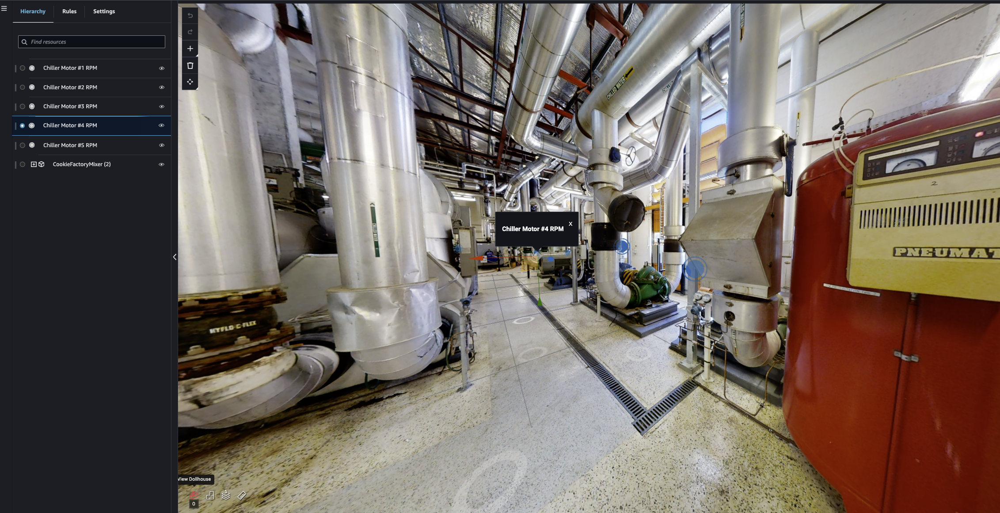
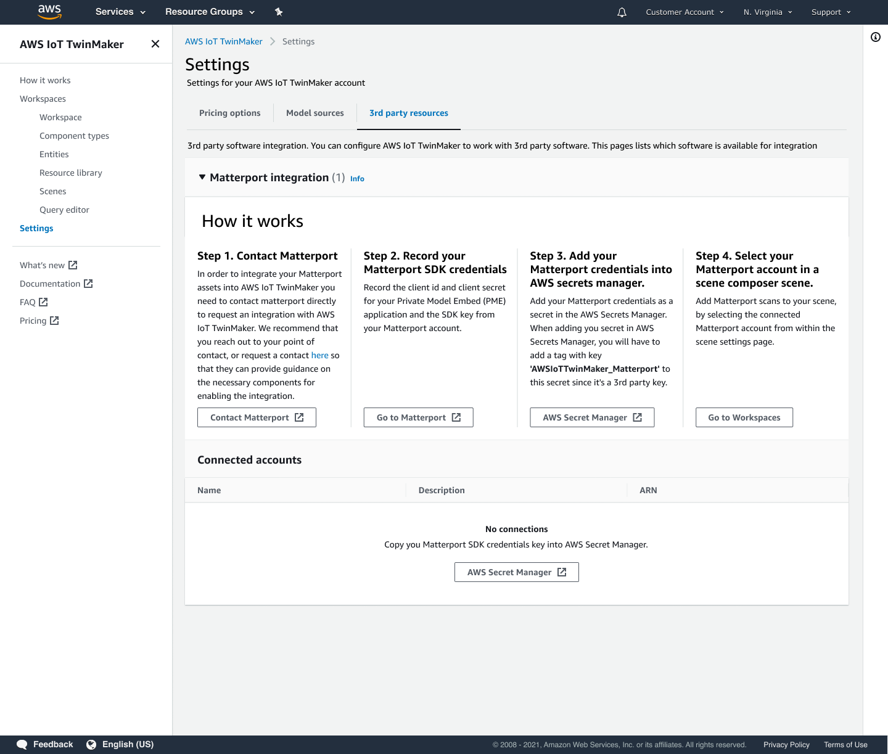
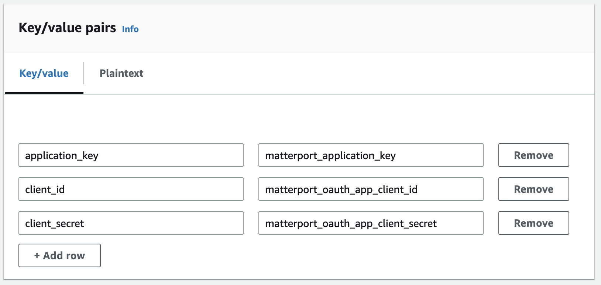
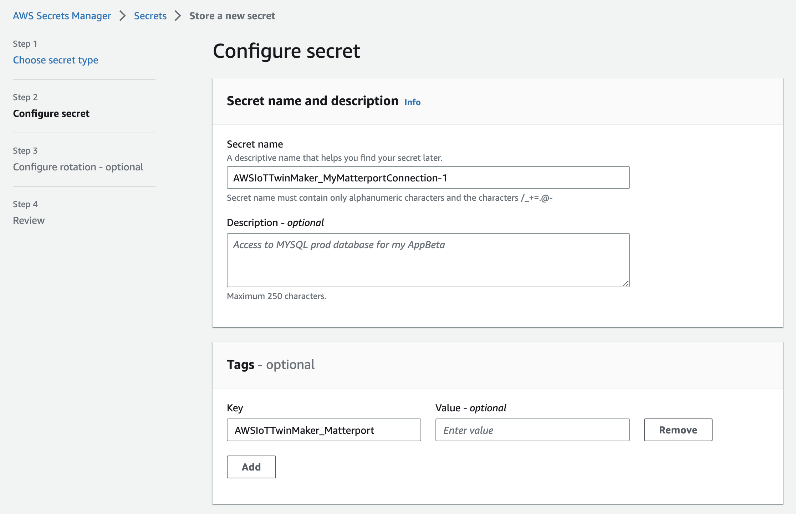
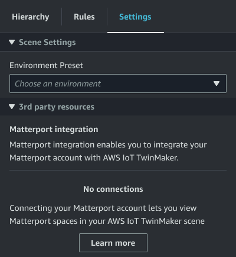

# AWS IoT TwinMaker Matterport integration

Matterport provides a variety of capture options to
scan real-world environments and create immersive 3D models, also known as Matterport digital twins.
These models are called Matterport spaces. AWS IoT TwinMaker
supports Matterport integration, allowing you to import your Matterport digital twins into your AWS IoT TwinMaker
scenes. By pairing Matterport digital twins with AWS IoT TwinMaker, you can visualize and monitor your
digital twin system in a virtual environment.


For more information about using Matterport, read Matterport's documentation on [AWS IoT TwinMaker and Matterport](https://matterport.com/partners/amazon-web-services "https://matterport.com/partners/amazon-web-services") page.

###### Integration topics

- [Integration overview](#tm-matterport-integration-overview "#tm-matterport-integration-overview")
- [Matterport integration prerequisites](#tm-matterport-integration-prereqs "#tm-matterport-integration-prereqs")
- [Generate and record your Matterport credentials](#tm-matterport-integration-sdk-key "#tm-matterport-integration-sdk-key")
- [Store your Matterport credentials in AWS Secrets Manager](#tm-matterport-integration-secrets "#tm-matterport-integration-secrets")
- [Import Matterport spaces into AWS IoT TwinMaker scenes](#tm-matterport-integration-tm-console "#tm-matterport-integration-tm-console")
- [Use Matterport spaces in your AWS IoT TwinMaker Grafana
  dashboard](#tm-matterport-grafana "#tm-matterport-grafana")
- [Use Matterport spaces in your AWS IoT TwinMaker web application](#tm-matterport-app-kit "#tm-matterport-app-kit")

## Integration overview

This integration enables you to do the following:

- Use your Matterport tags and spaces in the AWS IoT TwinMaker app kit.
- View your imported matterport data in your AWS IoT TwinMaker Grafana dashboard. For more information on using AWS IoT TwinMaker and Grafana, read the
  [Grafana dashboard integration](grafana-integration.md "grafana-integration.md") documentation.
- Import your Matterport spaces into your AWS IoT TwinMaker scenes.
- Select and import your Matterport tags that you'd like to bind to data in your AWS IoT TwinMaker scene.
- Automatically surface your Matterport space and tag changes in
  your AWS IoT TwinMaker scene and approve which to synchronize.

The integration process is comprised of 3 critical steps.

1. **[Generate and record your Matterport credentials](#tm-matterport-integration-sdk-key "#tm-matterport-integration-sdk-key")**
2. **[Store your Matterport credentials in AWS Secrets Manager](#tm-matterport-integration-secrets "#tm-matterport-integration-secrets")**
3. **[Import Matterport spaces into AWS IoT TwinMaker scenes](#tm-matterport-integration-tm-console "#tm-matterport-integration-tm-console")**

You start your integration in the [AWS IoT TwinMaker console](https://console.aws.amazon.com/iottwinmaker/ "https://console.aws.amazon.com/iottwinmaker/"). In the console's
**Settings** page, under **3rd party resources**,
open **Matterport integration** to navigate between the different
resources required for the integration.



## Matterport integration prerequisites

Before integrating Matterport with AWS IoT TwinMaker please make sure you meet the following
prerequisites:

- You have purchased an Enterprise-level [Matterport](https://my.matterport.com/ "https://my.matterport.com/") account and the
  Matterport products necessary for the AWS IoT TwinMaker integration.
- You have an AWS IoT TwinMaker workspace.
  For more information, see
  [Getting started with AWS IoT TwinMaker](twinmaker-gs.md "twinmaker-gs.md").
- You have updated your AWS IoT TwinMaker workspace role.
  For more information on creating a workspace role, see
  [Create and manage a service role for AWS IoT TwinMaker](twinmaker-gs-service-role.md "twinmaker-gs-service-role.md").

Add the following to your workspace role:

```
{
  "Effect": "Allow",
  "Action": "secretsmanager:GetSecretValue",
  "Resource": [
   "AWS Secrets Manager secret ARN"
  ]
}
```

- You must contact Matterport to configure the necessary licensing
  for enabling the integration. Matterport will also enable a Private Model Embed (PME) for the integration.

If you already have a Matterport account manager,
contact them directly.

Use the following procedure to contact Matterport and request an integration if you don’t have a Matterport point of contact:

    1. Open the
     **[Matterport and AWS IoT TwinMaker](https://matterport.com/partners/amazon-web-services "https://matterport.com/partners/amazon-web-services")** page.
    2. Press the **Contact us** button, to open the contact form.
    3. Fill out the required information on the form.
    4. When you're ready, choose **SAY HELLO** to send your request to
     Matterport.

Once you have requested integration, you can generate the required Matterport SDK
and Private Model Embed (PME) credentials needed to continue the integration process.

###### Note

This may involve you incurring a fee for purchasing new products or services.

## Generate and record your Matterport credentials

To integrate Matterport with AWS IoT TwinMaker, you must provide AWS Secrets Manager
with Matterport credentials. Use the following procedure to generate the Matterport SDK
credentials.

1. Log in to your [Matterport
   account](https://authn.matterport.com "https://authn.matterport.com").
2. Navigate to your account settings page.
3. Once in the settings page, select the **Developer tools** option.
4. On the **Developer tools** page, go to the
   **SDK Key Management** section.
5. Once in the **SDK Key Management** section, select the option to add a new SDK key.
6. Once you have the Matterport SDK key, add domains to the key for AWS IoT TwinMaker and your Grafana
   server. If you are using the AWS IoT TwinMaker app kit, then make sure to add your custom domain as
   well.
7. Next, find the **Application integration Management** section, you should see
   your **PME application listed**. Record the following
   information:
   - The **Client ID**
   - The **Client Secret**

###### Note

Since the **Client Secret** is only presented to you once, we strongly
recommend that you record your **Client Secret**. You must
present your **Client Secret** in the
AWS Secrets Manager console to continue with the Matterport
integration.

These credentials are automatically created when you have purchased the
necessary components and the PME for your account has been enabled by
Matterport. If these credentials do not appear, contact Matterport. To request
contact, see the **[Matterport and
AWS IoT TwinMaker](https://matterport.com/partners/amazon-web-services "https://matterport.com/partners/amazon-web-services")** contact form.

For more information on Matterport SDK credentials, see Matterport's official SDK documentation [SDK Docs Overview](https://matterport.github.io/showcase-sdk/index.html "https://matterport.github.io/showcase-sdk/index.html").

## Store your Matterport credentials in AWS Secrets Manager

Use the following procedure to store your Matterport credentials in AWS Secrets Manager.

###### Note

You need the **Client Secret** created from the procedure in the [Generate and record your Matterport credentials](#tm-matterport-integration-sdk-key "#tm-matterport-integration-sdk-key") topic to continue with the
Matterport integration.

1.  Log in to the AWS Secrets Manager console.
2.  Navigate to the **Secrets** page and select
    **Store a new secret**.
3.  For the **Secret type**, select **Other type of
    secret**.
4.  In the **Key/value pairs** section, add in the following key-value pairs, with your Matterport credentials as the values:

        * Create a key-value pair, with **Key:**
        `application_key`, and **Value:**
        `<your Matterport credentials>`.
        * Create a key-value pair, with **Key:**
        `client_id`, and **Value:**
        `<your Matterport credentials>`.
        * Create a key-value pair, with **Key:**
        `client_secret`, and **Value:**
        `<your Matterport credentials>`.

    When completed, you should have a configuration similar to the following example:

 5. For the **Encryption key**, you can leave the default encryption key
`aws/secretsmanager` selected. 6. Choose **Next** to move on to the **Configure secret**
page. 7. Fill out the field for **Secret name** and the
**Description**. 8. Add a tag to this secret in the **Tags** section.

When creating the tag, assign the key as
`AWSIoTTwinMaker_Matterport` as shown in the following screenshot:



###### Note

You must add a tag. Tags are required when adding 3rd party secrets into
AWS Secrets Manager, despite **Tags** being
listed as optional.

The **Value** field is optional. Once you have provided a
**Key**, you can select **Add** to move on to the next step. 9. Choose **Next** to move on to the **Configure rotation**
page. Setting up a secret rotation is optional. If you wish to finish adding
your secret and don’t need a rotation, choose **Next**
again. For more information on secret rotation, see
[Rotate AWS Secrets Manager secrets](../../../secretsmanager/latest/userguide/rotating-secrets.md "../../../secretsmanager/latest/userguide/rotating-secrets.md"). 10. Confirm your secret configuration on the **Review** page. Once you're ready
to add your secret, choose **Store**.

For more information about using AWS Secrets Manager, see the following
AWS Secrets Manager documentation:

- [Create and manage secrets with AWS Secrets Manager](../../../secretsmanager/latest/userguide/managing-secrets.md "../../../secretsmanager/latest/userguide/managing-secrets.md")
- [What is AWS Secrets Manager?](../../../secretsmanager/latest/userguide/intro.md "../../../secretsmanager/latest/userguide/intro.md")
- [Rotate AWS Secrets Manager secrets](../../../secretsmanager/latest/userguide/rotating-secrets.md "../../../secretsmanager/latest/userguide/rotating-secrets.md")

Now you are ready to import your Matterport assets into AWS IoT TwinMaker scenes. See the procedure in the following section, [Import Matterport spaces into AWS IoT TwinMaker scenes](#tm-matterport-integration-tm-console "#tm-matterport-integration-tm-console")

## Import Matterport spaces into AWS IoT TwinMaker scenes

Add Matterport scans to your scene by selecting the connected Matterport account from
within the scene settings page. Use the following procedure to import your Matterport
scans and tags:

1. Log in to the [AWS IoT TwinMaker console](https://console.aws.amazon.com/iottwinmaker/ "https://console.aws.amazon.com/iottwinmaker/").
2. Create or open an existing AWS IoT TwinMaker scene in which you want to use a Matterport space.
3. Once the scene has opened, navigate to the **Settings** tab.
4. In **Settings**, under **3rd party resources**, find the
   **Connection name** and enter the secret you created in the procedure from
   [Store your Matterport credentials in AWS Secrets Manager](#tm-matterport-integration-secrets "#tm-matterport-integration-secrets").

.png)

###### Note

If you see a message that states **No connections**, navigate to the [AWS IoT TwinMaker console](https://console.aws.amazon.com/iottwinmaker/ "https://console.aws.amazon.com/iottwinmaker/")
settings page to begin the process for Matterport integration.

 5. Next, choose the Matterport space you'd like to use in your scene by selecting it in the
**Matterport space** drop-down.

.png) 6. After selecting a space, you can import your Matterport tags and convert them to AWS IoT TwinMaker scene
tags by pressing the **Import tags** button.

.png)

After you have imported Matterport tags, the button is replaced by an
**Update tags** button. You can continually update your Matterport tags
in AWS IoT TwinMaker so that they always reflect the most recent changes in your Matterport account.

.png) 7. You have successfully integrated AWS IoT TwinMaker with Matterport, and now your AWS IoT TwinMaker scene has both
your imported Matterport space and tags. You can work within this scene as you
would with any other AWS IoT TwinMaker scene.

For more information on working with AWS IoT TwinMaker scenes, see [Creating and editing AWS IoT TwinMaker scenes](scenes.md "scenes.md").

## Use Matterport spaces in your AWS IoT TwinMaker Grafana

dashboard

Once you have imported your Matterport space into an AWS IoT TwinMaker scene, you can view that
scene with the Matterport space in your Grafana dashboard. If you have already
configured Grafana with AWS IoT TwinMaker, then you can simply open the Grafana dashboard to view
your scene with the imported Matterport space.

If you have not configured AWS IoT TwinMaker with Grafana yet, complete the Grafana integration
process first. You have two choices when integrating AWS IoT TwinMaker with Grafana. You can use a
self-managed Grafana instance or you can use Amazon Managed Grafana.

See the following documentation to learn more about the Grafana options and
integration process:

- [AWS IoT TwinMaker Grafana
  dashboard integration](grafana-integration.md "grafana-integration.md").
- [Amazon Managed Grafana](amazon-managed-grafana.md "amazon-managed-grafana.md").
- [Self-managed
  Grafana](self-managed-grafana.md "self-managed-grafana.md").

## Use Matterport spaces in your AWS IoT TwinMaker web application

Once you have imported your Matterport space into an AWS IoT TwinMaker scene, you can view that
scene with the Matterport space in your AWS IoT app kit web application.

See the following documentation to learn more about using the AWS IoT application kit:

- To learn more about using AWS IoT TwinMaker with the AWS IoT app kit, see [Create a customized web application using AWS IoT TwinMaker UI Components](tm-app-kit.md "tm-app-kit.md").
- To learn more about using AWS IoT application kit, please visit
  [AWS IoT Application
  kit Github](https://github.com/awslabs/iot-app-kit "https://github.com/awslabs/iot-app-kit") page.
- For instructions on how to start a new web application using AWS IoT application kit,
  please visit the official [IoT App
  Kit](https://awslabs.github.io/iot-app-kit/?path=/docs/introduction--docs "https://awslabs.github.io/iot-app-kit/?path=/docs/introduction--docs") documentation page.
