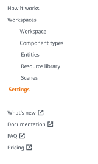
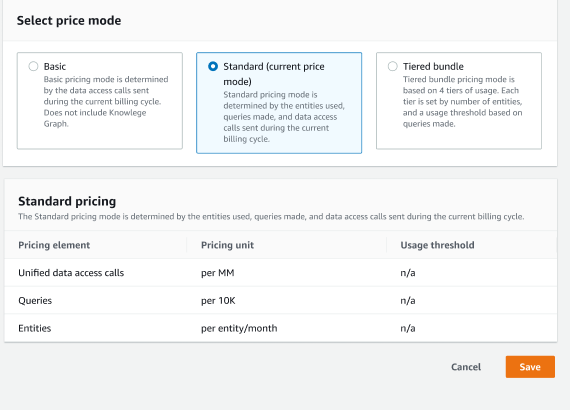

# Switch AWS IoT TwinMaker pricing modes

AWS IoT TwinMaker currently has three pricing modes, basic, standard or tiered bundle.
Standard pricing mode is set as the default pricing mode.

You can switch from the usage-based to the tiered-based pricing mode at any time, but
the change takes effect at the beginning of your next billing cycle. Once you have
switched from usage-based to the tiered-based pricing mode, you cannot switch back to
the usage-based pricing mode for the next three usage cycles. If you switch from basic
to standard, the change is effective immediately. For details and cost information, see
[AWS IoT TwinMaker
Pricing](https://aws.amazon.com/iot-twinmaker/pricing/ "https://aws.amazon.com/iot-twinmaker/pricing/")

This procedure shows you how to switch your pricing mode in the [AWS IoT TwinMaker console](https://console.aws.amazon.com/iottwinmaker/ "https://console.aws.amazon.com/iottwinmaker/"):

1. Open the [AWS IoT TwinMaker console](https://console.aws.amazon.com/iottwinmaker/ "https://console.aws.amazon.com/iottwinmaker/").
2. In the left navigation pane, select **Settings**. The
   **Pricing** page opens.

 3. Choose **Change price mode**. 4. Select either the **Standard** or **Tiered bundle** modes,
as shown in the following screenshot.

 5. Choose **Save** to confirm your new pricing mode. 6. You have now changed your pricing mode.

###### Note

You can switch from the usage-based to the tiered-based pricing mode at any time, but
the change takes effect at the beginning of your next billing cycle. Once you have
switched from usage-based to the tiered-based pricing mode, you cannot switch back to
the usage-based pricing mode for the next three usage cycles. If you switch from basic to standard, the change is effective immediately.
