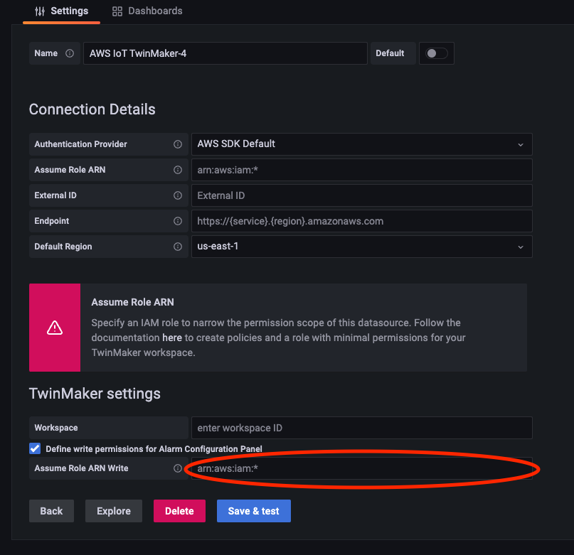
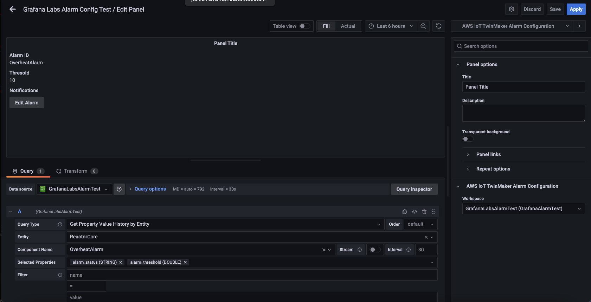
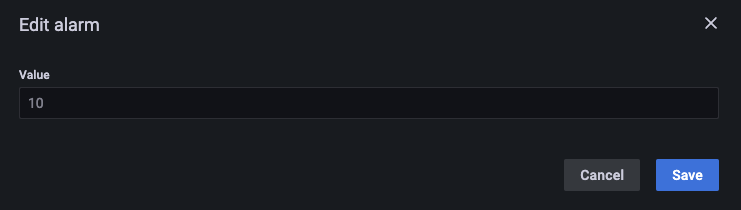

# Connect AWS IoT SiteWise Alarms to AWS IoT TwinMaker Grafana dashboards

###### Note

This feature is in **public preview** and is subject to change.

AWS IoT TwinMaker is able import AWS IoT SiteWise and Events alarms into AWS IoT TwinMaker components.
This allows you to be able to query alarm status and configure alarm thresholds without implementing
a custom data connector for AWS IoT SiteWise data migration. You can use the AWS IoT TwinMaker
Grafana plugin to visualize the alarm status and configure the alarm threshold in Grafana, without
making API calls to AWS IoT TwinMaker or interacting directly with AWS IoT SiteWise alarms.

###### Note

End of support notice: On May 20, 2026, AWS
will end support for AWS IoT Events. After May 20, 2026, you will no longer be able to access the AWS IoT Events console or AWS IoT Events resources. For more information, see [AWS IoT Events end of support](../../../iotevents/latest/developerguide/iotevents-end-of-support.md "../../../iotevents/latest/developerguide/iotevents-end-of-support.md").

## AWS IoT SiteWise alarm configuration prerequisites

Before creating alarms and integrating them into your Grafana dashboard, make sure you have
reviewed the following prerequisites:

- Become familiar with AWS IoT SiteWise's model and asset system. For more information,
  see [Creating
  asset models](../../../iot-sitewise/latest/userguide/create-asset-models.md "../../../iot-sitewise/latest/userguide/create-asset-models.md") and [Creating assets](../../../iot-sitewise/latest/userguide/create-assets.md "../../../iot-sitewise/latest/userguide/create-assets.md") in the _AWS IoT SiteWise User Guide_.
- Become familiar with the IoT Events alarm models and how to attach them to an
  AWS IoT SiteWise model. For more information, see [Defining AWS IoT Events alarms](../../../iot-sitewise/latest/userguide/define-iot-events-alarms.md "../../../iot-sitewise/latest/userguide/define-iot-events-alarms.md")
  in the _AWS IoT SiteWise User Guide_.
- Integrate AWS IoT TwinMaker with Grafana so you can access your AWS IoT TwinMaker resources in Grafana.
  For more information see, [AWS IoT TwinMaker
  Grafana dashboard integration](grafana-integration.md "grafana-integration.md").

## Define the AWS IoT SiteWise alarm component IAM role

AWS IoT TwinMaker uses the workspace IAM role to query and configure the alarm threshold in Grafana.
The following permissions are required in the AWS IoT TwinMaker workspace role,
in order to interact with AWS IoT SiteWise alarms in Grafana:

```
{
"Effect": "Allow",
    "Action": [
        "iotevents:DescribeAlarmModel",
    ],
    "Resource": ["{`IoTEventsAlarmModelArn`}"]
},{
"Effect": "Allow",
    "Action": [
        "iotsitewise:BatchPutAssetPropertyValue"
    ],
    "Resource": ["{`IoTSitewiseAssetArn`}"]
}
```

In the [AWS IoT TwinMaker console](https://console.aws.amazon.com/iottwinmaker/ "https://console.aws.amazon.com/iottwinmaker/"), create an entity that represents your AWS IoT SiteWise asset.
Make sure you add a component for that entity using `com.amazon.iotsitewise.alarm` as the
component type, and pick the corresponding asset and alarm models.

.png>)

The above screenshot is example of creating this entity with the type `com.amazon.iotsitewise.alarm`.

When you create this component, AWS IoT TwinMaker automatically imports the related alarm properties from
AWS IoT SiteWise and AWS IoT Events. You can the repeat this alarm component type pattern
to create alarm components for all the assets needed in your workspace.

## Query and update through the AWS IoT TwinMaker API

After creating alarm components, you can query the alarm status,
threshold, and update alarm thresholds through the AWS IoT TwinMaker API.

Below is a sample request to query alarm status:

```
aws iottwinmaker get-property-value-history --cli-input-json \
'{
    "workspaceId": "{workspaceId}",
    "entityId": "{entityId}",
    "componentName": "{componentName}",
    "selectedProperties": ["alarm_status"],
    "startTime": "{startTimeIsoString}",
    "endTime": "{endTimeIsoString}"
}'
```

Below is a sample request to query the alarm threshold.

```
aws iottwinmaker get-property-value-history --cli-input-json \
'{
    "workspaceId": "{workspaceId}",
    "entityId": "{entityId}",
    "componentName": "{componentName}",
    "selectedProperties": ["alarm_threshold"],
    "startTime": "{startTimeIsoString}",
    "endTime": "{endTimeIsoString}"
}'
```

Below is a sample request to update the alarm threshold:

```
aws iottwinmaker batch-put-property-values --cli-input-json \
'{
    "workspaceId": "{workspaceId}",
    "entries": [
        {
            "entityPropertyReference": {
                "entityId": "{entityId}",
                "componentName": "{componentName}",
                "propertyName": "alarm_threshold"
            },
            "propertyValues": [
                {
                    "value": {
                        "doubleValue": "{newThreshold}"
                    },
                    "time": "{effectiveTimeIsoString}"
                }
            ]
        }
    ]
}'
```

## Configure your Grafana dashboard for alarms

A second write enabled dashboard IAM role needs to be created , that is a normal role but with permission for the action `iottwinmaker:BatchPutPropertyValues` to add to the TwinMaker workspace arn like in the example below.

JSON

```
`{
 "Version":"2012-10-17",
 "Statement": [
 {
 "Effect": "Allow",
 "Action": [
 "iottwinmaker:Get*",
 "iottwinmaker:List*",
 "iottwinmaker:BatchPutPropertyValues"
 ],
 "Resource": [
 "arn:aws:s3:::`amzn-s3-demo-bucket`",
 "arn:aws:s3:::`amzn-s3-demo-bucket`/*"
 ]
 },
 {
 "Effect": "Allow",
 "Action": "iottwinmaker:ListWorkspaces",
 "Resource": "*"
 }
 ]
}`

```

Alternatively you can add this statement at the end of your IAM role instead:

```
{
    "Effect": "Allow",
    "Action": [
        "iottwinmaker:BatchPutPropertyValues"
    ],
    "Resource": [
        "{workspaceArn}",
        "{workspaceArn}/*"
    ]
}
```

The datasource needs to have it’s write arn set with the dashboard write role you created.

After you modify your IAM role, login into your Grafana dashboard to assume the updated role arn.
Select the checkbox for **Define write permissions for Alarm Configuration Panel**
and copy in the arn for the Write role.



## Use Grafana dashboard for alarm visualization

Use the following procedure to
add an alarm configuration panel to your dashboard and configure it:
:

1. Select the workspace in the panel options.
2. Set your datasource in the query configuration.
3. Use the following query type: `Get Property Value History by Entity`.
4. Select an entity or entity variable, you wish to add an alarm to.
5. Once you have selected the entity, select a component or component variable, to apply a property to.
6. For the property, choose: `alarm_status` and `alarm_threshold`.

When it's connected you should see the Id for the alarm Id and it’s current threshold.

###### Note

For the public preview, no notifications are shown. You should review your alarm status and
threshold to make sure the properties were applied correctly. 7. The default Query Order of Ascending should be used so the latest value shows. 8. The filter section of the Query can be left empty. A complete configuration is pictured below:

 9. By using the **Edit Alarm** button you can bring up a
dialog to change the current alarm threshold. 10. Select **Save** to set the new threshold value.



###### Note

This panel should only be used with a live time range that includes the present.
Using it with time ranges that end and start in the past may show unexpected values
when editing alarm thresholds as the current threshold always.
