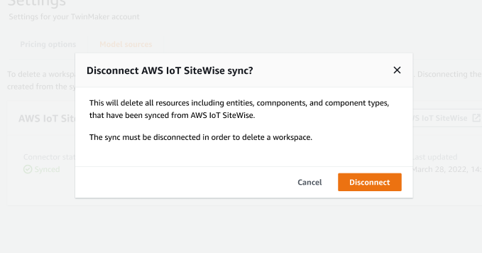

# Delete a sync job

Use the following procedure to delete a sync job.

###### Important

See [Differences between custom and default
workspaces](tm-sw-default-ws-diffs.md "tm-sw-default-ws-diffs.md") for information about the differences
between the custom and default workspaces.

1. Navigate to the [AWS IoT TwinMaker console](https://console.aws.amazon.com/iottwinmaker/ "https://console.aws.amazon.com/iottwinmaker/").
2. Open the workspace from which you wish to delete the sync job.
3. Under **Entity model sources**, select the
   AWS IoT SiteWise source to open the source details page.
4. To stop the sync job, choose **Disconnect**. Confirm your
   choice to fully delete the sync job.

Once a sync job is deleted, you can create the sync job again in the same or a
different workspace.

You can't delete a workspace if there are any sync jobs in that workspace. Delete the
sync jobs first before deleting a workspace.

If there are any errors during the deletion of the sync job, the sync job remains in
the `DELETING` state and is automatically retried. You can now manually
delete any of the synced entities or component types if there is any error related to
deleting a resource.

###### Note

Any resources that were synced from AWS IoT SiteWise are deleted first,
then the sync job itself is deleted.
