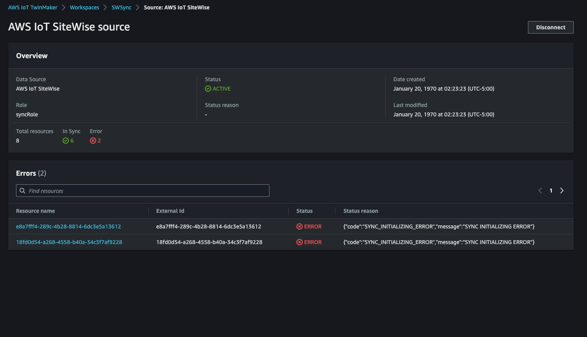

# Analyze sync status and errors

This topic provides guidance on how to analyze sync errors and statuses.

###### Important

See [Differences between custom and default
workspaces](tm-sw-default-ws-diffs.md "tm-sw-default-ws-diffs.md") for information about the differences
between the custom and default workspaces.

## Sync job statuses

A sync job has one of the following statuses depending on its state.

- The sync job `CREATING` state means the job is checking for
  permissions and loading data from AWS IoT SiteWise to prepare the
  sync.
- The sync job `INITIALIZING` state means all the existing
  resources in AWS IoT SiteWise are synced to AWS IoT TwinMaker. This step can
  take longer to complete if the user has a large number of assets and asset
  models in AWS IoT SiteWise. You can monitor the number of
  resources that have been synced by checking on the sync job in the
  [AWS IoT TwinMaker console](https://console.aws.amazon.com/iottwinmaker/ "https://console.aws.amazon.com/iottwinmaker/"), or by calling the `ListSyncResources`
  API.
- The sync job `ACTIVE` state means the initialization step is
  done. The job is now ready to sync any new updates from
  AWS IoT SiteWise.
- The sync job `ERROR` state indicates an error with any of the
  preceding states. Review the error message. There may be an issue with the
  IAM role setup. If you want to use a new IAM role, delete the sync job
  that had the error and create a new one with the new role.

Sync errors appear in the model source page, which is accessed from the
**Entity model sources** table in your workspace. The model source
page displays a list of resources that failed to sync. Most errors are automatically
retried by the sync job, but if the resource requires an action, then it remains in the
`ERROR` state. You can also obtain a list of errors by using the [ListSyncResources](../apireference/API_ListSyncResources.md "../apireference/API_ListSyncResources.md") API.

To see all the listed errors for the current source, use the following
procedure.

1. Navigate to your workspace in the [AWS IoT TwinMaker console](https://console.aws.amazon.com/iottwinmaker/ "https://console.aws.amazon.com/iottwinmaker/").
2. Select the AWS IoT SiteWise source listed in the **Entity
   model sources** modal to open the asset sync details page.

 3. As shown in the preceding screenshot, any resources with persisting errors are
listed in the **Errors** table. You can use this table to
track down and fix errors related to specific resources.
Possible errors include the following:

- While AWS IoT SiteWise supports duplicate asset names, AWS IoT TwinMaker only supports
  them at the `ROOT` level, not under the same parent entity. If you have two
  assets with the same name under a parent entity in AWS IoT SiteWise, one of
  them fails to sync. To fix this error, either delete one of the assets or move one
  under a different parent asset in AWS IoT SiteWise before you sync.
- If you already have an entity with the same ID as the AWS IoT SiteWise
  asset ID, that asset fails to sync until you delete the existing entity.
