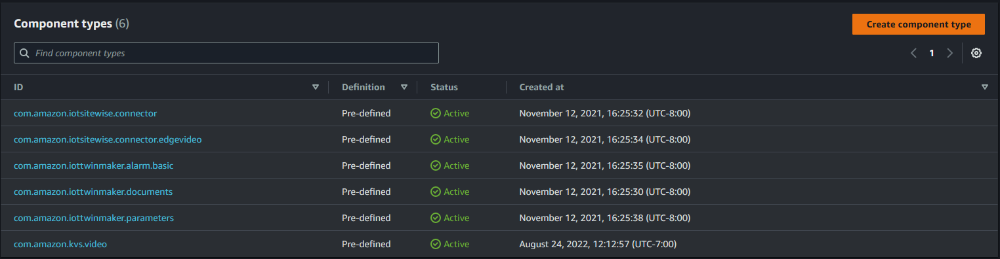

# Using and creating component types

This topic walks you through the values and structures that you use to create an AWS IoT TwinMaker component type. It shows you
how to create a request object that you can pass to the [CreateComponentType](../apireference/API_CreateComponentType.md "../apireference/API_CreateComponentType.md") API or
by using the component type editor in the AWS IoT TwinMaker console.

Components provide context for properties and data for their associated entities.

## Built-in component types

In the AWS IoT TwinMaker console, when you choose a workspace and then choose
**Component types** in the left pane, you see the following
component types.

- **com.amazon.iotsitewise.resourcesync**: A component type that automatically syncs your AWS IoT SiteWise
  assets and asset models and converts them into AWS IoT TwinMaker entities components and component types.
  For more information on using
  AWS IoT SiteWise asset sync, see [Asset sync with AWS IoT SiteWise](tm-sw-asset-sync.md "tm-sw-asset-sync.md").
- **com.amazon.iottwinmaker.alarm.basic**: A basic alarm
  component that pulls alarm data from an external source to an entity. This
  component doesn't contain a function that connects to a specific data source.
  This means that the alarm component is abstract and can be inherited by another
  component type that specifies a data source and a function that reads from that
  source.
- **com.amazon.iottwinmaker.documents**: A simple mapping of
  titles to URLs for documents that contain information about an entity.
- **com.amazon.iotsitewise.connector.edgevideo**: A component
  that pulls video from an IoT device using the Edge Connector for Kinesis Video Streams AWS IoT Greengrass component into an
  entity. The [Edge Connector for Kinesis Video Streams AWS IoT Greengrass component](../../../greengrass/v2/developerguide/kvs-edge-connector-component.md "../../../greengrass/v2/developerguide/kvs-edge-connector-component.md")
  is not an AWS IoT TwinMaker component, but rather a prebuilt AWS IoT Greengrass component that is deployed locally on your IoT device.
- **com.amazon.iotsitewise.connector**: A component that pulls
  AWS IoT SiteWise data into an entity.
- **com.amazon.iottwinmaker.parameters**: A component that adds
  static key-value pairs to an entity.
- **com.amazon.kvs.video**: A component that pulls video from Kinesis Video Streams into an AWS IoT TwinMaker entity.

## Core features of AWS IoT TwinMaker component types

The following list describes the core features of component types.

- **Property definitions**: The [PropertyDefinitionRequest](../apireference/API_PropertyDefinitionRequest.md "../apireference/API_PropertyDefinitionRequest.md") object defines a property that you can
  populate in the scene composer or it can be populated with data pulled from
  external data sources. Static properties that you set are stored in AWS IoT TwinMaker.
  Time-series properties and other properties that are pulled from data
  sources are stored externally.

You specify property definitions inside a string to the
`PropertyDefinitionRequest` map. Each string must be unique to
the map.

- **Functions**: The [FunctionRequest](../apireference/API_FunctionRequest.md "../apireference/API_FunctionRequest.md") object
  specifies a Lambda function that reads from and potentially writes to an external data source.

A component type that contains a property with a value that is stored
externally but that doesn't have a corresponding function to retrieve the values
is an abstract component type. You can extend concrete component types from an
abstract component type. You can't add abstract component types to an entity.
They don't appear in the scene composer.

You specify functions inside a string to `FunctionRequest` map. The string must specify one of the following
predefined function types.

    + `dataReader`: A function that pulls data from an external source.
    + `dataReaderByEntity`: A function that pulls data from an external source.

    When you use this type of data reader, the [GetPropertyValueHistory](../apireference/API_GetPropertyValueHistory.md "../apireference/API_GetPropertyValueHistory.md") API operation supports only
     entity-specific queries for properties in this component type. (You can
     only request the property value history for `componentName` +
     `entityId`.)
    + `dataReaderByComponentType`: A function that pulls data from an external source.

    When you use this type of data reader, the [GetPropertyValueHistory](../apireference/API_GetPropertyValueHistory.md "../apireference/API_GetPropertyValueHistory.md") API operation supports only
     cross-entity queries for properties in this component type. (You can
     only request the property value history for
     `componentTypeId`.)
    + `dataWriter`: A function that writes data to an external source.
    + `schemaInitializer`: A function that automatically initializes property values
     whenever you create an entity that contains the component type.

One of the three types of data reader functions is required in a non-abstract component type.

For an example of a Lambda function that implements time-stream telemetry
components, including alarms, see the data reader in [AWS IoT TwinMaker Samples](https://github.com/aws-samples/aws-iot-twinmaker-samples/blob/main/src/modules/timestream_telemetry/lambda_function/udq_data_reader.py "https://github.com/aws-samples/aws-iot-twinmaker-samples/blob/main/src/modules/timestream_telemetry/lambda_function/udq_data_reader.py").

###### Note

Because the alarm connector inherits from the abstract alarm component type, the Lambda
function must return the `alarm_key` value. If you don't return
this value, Grafana won't recognize it as an alarm. This is required for all
components that return alarms.

- **Inheritance**: Component types promote code reusability through
  inheritance. A component type can inherit up to 10 parent component
  types.

Use the `extendsFrom` parameter to specify the component types from which your component type inherits properties
and functions.

- **isSingleton**: Some components contain properties, such as location
  coordinates, that can't be included more than once in an entity. Set the value of the `isSingleton` parameter to
  `true` to indicate that your component type can be included only once in an entity.

## Creating property definitions

The following table describes the parameters of a `PropertyDefinitionRequest`.

| Parameter            | Description                                                                                                                                                                                                     |
| -------------------- | --------------------------------------------------------------------------------------------------------------------------------------------------------------------------------------------------------------- |
| `isExternalId`       | A Boolean that specifies whether the property is a unique identifier (such as an AWS IoT SiteWise asset Id) of a property value that is stored externally. The default value of this property is `false`. |
| `isStoredExternally` | A Boolean that specifies whether the property value is stored externally. The default value of this property is `false`.                                                                                  |
| `isTimeSeries`       | A Boolean that specifies whether the property stores time-series data. The default value of this property is `false`                                                                                         |
| `isRequiredInEntity` | A Boolean that specifies whether the property must have a value in an entity that uses the component type.                                                                                                   |
| `dataType`           | A [DataType](../apireference/API_DataType.md "../apireference/API_DataType.md") object that specifies the data type (such as string, map, list, and unit of measure) of the property.                     |
| `defaultValue`       | A [DataValue](../apireference/API_DataValue.md "../apireference/API_DataValue.md") object that specifies the default value of the property.                                                                  |
| `configuration`      | A string-to-string map that specifies additional information that you need to connect to an external data source.                                                                                            |

## Creating functions

The following table describes the parameters of a `FunctionRequest`.

| Parameter            | Description                                                                                                                                                                                                    |
| -------------------- | -------------------------------------------------------------------------------------------------------------------------------------------------------------------------------------------------------------- |
| `implementedBy`      | A [DataConnector](../apireference/API_DataConnector.md "../apireference/API_DataConnector.md") object that specifies the Lambda function that connects to the external data source.                         |
| `requiredProperties` | A list of properties that the function needs in order to read from and write to an external data source.                                                                                                       |
| `scope`              | The scope of the function. Use `Workspace` for functions with a scope that spans an entire workspace. Use `Entity` for functions with a scope that is limited to the entity that contains the component. |

For examples that show how to create and extend component types, see [Example component types](twinmaker-component-types-examples.md "twinmaker-component-types-examples.md").
