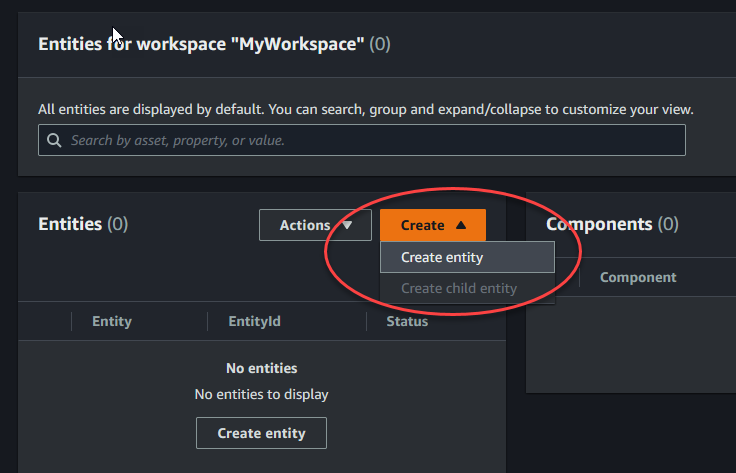
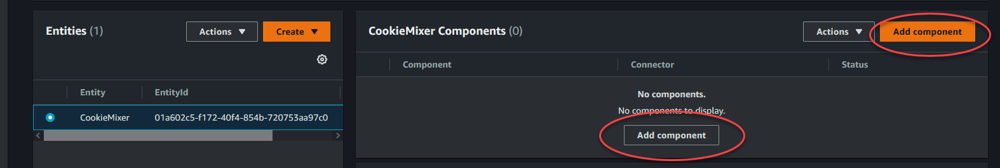
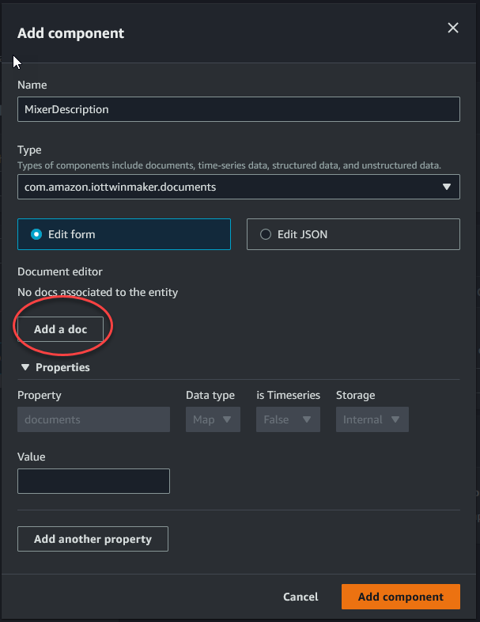

# Create your first entity

To create your first entity, use the following steps.

1. On the **Workspaces** page, choose your workspace, and then in the left pane
   choose **Entities**.
2. On the **Entities** page, choose **Create**, and then choose
   **Create entity**.

 3. In the **Create an entity** window, enter a name for your entity.
This example uses a `CookieMixer` entity. 4. (Optional) Enter a description for your entity. 5. Choose **Create entity**,
Entities contain data about each item in your workspace. You put data into entities
by adding components. AWS IoT TwinMaker provides the following built-in component types.

- **Parameters**: Adds a set of key-value properties.
- **Document**: Adds a name and a URL for a document that contains
  information about the entity.
- **Alarms**: Connects to an alarm time-series data source.
- **SiteWise connector**: Pulls time-series properties that are
  defined in an AWS IoT SiteWise asset.
- **Edge Connector for Kinesis Video Streams AWS IoT Greengrass**: Pulls video data from the
  Edge Connector for KVS AWS IoT Greengrass. For more information, see [AWS IoT TwinMaker video integration](video-integration.md "video-integration.md").
  You can see these component types and their definitions by choosing
  **Component types** in the left pane. You can also create a new
  component type on the **Component types** page. For more information
  about creating component types, see [Using and creating component types](twinmaker-component-types.md "twinmaker-component-types.md").

In this example, we create a simple document component that adds descriptive information about your entity.

1. On the **Entities** page, choose the entity, and then choose add component.

 2. In the **Add component** window, enter a name for your component. Since
this example uses a cookie mixer entity, we enter `MixerDescription` in the
**Name** field.

 3. Choose **Add a doc**, then enter values for the doc **Name**
and **External Url**. With the documents component, you can store a list of external
URLs that contain important information about the entity. 4. Choose **Add component**.
You're now ready to create your first scene. For instructions on how to do this, see
[Creating and editing AWS IoT TwinMaker scenes](scenes.md "scenes.md").
