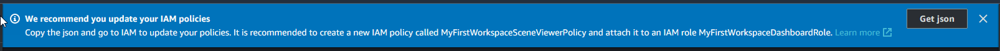

# Create a workspace

To create and configure your first workspace, use the following steps.

###### Note

This topic shows you how to create a simple workspace with a single resource. For a fully
featured workspace with multiple resources, try the sample setup in the [AWS IoT TwinMaker
samples](https://github.com/aws-samples/aws-iot-twinmaker-samples "https://github.com/aws-samples/aws-iot-twinmaker-samples") Github repository.

1. On the [AWS IoT TwinMaker console](https://console.aws.amazon.com/iottwinmaker/home "https://console.aws.amazon.com/iottwinmaker/home") home page, choose
   **Workspaces** in the left navigation pane.
2. On the **Workspaces** page, choose **Create workspace**.
3. On the **Create a Workspace** page, enter a name for your workspace.
4. (Optional) Add a description for your workspace.
5. Under **S3 resource**, choose **Create an S3 bucket**. This
   option creates an Amazon S3 bucket where AWS IoT TwinMaker stores information and resources
   related to the workspace. Each workspace requires its own bucket.
6. Under **Execution role**, choose either **Auto-generate a new
   role** or the custom IAM role that you created as for this
   workspace.

If you choose **Auto-generate a new role**, AWS IoT TwinMaker attaches a policy to the role that grants
permission to the new service role to access other AWS services, including permission to read and write
to the Amazon S3 bucket that you specify in the previous step.
For information about assigning permissions to this role, see [Create and manage a service role for
AWS IoT TwinMaker](twinmaker-gs-service-role.md "twinmaker-gs-service-role.md"). 7. Choose **Create Workspace**. The following banner appears at the top of the
**Workspaces** page.

 8. Choose **Get json**. We recommend you add the IAM policy you see to the
IAM role that AWS IoT TwinMaker created for users and accounts that view the Grafana
dashboard. The name of this role follows this pattern:
`workspace-name`DashboardRole, For instructions on
how to create a policy and attach it to a role, see [Modifying a role permissions policy (console)](../../../IAM/latest/UserGuide/id_roles_create_for-service.md#roles-modify_permissions-policy "../../../IAM/latest/UserGuide/id_roles_create_for-service.md#roles-modify_permissions-policy").

The following example contains the policy to add to the dashboard role.

JSON

```
`{
 "Version":"2012-10-17",
 "Statement": [
 {
 "Effect": "Allow",
 "Action": [
 "s3:GetObject"
 ],
 "Resource": [
 "arn:aws:s3:::iottwinmaker-workspace-`workspace-name-lower-case`-`123456789012`",
 "arn:aws:s3:::iottwinmaker-workspace-`workspace-name-lower-case`-`123456789012`/*"
 ]
 },
 {
 "Effect": "Allow",
 "Action": [
 "iottwinmaker:Get*",
 "iottwinmaker:List*"
 ],
 "Resource": [
 "arn:aws:iottwinmaker:us-east-1:`111122223333`:workspace/`workspace-name`",
 "arn:aws:iottwinmaker:us-east-1:`111122223333`:workspace/`workspace-name`/*"
 ]
 },
 {
 "Effect": "Allow",
 "Action": "iottwinmaker:ListWorkspaces",
 "Resource": "*"
 }
 ]
}`

```

You're now ready to start creating a data model for your workspace with your first
entity. For instructions on how to do this, see [Create your first entity](twinmaker-gs-entity.md "twinmaker-gs-entity.md").
