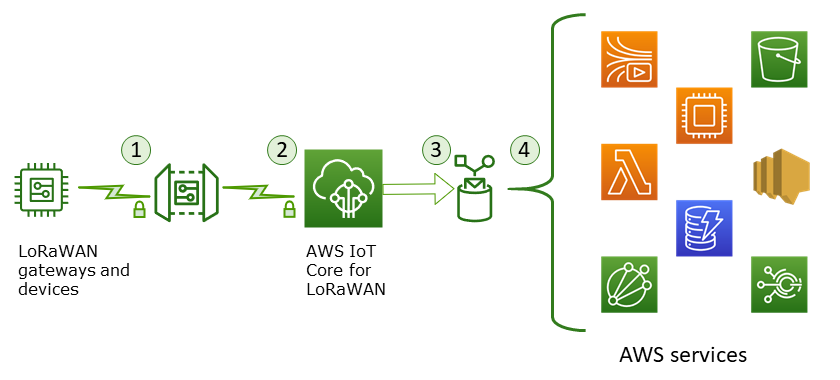

# Data and transport security with AWS IoT Core for LoRaWAN

AWS IoT Core for LoRaWAN uses the following methods to secure the data and communication
between LoRaWAN devices, gateways, and AWS IoT Core for LoRaWAN:

- The security best practices that devices follow when communicating with
  LoRaWAN gateways, as described in the whitepaper [LoRaWAN Security](https://lora-alliance.org/sites/default/files/2019-05/lorawan_security_whitepaper.pdf "https://lora-alliance.org/sites/default/files/2019-05/lorawan_security_whitepaper.pdf").
- The security that AWS IoT Core uses to connect gateways to AWS IoT Core for LoRaWAN and
  send the data to other AWS services. For more information, see [data protection in AWS IoT Core](../../../iot/latest/developerguide/data-protection.md "../../../iot/latest/developerguide/data-protection.md").

## How data is secured

throughout the system

This diagram identifies the key elements in a LoRaWAN system connected to
AWS IoT Core for LoRaWAN to identify how data is secured throughout.

1. The LoRaWAN wireless device encrypts its binary messages using AES128 CTR mode
   before it transmits them.
2. Gateway connections to AWS IoT Core for LoRaWAN are secured by TLS as described in [Transport
   security in AWS IoT](../../../iot/latest/developerguide/transport-security.md "../../../iot/latest/developerguide/transport-security.md"). AWS IoT Core for LoRaWAN decrypts the binary message and encodes the
   decrypted binary message payload as a base64 string.
3. The resulting base64-encoded message is sent as the message payload to the
   AWS IoT rule described in the destination assigned to the device. Data within AWS
   is encrypted using AWS-owned keys.
4. The AWS IoT rule directs the message data to the services described in the
   rule's configuration. Data within AWS is encrypted using AWS-owned keys.

## LoRaWAN device and gateway

transport security

LoRaWAN devices and AWS IoT Core for LoRaWAN store pre-shared root keys. Session keys are
derived by both LoRaWAN devices and AWS IoT Core for LoRaWAN following the protocols. The
symmetric session keys are used for encryption and decryption in a standard AES-128
CTR mode. A 4-byte message integrity code (MIC) is also used to check the data
integrity following a standard AES-128 CMAC algorithm. The session keys can be
updated by using the Join/Rejoin process.

The security practice for LoRa gateways is described in the LoRaWAN
specifications. LoRa gateways connect to AWS IoT Core for LoRaWAN through a web socket using a
[`Basics Station`](https://lora-developers.semtech.com/resources/tools/lora-basics/lora-basics-for-gateways/ "https://lora-developers.semtech.com/resources/tools/lora-basics/lora-basics-for-gateways/"). AWS IoT Core for LoRaWAN supports only `Basics
 Station` version 2.0.4 and later.

Before the web socket connection is established, AWS IoT Core for LoRaWAN uses the [TLS Server
and Client Authentication mode](../../../iot/latest/developerguide/transport-security.md "../../../iot/latest/developerguide/transport-security.md") to authenticate the gateway. To ensure the
confidentiality of the LoRaWAN protocol, [TLS](https://en.wikipedia.org/wiki/Transport_Layer_Security "https://en.wikipedia.org/wiki/Transport_Layer_Security")
[version
1.2](https://en.wikipedia.org/wiki/Transport_Layer_Security#TLS_1.2 "https://en.wikipedia.org/wiki/Transport_Layer_Security#TLS_1.2"). is used. TLS support is available in a number of programming languages
and operating systems. Data within AWS is encrypted by the specific AWS service.
For more information about data encryption on other AWS services, see the security
documentation for that service.

AWS IoT Core for LoRaWAN also maintains a Configuration and Update Server (CUPS) that configures
and updates the certificates and keys used for TLS authentication.
