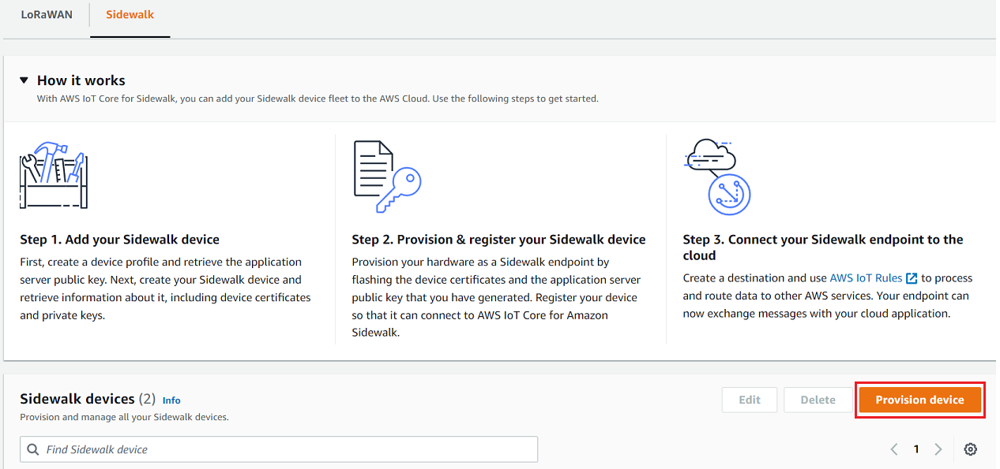

# Add your device profile and

Sidewalk end device

This section shows how you can create a device profile. It also shows how you can
use the AWS IoT console and the AWS CLI to add your Sidewalk end device to
AWS IoT Core for Amazon Sidewalk.

## Add your Sidewalk

device (console)

To add your Sidewalk device using the AWS IoT console, go to the [Sidewalk
tab of the Devices hub](https://console.aws.amazon.com/iot/home#/wireless/devices?tab=sidewalk "https://console.aws.amazon.com/iot/home#/wireless/devices?tab=sidewalk"), choose **Provision
device**, and then perform the following steps.



1. ###### Specify device details

Specify the configuration information for your Sidewalk device.
You can also create a new device profile, or choose an existing profile
for your Sidewalk device.

    1. Specify a device name and optional description. The
     description can be up to 2,048 characters long. These fields can
     be edited after you create the device.
    2. Choose a device profile to associate with your Sidewalk
     device. If you have any existing device profiles, you can choose
     your profile. To create a new profile, choose **Create
     new profile**, and then enter a name for the
     profile.


    ###### Note

    To attach tags to your device profile, after you create
     your profile, go to the [Profiles hub](https://console.aws.amazon.com/iot/home#/wireless/profiles "https://console.aws.amazon.com/iot/home#/wireless/profiles")
     and then edit your profile to add this information.
    3. Specify the name of your destination that will route messages
     from your device to other AWS services. If you haven't already
     created a destination, go to the [Destinations
     hub](https://console.aws.amazon.com/iot/home#/wireless/destinations "https://console.aws.amazon.com/iot/home#/wireless/destinations") to create your destination. You can then choose
     that destination for your Sidewalk device. For more
     information, see [Add a destination for your
     Sidewalk end device](iot-sidewalk-qsg-destination.md "iot-sidewalk-qsg-destination.md").
    4. Choose **Next** to continue adding your
     Sidewalk device.

2. ###### Associate Sidewalk device with AWS IoT thing (Optional)

You can optionally associate your Sidewalk device to an AWS IoT
thing. IoT things are entries in the AWS IoT device registry. Things make
it easier to search and manage your devices. Associating a thing with
your device lets your device access other AWS IoT Core features.

To associate your device with a thing, choose **Automatic
thing registration**.

    1. Enter a unique name for the IoT thing that you want to
     associate your Sidewalk device. Thing names are case
     sensitive and must be unique in your AWS account and
     AWS Region.
    2. Provide any additional configurations for your IoT thing, such
     as using a thing type, or searchable attributes that can be used
     to filter from a list of things.
    3. Choose **Next** and verify the information
     about your Sidewalk device, and then choose
     **Create**.

## Add your Sidewalk device

(CLI)

To add your Sidewalk device and download the JSON files that will be
used to provision your Sidewalk device, perform the following API
operations.

###### Topics

- [Step 1: Create a device
  profile](#iot-sidewalk-profile-create "#iot-sidewalk-profile-create")
- [Step 2: Add your
  Sidewalk device](#iot-sidewalk-device-create "#iot-sidewalk-device-create")

### Step 1: Create a device

profile

To create a device profile in your AWS account, use the [`CreateDeviceProfile`](../../2020-11-22/apireference/API_CreateDeviceProfile.md "../../2020-11-22/apireference/API_CreateDeviceProfile.md") API operation or the
[`create-device-profile`](../../../cli/latest/reference/create-device-profile.md "../../../cli/latest/reference/create-device-profile.md") CLI command. When
creating your device profile, specify the name and provide any optional tags
as name-value pairs.

For example, the following command creates a device profile for your
Sidewalk devices:

```
aws iotwireless create-device-profile \
    --name `sidewalk_profile` --sidewalk {}
```

Running this command returns the Amazon Resource Name (ARN) and the ID of
the device profile as output.

```
{
    "DeviceProfileArn": "arn:aws:iotwireless:`us-east-1`:`123456789012`:DeviceProfile/`12345678-a1b2-3c45-67d8-e90fa1b2c34d`",
    "DeviceProfileId": "`12345678-a1b2-3c45-67d8-e90fa1b2c34d`"
}
```

### Step 2: Add your

Sidewalk device

To add your Sidewalk device to your account for AWS IoT Core for Amazon Sidewalk, use
the [`CreateWirelessDevice`](../../2020-11-22/apireference/API_CreateWirelessDevice.md "../../2020-11-22/apireference/API_CreateWirelessDevice.md") API operation or the
[`create-wireless-device`](../../../cli/latest/reference/create-wireless-device.md "../../../cli/latest/reference/create-wireless-device.md") CLI command. When
creating your device, specify the following parameters, in addition to an
optional name and description for your Sidewalk device.

###### Note

If you want to associate your Sidewalk device with an AWS IoT
thing, use the [`AssociateWirelessDeviceWithThing`](../../2020-11-22/apireference/API_AssociateWirelessDeviceWithThing.md "../../2020-11-22/apireference/API_AssociateWirelessDeviceWithThing.md") API
operation or the [`associate-wireless-device-with-thing`](../../../cli/latest/reference/associate-wireless-device-with-thing.md "../../../cli/latest/reference/associate-wireless-device-with-thing.md") CLI
command..

The following command shows an example of creating a Sidewalk
device:

```
aws iotwireless create-wireless-device \
     --cli-input-json "`file://device.json`"
```

The following shows the contents of the file
`device.json`.

**Contents of device.json**

```
{
  "Type": "Sidewalk",
  "Name": "`SidewalkDevice`",
  "DestinationName": "`SidewalkDestination`",
  "Sidewalk": {
    "DeviceProfileId": "`12345678-a1b2-3c45-67d8-e90fa1b2c34d`"
    }
}
```

Running this command returns the device ID and Amazon Resource Name (ARN)
as output.

```
{
    "Arn": "arn:aws:iotwireless:`us-east-1`:`123456789012`:WirelessDevice/`23456789-abcd-0123-bcde-fabc012345678`",
    "Id": `"23456789-abcd-0123-bcde-fabc012345678"`
}
```
