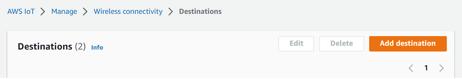

# Create a destination for your

Sidewalk device

You can add a destination to your account for AWS IoT Core for Amazon Sidewalk either from the using
the [Destinations
hub](https://console.aws.amazon.com/iot/home#/wireless/destinations "https://console.aws.amazon.com/iot/home#/wireless/destinations") or using the `CreateDestination`. When creating your
destination, specify:

- A unique name for the destination to use for your Sidewalk end
  device.

###### Note

If you already add your device using a destination name, you must use
that name when creating your destination. For more information, see
[Step 2: Add your
Sidewalk device](iot-sidewalk-add-device.md#iot-sidewalk-device-create "iot-sidewalk-add-device.md#iot-sidewalk-device-create").

- The name of the AWS IoT rule that will process the device's data, and the
  topic to which messages are published.
- An IAM role that grants the device's data permission to access the
  rule.
  The following sections describe how to create the AWS IoT rule and IAM role for
  your destination.

## Create a destination

(console)

To create a destination using the AWS IoT console, go to the [Destinations
hub](https://console.aws.amazon.com/iot/home#/wireless/destinations "https://console.aws.amazon.com/iot/home#/wireless/destinations") and choose **Add destination**.



To process a device's data, specify the following fields when creating a
destination, and then choose **Add destination**.

- ###### Destination details

Enter a **Destination name** and an optional
description for your destination.

- ###### Rule name

The AWS IoT rule that is configured to evaluate messages sent by
your device and process the device's data. The rule name will be
mapped to your destination. The destination requires the rule to
process the messages that it receives. You can choose for the
messages to be processed by either invoking an AWS IoT rule or by
publishing to the AWS IoT message broker.

    + If you choose **Enter a rule name**, enter a
     name, and then choose **Copy** to copy the
     rule name that you'll enter when creating the AWS IoT rule. You
     can either choose **Create rule** to create
     the rule now or navigate to the [Rules](https://console.aws.amazon.com/iot/home#/create/rule "https://console.aws.amazon.com/iot/home#/create/rule") Hub of the AWS IoT
     console and create a rule with that name.


    You can also enter a rule and use the
     **Advanced** setting to specify a topic
     name. The topic name is provided during rule invocation and is
     accessed by using the `topic` expression inside the
     rule. For more information about AWS IoT rules, see [AWS IoT
     rules](../../../iot/latest/developerguide/iot-rules.md "../../../iot/latest/developerguide/iot-rules.md").
    + If you choose **Publish to AWS IoT message
     broker**, enter a topic name. You can then copy the
     MQTT topic name and multiple subscribers can subscribe to this
     topic to receive messages published to that topic. For more
     information, see [MQTT
     topics](../../../iot/latest/developerguide/topics.md "../../../iot/latest/developerguide/topics.md").

For more information about AWS IoT rules for destinations, see [Create rules to process LoRaWAN device messages](lorawan-destination-rules.md "lorawan-destination-rules.md").

- ###### Role name

The IAM role that grants the device's data permission to access
the rule named in **Rule name**. In the console,
you can create a new service role or select an existing service
role. If you're creating a new service role, you can either enter a
role name (for example,
`SidewalkDestinationRole`), or leave it
blank for AWS IoT Core for LoRaWAN to generate a new role name. AWS IoT Core for LoRaWAN
will then automatically create the IAM role with the appropriate
permissions on your behalf.

## Create a destination

(CLI)

To create a destination, use the [`CreateDestination`](../../2020-11-22/apireference/API_CreateDestination.md "../../2020-11-22/apireference/API_CreateDestination.md") API operation or the [`create-destination`](../../../cli/latest/reference/iotwireless/create-destination.md "../../../cli/latest/reference/iotwireless/create-destination.md") CLI command. For example, the
following command creates a destination for your Sidewalk end
device:

```
aws iotwireless create-destination --name `SidewalkDestination` \
    --expression-type `RuleName` --expression `SidewalkRule` \
    --role-arn arn:aws:iam::`123456789012`:role/`SidewalkRole`
```

Running this command returns the destination details, which include the Amazon
Resource Name (ARN) and the destination name.

```
{
    "Arn": "arn:aws:iotwireless:`us-east-1`:`123456789012`:Destination/`SidewalkDestination`",
    "Name": "`SidewalkDestination`"
}
```

For more information about creating a destination, see [Create rules to process LoRaWAN device messages](../../../iot/latest/developerguide/connect-iot-lorawan-destination-rules.md "../../../iot/latest/developerguide/connect-iot-lorawan-destination-rules.md").
