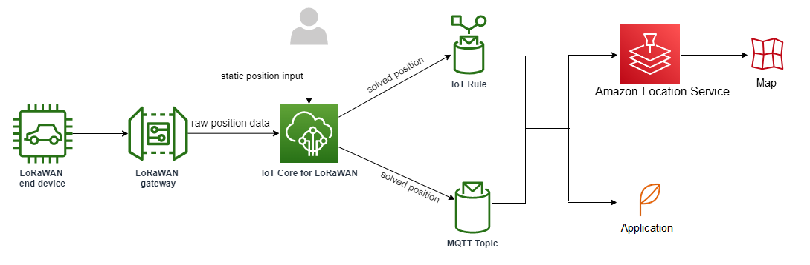

# Configuring position of wireless resources with

AWS IoT Core for LoRaWAN

|                                                                                                                                                                                                                                                                                                                                                                                                                                                                                                                                      |
| ------------------------------------------------------------------------------------------------------------------------------------------------------------------------------------------------------------------------------------------------------------------------------------------------------------------------------------------------------------------------------------------------------------------------------------------------------------------------------------------------------------------------------------ | ----------------------------------------------------------------------------------------------------------------------------------------------------------------------------------------------------------------------------------------------------------------------------------------------------------------------------------------------------------------------------------------------------------------------------------------------------------------------------------------------------------------------------------------------------------------------------------------------------------------------------------------------------------------------------------------------------------------------------------------------------------------------------------------------------------------------------------------------------------------------------------------------------------------------------------------------------------------------------------------------------------------------------------------------------------------------------------------------------------------------------------------------------------------------------------------------------------------------------------------------------------------------------------------------------------------------------------------------------------------------------------------------------------------------------------------------------------------------------------------------------------------------------------------------------------------------------------------------------------------------------------------------------------------------------------------------------------------------------------------------------------------------------------------------------------------------------------------------------------------------------------------------------------------------------------------------------------------------------------------------------------------------------------------------------------------------------------------------------------------------------------------------------------------------------------------------------------------------------------------------------------------------------------------------------------------------------------------------------------------------------------------------------------------------------------------------------------------------------------------------------------------------------------------------------------------------------------------------------------------------------------------------------------------------------------------------------------------------------------------------------------------------------------------------------------------------------------------------------------------------------------------------------------------------------------------------------------------------------------------------------------------------------------------------------------------------------------------------------------------------------------------------------------------------------------------------------------------------------------------------------------------------------------------------------------------------------------------------------------------------------------------------------------------------------------------------------------------------------------------------------------------------------------------------------------------------------------------------------------------------------------------------------------------------------------------------------------------------------------------------------------------------------------------------------------------------------------------------------------------------------------------------------------------------------------------------------------------------------------------------------------------------------------------------------------------------------------------------------------------------------------------------------------------------------------------------------------------------------------------------------------------------------------------------------------------------------------------------------------------------------------------------------------------------------------------------------------------------------------------------------------------------------------------------------------------------------------------------------------------------------------------------------------------------------------------------------------------------------------------------------------------------------------------------------------------------------------------------------------------------------------------------------------------------------------------------------------------------------------------------------------------------------------------------------------------------------------------------------------------------------------------------------------------------------------------------------------------------------------------------------------------------------------------------------------------------------------------------------------------------------------------------------------------------------------------------------------------------------------------------------------------------------------------------------------------------------------------------------------------------------------------------------------------------------------------------------------------------------------------------------------------------------------------------------------------------------------------------------------------------------------------------------------------------------------------------------------------------------------------------------------------------------------------------------------------------------------------------------------------------------------------------------------------------------------------------------------------------------------------------------------------------------------------------------------------------------------------------------------------------------------------------------------------------------------------------------------------------------------------------------------------------------------------------------------------- |
| Before using this feature, note that the chosen third party provider for resolving position information for LoRaWAN devices relies on data feeds and data sets provided or maintained by the International GNSS Service (IGS), EarthData via NASA, or other third-parties. These data feeds and data sets are Third-Party Content (as defined in the Customer Agreement) and provided on an as-is basis. For more information, see [AWS Service Terms](https://aws.amazon.com/service-terms "https://aws.amazon.com/service-terms"). | You can use AWS IoT Core for LoRaWAN to specify your static position data, or activate positioning to identify the position of your device in real time using third-party solvers. You can add or update the position information for either LoRaWAN devices or gateways, or both. You specify the position information either when adding your device or gateway to AWS IoT Core for LoRaWAN, or when editing the configuration details of your device or gateway. The position information is specified as a [GeoJSON](https://geojson.org/ "https://geojson.org/") payload. The GeoJSON format is a format that's used to encode geographic data structures. The payload contains the latitude and longitude co-ordinates of your device location, that are based on the [World Geodetic System coordinate system (WGS84)](https://gisgeography.com/wgs84-world-geodetic-system/ "https://gisgeography.com/wgs84-world-geodetic-system/"). After the solvers compute the position of your resource, if you have Amazon Location Service, you can activate an Amazon Location map where the position of your resource will be displayed. Using the position data, you can:  • Activate positioning to identify and obtain the position of your LoRaWAN devices.  • Track and monitor the position of your gateways and devices.  • Define AWS IoT rules that process any updates to the position data and routes it to other AWS services. For a list of rule actions, see [AWS IoT rule actions](../../../iot/latest/developerguide/iot-rule-actions.md "../../../iot/latest/developerguide/iot-rule-actions.md") in the _AWS IoT developer guide_.  • Create alerts and receive notifications to devices in case of any unusual activity by using the position data and Amazon SNS. ## How positioning works for LoRaWAN devices You can activate positioning to identify the position of your devices using third-party Wi-Fi and GNSS solvers. This information can be used to track and monitor your device. The following steps show you how to activate positioning and view the position information for LoRaWAN devices. ###### Note The third-party solvers can only be used with LoRaWAN devices that have the [LoRa Edge](https://www.semtech.com/products/wireless-rf/lora-edge "https://www.semtech.com/products/wireless-rf/lora-edge") chip. It can't be used with LoRaWAN gateways. For gateways, you can still specify the static position information and identify the location on an Amazon Location map. 1. ###### Add your device Before you activate positioning, first add your device to AWS IoT Core for LoRaWAN. The LoRaWAN device must have the LoRa Edge chipset, which is an ultra-low power platform that integrates a long range LoRa transceiver, multi-constellation GNSS scanner, and passive Wi-Fi MAC scanner targeting geolocation applications. 2. ###### Activate positioning To obtain the real-time position of your devices, activate positioning. When your LoRaWAN device sends an uplink message, the Wi-Fi and GNSS scan data contained in the message is sent to AWS IoT Core for LoRaWAN using the geolocation frame port. 3. ###### Retrieve position information Retrieve the estimated device position from the solvers computed based on the scan results from the transceivers. If the position information was computed using both Wi-Fi and GNSS scan results, AWS IoT Core for LoRaWAN selects the estimated position that has the higher accuracy. 4. ###### View position information After the solver computes the position information, it will also provide the accuracy information which indicates the difference between the position computed by the solvers and the static position information that you entered. You can also view the device location on an Amazon Location map. ###### Note As solvers can't be used for LoRaWAN gateways, the accuracy information will be reported as `0.0`. For more information about the uplink message format and the frequency ports that are used for the positioning solver, see [Uplink message from AWS IoT Core for LoRaWAN to rules engine](lorawan-location-devices.md#lorawan-location-devices-uplink "lorawan-location-devices.md#lorawan-location-devices-uplink"). ## Overview of positioning workflow The following diagram shows how AWS IoT Core for LoRaWAN stores and updates the position information of your devices and gateways.  1. ###### Specify static position of your resource Specify the static position information of your device or gateway as a GeoJSON payload, using the latitude and longitude coordinates. You can also specify an optional altitude coordinate. These coordinates are based on the WGS84 coordinate system. For more information, see [World Geodetic System (WGS84)](https://gisgeography.com/wgs84-world-geodetic-system/ "https://gisgeography.com/wgs84-world-geodetic-system/"). 2. ###### Activate positioning for devices If you're using LoRaWAN devices that have the LoRa Edge chip, you can optionally activate positioning to track your device position in real time. When your device sends an uplink message, the GNSS and Wi-Fi scan data is sent to AWS IoT Core for LoRaWAN using the geolocation frame port. The solvers then use this information to resolve the device position. 3. ###### Add a destination to route position data You can add a destination that describes the IoT rule for processing the device data and route the updated position information to AWS IoT Core for LoRaWAN. You can also view the last known position of your resource on an Amazon Location map. ## Configuring your resource position You can configure the position of your resource using the AWS Management Console, the AWS IoT Wireless API, or the AWS CLI. If your devices have the LoRa Edge chip, you can activate positioning to compute the real-time position information. For your gateways, you can still enter the static position coordinates and use Amazon Location to track the gateway position on an Amazon Location map. ###### Topics  • [Configuring the position of LoRaWAN gateways](lorawan-location-gateways.md "lorawan-location-gateways.md")  • [Configuring position of LoRaWAN devices](lorawan-location-devices.md "lorawan-location-devices.md") |
