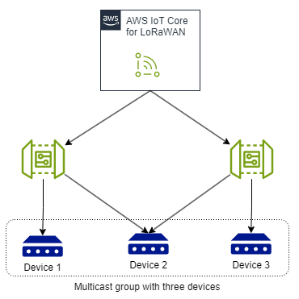

# Choose participating gateways to

receive multicast downlink messages

A multicast group that consists of multiple devices can have the devices
associated with multiple gateways. When a downlink message is sent to the multicast
group, it will be sent to all the gateways that are associated with the devices in
the group. This can potentially lead to the message that the device receives getting
corrupted, such as when a device is in the vicinity of two gateways and receives the
same multicast downlink from both gateways at the same time.


To avoid this message corruption, you can specify the gateways that you want to
use for receiving the downlink message and the transmission interval between them.
To provide this information, use the following fields using the console or
CLI.

###### Note

This feature is different from the participating gateways feature that you can
use for general downlink data traffic from AWS IoT Core for LoRaWAN to your device. For
more information, see [Choosing gateways to receive the LoRaWAN
downlink data traffic](lorawan-gateway-participate.md "lorawan-gateway-participate.md").

- ###### Gateway list

The list of gateways that you want to use for sending the multicast
downlink message. Each downlink message will be sent to all the gateways
in the list in the order that you provided them. If the gateway list is
empty, then AWS IoT Core for LoRaWAN will use the gateways that were used for the
most recent uplink message from the device.

- ###### Transmission interval

The time duration in milliseconds for which AWS IoT Core for LoRaWAN will wait
before transmitting the multicast payload to the next gateway in the
list.

###### Note

If you are performing FUOTA for a multicast group for which you added
participating gateways when creating the group, make sure that the
fragment interval is less than or equal to the transmission interval for
the gateways.

## Choose gateways for

multicast downlink (console)

In the AWS IoT console, you can choose the gateways that you want to use for
receiving the multicast downlink message when creating the multicast group and
adding your devices to the groups. For information about creating a group, see
[Create multicast groups and add
devices to the group](lorawan-create-multicast-groups.md "lorawan-create-multicast-groups.md").

1. Go to the [Multicast groups](https://console.aws.amazon.com/iot/home#/wireless/multicastGroups "https://console.aws.amazon.com/iot/home#/wireless/multicastGroups") page of the AWS IoT console and choose
   **Create multicast group**.
2. Specify a name for the multicast group, and optionally provide a
   description and tags for your group.
3. Choose **Next** to add devices to your multicast
   group.
4. Specify the RFRegion, and whether to add devices individually using
   their Device ID, or in bulk using their device profile.
5. Add the gateways that you want to use for receiving the downlink
   message using their Gateway ID, and the transmission interval.
6. Choose **Create** to create the multicast
   group.

## Choose gateways for multicast

downlink (CLI)

To specify the gateways for receiving the downlink messages, use the [`CreateMulticastGroup`](../../2020-11-22/apireference/API_CreateMulticastGroup.md "../../2020-11-22/apireference/API_CreateMulticastGroup.md") API operation or the [`create-multicast-group`](../../../cli/latest/reference/iotwireless/create-multicast-group.md "../../../cli/latest/reference/iotwireless/create-multicast-group.md") CLI
command.

```
aws iotwireless create-multicast-group \
    --name `"MC_group_FUOTA"` \
    --cli-input-json `file://input.json`
```

The following shows the contents of the
`input.json` file.

**Contents of
`input.json`**

```
{
    "LoRaWAN": {
    "DlClass": "ClassB",
    "ParticipatingGateways": {
        "GatewayList": [
            `"a01b2c34-d44e-567f-abcd-0123e445663a"`,
             `"12345678-a1b2-3c45-67d8-e90fa1b2c34d"`
          ],
         "TransmissionInterval": `1200`
      },
      "RfRegion": "US915"
   }
}
```

In this example, the downlink message will be sent to the gateway with ID
`a01b2c34-d44e-567f-abcd-0123e445663a`, and the same message will
then be sent to the gateway with ID
`12345678-a1b2-3c45-67d8-e90fa1b2c34d` after 1200 ms.

## Next steps

After you've chosen the gateways to use, you can add devices to the multicast
group and proceed to schedule a multicast session. For more information, see
[Schedule a downlink message
for your multicast group](lorawan-multicast-schedule-downlink.md "lorawan-multicast-schedule-downlink.md").

If you want to update the firmware of the devices in the multicast group, you
can perform Firmware Updates Over-The-Air (FUOTA) with AWS IoT Core for LoRaWAN. In this
case, as the FUOTA uses this multicast group, the FUOTA message will be sent to
the gateways in the list that you specified. For more information about FUOTA,
see [Firmware update over-the-air (FUOTA) for
AWS IoT Core for LoRaWAN](lorawan-mc-fuota-overview.md "lorawan-mc-fuota-overview.md").
