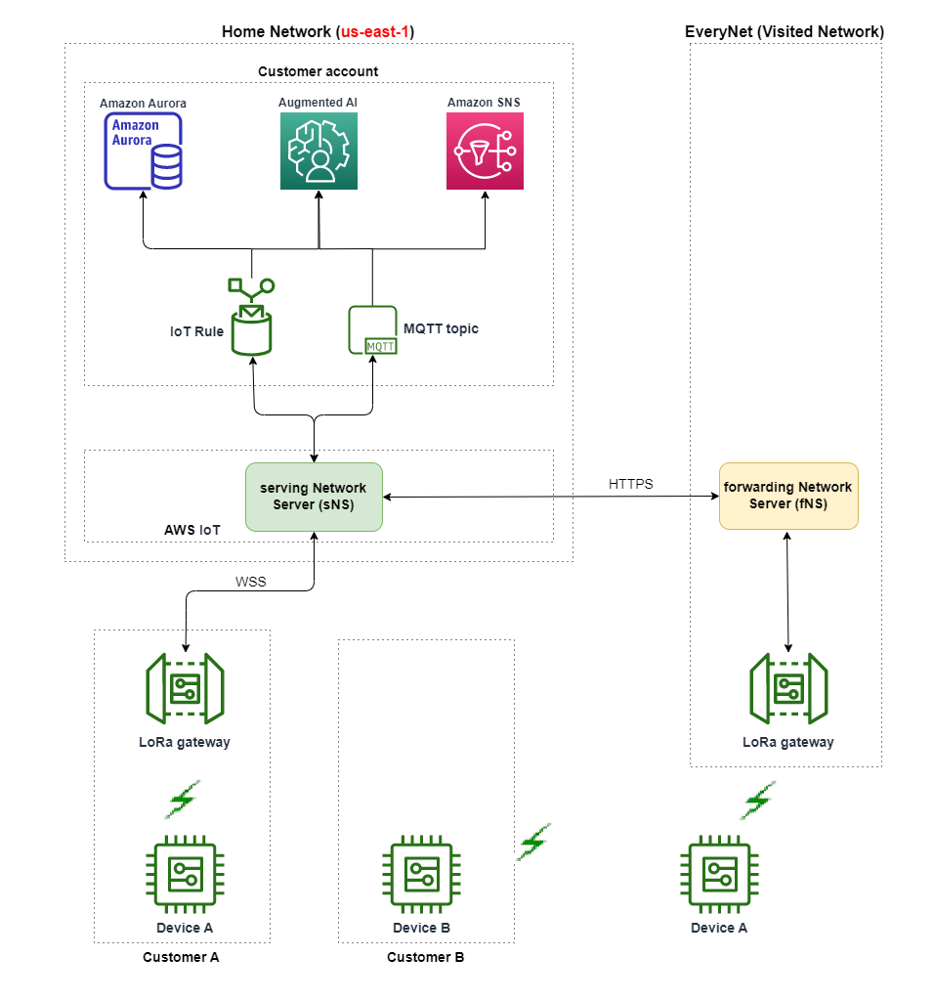

# How LoRaWAN public network support

works

AWS IoT Core for LoRaWAN supports the passive roaming feature, according to the LoRa Alliance
specification. With passive roaming, the roaming process is entirely transparent to
the end device. End devices that roam outside the home network can connect to
gateways in that network and exchange uplink and downlink data using the application
server. The devices stay connected to the home network throughout the entire roaming
process.

###### Note

AWS IoT Core for LoRaWAN supports only the stateless feature of passive roaming. Handover
roaming is not supported. In handover roaming, your device will switch to a
different carrier when it travels outside the home network.

###### Topics

- [Public LoRaWAN network
  concepts](#lorawan-roaming-concepts "#lorawan-roaming-concepts")
- [Public LoRaWAN network support
  architecture](#lorawan-roaming-architecture "#lorawan-roaming-architecture")

## Public LoRaWAN network

concepts

The following concepts are used by the public network feature supported by
AWS IoT Core for LoRaWAN.

**LoRaWAN network server (LNS)**

An LNS is a standalone private server that can run on your
premises or can be a cloud-based service. AWS IoT Core for LoRaWAN is an LNS
that offers services on the cloud.

**Home network server (hNS)**

The home network is the network that the device belongs to. The
home network server (hNS) is an LNS where AWS IoT Core for LoRaWAN stores the
provisioning data of the device, such as the `DevEUI`,
`AppEUI`, and session keys.

**Visited network server (vNS)**

The visited network is the network that the device gets coverage
from when it leaves the home network. The visited network server
(vNS) is an LNS that has a business and technical agreement with the
hNS for being able to serve the end device. AWS partner, Everynet,
acts as the visited network to provide coverage.

**Serving network server (sNS)**

The serving network server (sNS) is an LNS that handles the MAC
commands for the device. There can be only one sNS for one LoRa
session.

**Forwarding network server
(fNS)**

The forwarding network server (fNS) is an LNS that manages the
radio gateways. There can be zero or more fNS involved in one LoRa
session. This network server manages the forwarding of data packets
that are received from the device to the home network.

## Public LoRaWAN network support

architecture

The following architecture diagram shows how AWS IoT Core for LoRaWAN partners with
Everynet to provide public network connectivity. In this case, _Device A_ is connected to the hNS (home network
server) provided by AWS IoT Core for LoRaWAN through a LoRa gateway. When Device A moves
out of the home network, it enters a visited network, and is covered by the
visited network server (vNS) provided by Everynet. The vNS also extends coverage
to _Device B_ which doesn't have a LoRa gateway
to connect to.

You can view the public network coverage information in the AWS IoT console as
described in the following section.

AWS IoT Core for LoRaWAN uses a roaming hub functionality, in accordance with the [LoRa Alliance LoRaWAN Roaming Hub Technical Recommendation](https://lora-alliance.org/wp-content/uploads/2022/01/TR010-1.0.0-LoRaWAN-Roaming-Hub.pdf "https://lora-alliance.org/wp-content/uploads/2022/01/TR010-1.0.0-LoRaWAN-Roaming-Hub.pdf"). The
roaming hub provides an endpoint for Everynet to route the traffic received from
the end device. In this case, Everynet acts as a forwarding network server (fNS)
to forward the traffic received from the device. It uses an HTTP RESTful API, as
defined by the LoRa Alliance specification.

###### Note

If your device moves from its home network and enters a location where
both your home network and Everynet can offer coverage, it uses
first-come-first-serve policy to determine whether to connect to your LoRa
gateway, or to Everynet's gateway.

When visiting a public network, the hNS and serving network server (sNS) are
separated. Uplink and downlink packets are then exchanged between the sNS and
hNS.
