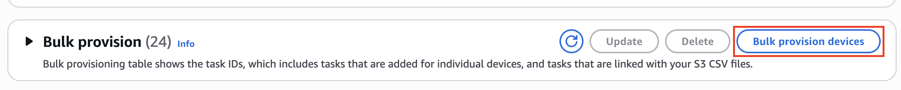

# Provision Sidewalk devices in

bulk

This section shows how you can provision Sidewalk devices in bulk to
AWS IoT Core for Amazon Sidewalk using the AWS IoT console and the AWS CLI.

## Provision Sidewalk devices in

bulk (console)

To add your Sidewalk device using the AWS IoT console, go to the [Sidewalk
tab of the Devices hub](https://console.aws.amazon.com/iot/home#/wireless/devices?tab=sidewalk "https://console.aws.amazon.com/iot/home#/wireless/devices?tab=sidewalk"), choose **Bulk provision
devices**, and then perform the following steps.



1. ###### Choose import method

Specify how you want to import the devices to be onboarded in bulk to
AWS IoT Core for Amazon Sidewalk.

    * To provision individual devices using their SMSN, choose
     **Provision individual factory supported
     device**.
    * To provision devices in bulk by providing a CSV file that
     contains a list of devices and their
     SMS,
     choose **Use S3 bucket**.

2. ###### Specify devices to be onboarded

Depending on the method that you chose to onboard your devices, add
the device information and their serial numbers.

    1. If you chose **Provision individual factory supported
     device**, specify the following information:


    	1. A **Name** for each device to be
    	 onboarded. The name must be unique in your AWS account
    	 and AWS Region.
    	2. Their Sidewalk manufacturing serial number
    	 (SMSN) in the **Enter SMSN**
    	 field.
    	3. A **Destination** that describes the
    	 IoT rule to route messages from the device to other
    	 AWS services.
    	4. (Optional) A **Location Destination** where you want to
    	 send the device location data, after you enable location data when
    	 you create your Sidewalk end device with AWS IoT Core for Amazon
    	 Sidewalk. For more information on AWS IoT's location resolution
    	 capabilities, see [AWS IoT Core
    	 Device Location](../../../iot/latest/developerguide/device-location.md "../../../iot/latest/developerguide/device-location.md")
    	 AWS services.###### Note

    For Bluetooth Low Energy based location, AWS IoT returns location coordinates
     based on the approximate location of nearby Sidewalk Gateways that are
     connected to Amazon Sidewalk and have the Community Finding feature enabled.
     Gateway Location Data is AWS Content and is provided to you solely for
     the purpose of assisting you in locating your devices that are connected
     to Amazon Sidewalk, and you must only use the data for that purpose. You must
     only use and access location data via the interface and functionality
     that we generally make available to you, and you must not attempt to
     re-identify, reverse engineer, or re-map any Gateway location data provided
     by us to you.


    ###### Note

    You must enable positioning to use the device
     location feature.

    If you enable device location for the Sidewalk-enabled
     device, your raw uplink payload won't be propagated to the
     destination.
    2. If you chose **Use S3 bucket**:


    	1. Provide the **S3 Bucket**
    	 information, which consists of the S3 URL information.
    	 To provide your CSV file, choose **Browse
    	 S3**, and then choose the CSV file you
    	 want to use.


    	AWS IoT Core for Amazon Sidewalk automatically populates the S3 URL,
    	 which is the path to your CSV file in the S3 bucket. The
    	 format of the path is
    	 `s3://`bucket_name`/`file_name``.
    	 To view the file in the [Amazon Simple Storage Service](https://console.aws.amazon.com/s3/ "https://console.aws.amazon.com/s3/")
    	 console, choose **View**.
    	2. Provide the **S3 Provisioning role**,
    	 which allows AWS IoT Core for Amazon Sidewalk to access the CSV file in
    	 the S3 bucket on your behalf. You can either create a
    	 new service role or choose an existing role.


    	To create a new role, you can either provide a
    	 **Role name** or leave it blank to
    	 generate a random name automatically.
    	3. Provide a **Destination** that
    	 describes the IoT rule to route messages from the device
    	 to other AWS services.
    	4. (Optional) A **Location Destination** where you want to
    	 send the device location data, after you enable location data when
    	 you create your Sidewalk end device with AWS IoT Core for Amazon
    	 Sidewalk. For more information on AWS IoT's location resolution
    	 capabilities, see [AWS IoT Core
    	 Device Location](../../../iot/latest/developerguide/device-location.md "../../../iot/latest/developerguide/device-location.md")
    	 AWS services.###### Note

    For Bluetooth Low Energy based location, AWS IoT returns location coordinates
     based on the approximate location of nearby Sidewalk Gateways that are
     connected to Amazon Sidewalk and have the Community Finding feature enabled.
     Gateway Location Data is AWS Content and is provided to you solely for
     the purpose of assisting you in locating your devices that are connected
     to Amazon Sidewalk, and you must only use the data for that purpose. You must
     only use and access location data via the interface and functionality
     that we generally make available to you, and you must not attempt to
     re-identify, reverse engineer, or re-map any Gateway location data provided
     by us to you.


    ###### Note

    You must enable positioning to use the device
     location feature.

    If you enable device location for the Sidewalk-enabled
     device, your raw uplink payload won't be propagated to the
     destination.

3. Start import task

Provide any optional tags as name-value pairs and choose
**Submit** to start your wireless device import
task.

## Provision Sidewalk devices in bulk

(CLI)

To onboard your Sidewalk devices to your account for AWS IoT Core for Amazon Sidewalk,
use any of the following API operations depending on whether you want to add
devices individually or by providing the CSV file contained in an S3
bucket.

- ###### Upload devices in bulk using an S3 CSV file

To upload devices in bulk by providing the CSV file in an S3
bucket, use the [`StartWirelessDeviceImportTask`](../apireference/API_StartWirelessDeviceImportTask.md "../apireference/API_StartWirelessDeviceImportTask.md") API
operation, or the [`start-wireless-device-import-task`](../../../cli/latest/reference/iotwireless/start-wireless-device-import-task.md "../../../cli/latest/reference/iotwireless/start-wireless-device-import-task.md")
AWS CLI command. When creating the task, specify the path to the CSV
file in the Amazon S3 bucket and the IAM role that grants
AWS IoT Core for Amazon Sidewalk permissions to access the CSV file.

Once the task starts to run, AWS IoT Core for Amazon Sidewalk will start reading the CSV
file and compare the serial numbers (SMSN) in the file with the
corresponding information in the control log received from Amazon
Sidewalk. When the serial numbers match, it will start creating
wireless device records corresponding to these serial numbers.

The following command shows an example of creating an import
task:

```
aws iotwireless start-wireless-device-import-task \
    --cli-input-json "`file://task.json`"
```

The following shows the contents of the file
`task.json`.

**Contents of task.json**

```
{
    "DestinationName": `"Sidewalk_Destination"`,
    "Positioning": `"Enabled"`
    "Sidewalk": {
        "DeviceCreationFile": "s3://`import_task_bucket`/`import_file1`",
        "Role": "arn:aws:iam::`123456789012`:role/`service-role`/`ACF1zBEI`",
        "Positioning": {
            DestinationName": `"Sidewalk_Location_Destination"`
        }
    }
}
```

Running this command returns an ID and ARN for the import task.

```
{
    "Arn": "arn:aws:iotwireless:`us-east-1`:`123456789012`:ImportTask/`a1b234c5-67ef-21a2-a1b2-3cd4e5f6789a`"
    "Id": `"a1b234c5-67ef-21a2-a1b2-3cd4e5f6789a"`
}
```

- ###### Provision devices individually using their SMSN

To provision devices individually using their SMSN, use the [`StartSingleWirelessDeviceImportTask`](../apireference/API_StartSingleWirelessDeviceImportTask.md "../apireference/API_StartSingleWirelessDeviceImportTask.md")
API operation, or the [`start-single-wireless-device-import-task`](../../../cli/latest/reference/iotwireless/start-single-wireless-device-import-task.md "../../../cli/latest/reference/iotwireless/start-single-wireless-device-import-task.md")
AWS CLI command. When creating the task, specify the Sidewalk
destination and the serial number of the device that you want to
onboard.

When the serial number matches the corresponding information in the
control log received from Amazon Sidewalk, the task will run and create the
wireless device record.

The following command shows an example of creating an import
task:

```
aws iotwireless start-single-wireless-device-import-task \
    --destination-name `sidewalk_destination` \
    --positioning `Enabled` \
    --sidewalk '{
        "SidewalkManufacturingSn": `"82B83C8B35E856F43CE9C3D59B418CC96B996071016DB1C3BE5901F
 0F3071A4A"`}',
        "Positioning":{
            DestinationName": `sidewalk_location_destination`
        }
    }'
```

Running this command returns an ID and ARN for the import task.

```
{
    "Arn": "arn:aws:iotwireless:`us-east-1`:`123456789012`:ImportTask/`e2a5995e-743b-41f2-a1e4-3ca6a5c5249f`"
    "Id": `"e2a5995e-743b-41f2-a1e4-3ca6a5c5249f"`
}
```

## Update or delete import tasks

If you want to add additional devices to an import task, you can update the
task. You can also delete a task if you no longer require the task or if it
failed. For information about when to update or delete a task, see [How to use Sidewalk bulk
provisioning](sidewalk-provision-bulk-import.md#provision-bulk-use "sidewalk-provision-bulk-import.md#provision-bulk-use").

###### Warning

Deletion actions are permanent and can't be undone. Deleting an import
task that has already completed successfully will not remove the end devices
that have already been onboarded using the task.

To update or delete import tasks:

- ###### Using the AWS IoT console

The following steps explain how to update or delete your import
tasks using the AWS IoT console.

###### To update an import task:

    1. Go to the [Sidewalk devices hub](https://console.aws.amazon.com/iot/home#/wireless/devices?tab=sidewalk "https://console.aws.amazon.com/iot/home#/wireless/devices?tab=sidewalk") of the AWS IoT
     console.
    2. Choose the import task that you want to update and then choose
     **Edit**.
    3. Provide another S3 file that contains the serial numbers of
     devices that you want to add to the task and then choose
     **Submit**.

###### To delete an import task:

    1. Go to the [Sidewalk devices hub](https://console.aws.amazon.com/iot/home#/wireless/devices?tab=sidewalk "https://console.aws.amazon.com/iot/home#/wireless/devices?tab=sidewalk") of the AWS IoT
     console.
    2. Choose the task that you want to delete and then choose
     **Delete**.

- ###### Using the AWS IoT Wireless API or AWS CLI

Use the following AWS IoT Wireless API operations or CLI
commands to update or delete your import task.

    + ###### [`UpdateWirelessDeviceImportTask`](../apireference/API_UpdateWirelessDeviceImportTask.md "../apireference/API_UpdateWirelessDeviceImportTask.md")
     API or [`update-wireless-device-import-task`](../../../cli/latest/reference/update-wireless-device-import-task.md "../../../cli/latest/reference/update-wireless-device-import-task.md")
     CLI


    This API operation appends the contents of an Amazon S3 CSV
     file to an existing import task. You can only add serial
     numbers of devices that were not previously included in the
     task.
    + ###### [`DeleteWirelessDeviceImportTask`](../apireference/API_DeleteWirelessDeviceImportTask.md "../apireference/API_DeleteWirelessDeviceImportTask.md")
     API or [`delete-wireless-device-import-task`](../../../cli/latest/reference/delete-wireless-device-import-task.md "../../../cli/latest/reference/delete-wireless-device-import-task.md")
     CLI


    This API operation deletes the import task that was marked
     for deletion using the import task ID.
