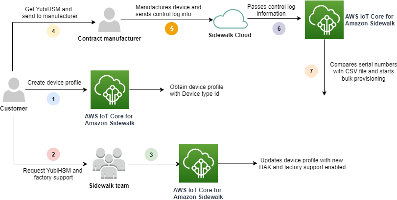

# Amazon Sidewalk bulk provisioning

workflow

The following sections show you key concepts of bulk provisioning and how it works.
The steps that are involved in bulk provisioning include:

1. Create a device profile using AWS IoT Core for Amazon Sidewalk.
2. Request the Amazon Sidewalk team for a YubiHSM key and to update your device
   profile with factory support.
3. Send the YubiHSM key to your manufacturer so that AWS IoT Core for Amazon Sidewalk can obtain
   the control log after the devices are manufactured.
4. Create an import task and provide the serial numbers (SMSN) of the devices to
   be onboarded to AWS IoT Core for Amazon Sidewalk.

## Components of bulk

provisioning

The following concepts show you some key components of bulk provisioning and how
to use them as part of bulk provisioning your Sidewalk devices.

### YubiHSM key

Amazon creates one or more HSMs (hardware security modules) for each of your
Sidewalk products. Each HSM has a unique serial number, called YubiHSM
key, that's printed on the hardware module. This key can be purchased from the
[Yubico
webpage](https://www.yubico.com/product/yubihsm-2/ "https://www.yubico.com/product/yubihsm-2/").

The key is unique to each HSM and tied to each device profile that you create
with AWS IoT Core for Amazon Sidewalk. To obtain the YubiHSM key, contact the Amazon Sidewalk team. If
you send the YubiHSM key to the manufacturer, after the Sidewalk devices
are manufactured in the factory, AWS IoT Core for Amazon Sidewalk will receive a control log file
that contains the serial numbers of the devices. It then compares this
information with your input CSV file for onboarding the devices to AWS IoT.

### Device attestation key

(`DAK`)

When a Sidewalk end device joins the Sidewalk network, it must
be provisioned with a Sidewalk device certificate. The certificates that
are used for setting up your device include a private device-specific
certificate, and the public device certificates, which correspond to the
Sidewalk certificate chain. When your Sidewalk devices are
manufactured, the YubiHSM signs the device certificates.

The following shows a sample JSON file that contains the device certificates
and the private keys. For more information, see [Obtain device JSON files for
provisioning](sidewalk-json-get.md "sidewalk-json-get.md").

```
{
  "p256R1": "`grg8izXoVvQ86cPVm0GMyWuZYHEBbbH ... DANKkOKoNT3bUGz+/f/pyTE+xMRdIUBZ1Bw==`",
  "eD25519": "`grg8izXoVvQ86cPVm0GMyWuZYHEBbbHD ... UiZmntHiUr1GfkTOFMYqRB+Aw==`",
  "metadata": {
    "devicetypeid": "`fe98`",

    ...

    "devicePrivKeyP256R1": "`3e704bf8d319b3a475179f1d68c60737b28c708f845d0198f2d00d00c88ee018`",
    "devicePrivKeyEd25519": "`17dacb3a46ad9a42d5c520ca5f47f0167f59ce54d740aa13918465faf533b8d0`"
  },
  "applicationServerPublicKey": "`5ce29b89c2e3ce6183b41e75fe54e45f61b8bb320efbdd2abd7aefa5957a316b`"
}
```

The device attestation key (DAK) is a private key that you obtain when
creating your device profile. It corresponds to the product certificate, which
is a unique certificate that's issued to each Sidewalk product. When you
contact the Amazon Sidewalk team, you'll receive the Sidewalk certificate
chain, the YubiHSM key, and an HSM provisioned with the product device
attestation key (DAK).

Your device profile is also updated with the new device attestation key (DAK),
and with factory support enabled. The DAK metadata information of the device
profile provides details such as the DAK name, the certificate ID, the ApId
(Advertised Product ID), whether factory support is enabled, and the maximum
number of signatures that the DAK can sign.

### Advertised product ID

(`ApId`)

The `ApId` parameter is an alphanumeric string that identifies the
advertised product. This field must be specified when you want to use a given
device profile for Sidewalk devices that you bulk provision.
AWS IoT Core for Amazon Sidewalk then generates the DAK, and provides it to you through the
YubiHSM key. The related DAK information will be presented in the device
profile.

To obtain the `ApId`, after you retrieve information about the
device profile that you created, contact the Amazon Sidewalk Support team. You can
obtain the device profile information from the AWS IoT console, or using the
[`GetDeviceProfile`](../../2020-11-22/apireference/API_GetDeviceProfile.md "../../2020-11-22/apireference/API_GetDeviceProfile.md") API operation, or the [`get-device-profile`](../../../cli/latest/reference/get-device-profile.md "../../../cli/latest/reference/get-device-profile.md") CLI command.

## How bulk provisioning works

This flowchart shows how bulk provision works with AWS IoT Core for Amazon Sidewalk.



The following procedure illustrates the different steps in the bulk provisioning
process.

1. ###### Create device profile for Sidewalk device

Before you take your end device to the factory, first create a device
profile. You can use this profile to provision individual devices as
described in [Add your device profile and
Sidewalk end device](iot-sidewalk-add-device.md "iot-sidewalk-add-device.md"). 2. ###### Request factory support for your profile

When you're ready to take your end device to factory, ask the Amazon Sidewalk
team for the YubiHSM key and for factory support for your device
profile. 3. ###### Obtain DAK and factory supported profile

The Amazon Sidewalk Support team will then update your device profile with the
product device attestation key (DAK) and factory support. Your device
profile will be updated automatically with an advertised product ID (ApID),
and a new DAK and certificate information, such as the certificate ID.
Sidewalk devices that use this profile are qualified for use with
bulk provisioning. 4. ###### Send YubiHSM key to manufacturer (CM)

Your end device is now qualified, so you can send your YubiHSM key to the
contract manufacturer (CM) to start the manufacturing process. For more
information, see [Manufacturing Amazon Sidewalk devices](https://docs.sidewalk.amazon/manufacturing/ "https://docs.sidewalk.amazon/manufacturing/") in the _Amazon Sidewalk documentation_. 5. ###### Manufacture devices and send control logs and serial numbers

The CM manufactures the devices and generates control logs. The CM also
provides you a CSV file that contains a list of devices to be manufactured
and their Sidewalk manufacturing serial numbers (SMSN). The following
code shows a sample control log. It contains the serial numbers of the
device, the APID, and the public device certificates.

```
{
    "controlLogs": [
    {
        "version": "4-0-1",
        "device":
        {
            "serialNumber": `"device1"`,
            "productIdentifier": {
                "advertisedProductId": `"abCD"`
             },
             "sidewalkData": {
                "SidewalkED25519CertificateChain": "...",
                "SidewalkP256R1CertificateChain": "..."
             }
         }
      }
   ]
}
```

6. ###### Pass control log information to AWS IoT Core for Amazon Sidewalk

The Amazon Sidewalk cloud retrieves the control log information from the
manufacturer and passes this information to AWS IoT Core for Amazon Sidewalk. The devices can
then be created along with their serial numbers. 7. ###### Check serial number match and start bulk provisioning

When you use the AWS IoT console or the AWS IoT Core for Amazon Sidewalk API operation
`StartWirelessDeviceImportTask`, AWS IoT Core for Amazon Sidewalk compares the
Sidewalk manufacturing serial number (SMSN) of each devices obtained
from Amazon Sidewalk with the corresponding serial numbers in your CSV file. If
this information matches, it starts the bulk provisioning process and
creates the devices to be imported to AWS IoT Core for Amazon Sidewalk.
