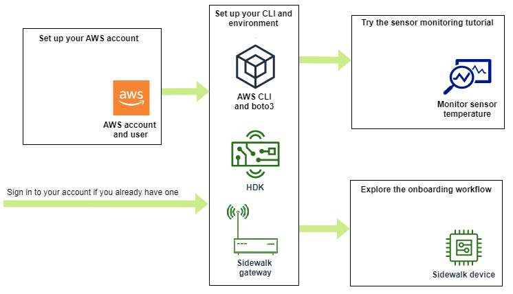
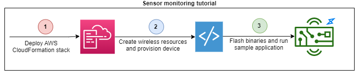

# Getting started with AWS IoT Core for Amazon Sidewalk

This section shows you how to get started with connecting your Sidewalk end devices
to AWS IoT Core for Amazon Sidewalk. It explains how you can connect an end device to Amazon Sidewalk and pass
messages between them. You'll also learn about the Sidewalk sample application and an
overview of how to perform sensor monitoring using AWS IoT Core for Amazon Sidewalk. The sample application
provides you with a dashboard to view and monitor changes to the sensor temperature.


The following topics will help you get started with AWS IoT Core for Amazon Sidewalk.

###### Topics

- [Try the sensor monitoring tutorial](#sidewalk-gs-tutorial "#sidewalk-gs-tutorial")
- [Introduction to onboarding your Sidewalk
  devices](#sidewalk-gs-workflow "#sidewalk-gs-workflow")

## Try the sensor monitoring tutorial

This section provides you an overview of the Amazon Sidewalk sample application on GitHub
that shows you how to monitor the temperature of a sensor. In this tutorial, you use
scripts that programmatically create the required wireless resources, provision the end
device and flash the binaries, and then connect your end device to the application. The
scripts that use the AWS CLI and Python commands create an AWS CloudFormation
stack and wireless resources, and then flash the binaries and deploy the application
onto your hardware development kit (HDK).

The following diagram shows the steps are involved when you run the [sample application](https://github.com/aws-samples/aws-iot-core-for-amazon-sidewalk-sample-app "https://github.com/aws-samples/aws-iot-core-for-amazon-sidewalk-sample-app") and connect your Sidewalk end device to the
application. For detailed instructions including pre-requisites and configuration for
this tutorial, see the [README document](https://github.com/aws-samples/amazon-sidewalk-sample-iot-app/blob/main/README.md "https://github.com/aws-samples/amazon-sidewalk-sample-iot-app/blob/main/README.md") in _GitHub_.



## Introduction to onboarding your Sidewalk

devices

This section shows you how to onboard your Sidewalk end devices to
AWS IoT Core for Amazon Sidewalk. To onboard your devices, first add your Sidewalk device, then
provision and register your device, and then connect your hardware to the cloud
application. Before running this tutorial, review and complete [Installing Python and Python3-pip](getting-started.md#wireless-onboard-prereq "getting-started.md#wireless-onboard-prereq").

The following steps show you how to onboard and connect your Sidewalk end
devices to AWS IoT Core for Amazon Sidewalk. If you want to onboard devices using the AWS CLI, you can refer
to the sample commands provided in this section. For information about onboarding
devices using the AWS IoT console, see [Connecting to AWS IoT Core for Amazon Sidewalk](iot-sidewalk-onboard.md "iot-sidewalk-onboard.md").

###### Important

To perform the entire onboarding workflow, you also provision and register your
end device, and connect your hardware development kit (HDK). For more information,
see [Provisioning and
registering your end device](https://docs.sidewalk.amazon/provisioning/ "https://docs.sidewalk.amazon/provisioning/") in the _Amazon Sidewalk
documentation_.

###### Topics

- [Step 1: Add your Sidewalk device to
  AWS IoT Core for Amazon Sidewalk](#iot-sidewalk-qsg-step1 "#iot-sidewalk-qsg-step1")
- [Step 2: Create a destination for your
  Sidewalk end device](#iot-sidewalk-qsg-step2 "#iot-sidewalk-qsg-step2")
- [Step 3: Provision and register the end
  device](#iot-sidewalk-qsg-step2 "#iot-sidewalk-qsg-step2")
- [Step 4: Connect to Sidewalk end
  device and exchange messages](#iot-sidewalk-qsg-step4 "#iot-sidewalk-qsg-step4")

### Step 1: Add your Sidewalk device to

AWS IoT Core for Amazon Sidewalk

Here's an overview of the steps that you'll perform to add your Sidewalk
end device to AWS IoT Core for Amazon Sidewalk. Store the information you obtain about the device
profile and the wireless device that you create. You'll use this information to
provision and register the end device. For more information about these steps, see
[Add your device to AWS IoT Core for Amazon Sidewalk](iot-sidewalk-create-device.md "iot-sidewalk-create-device.md").

1. ###### Create a device profile

Create a device profile that contains the shared configurations for your
Sidewalk devices. When creating the profile, specify a
`name` for the profile as an
alphanumeric string. To create a profile, either go to the [Sidewalk tab of the Profiles hub](https://console.aws.amazon.com/iot/home#/wireless/profiles?tab=sidewalk "https://console.aws.amazon.com/iot/home#/wireless/profiles?tab=sidewalk") in the AWS IoT console
and choose **Create profile**, or use the [`CreateDeviceProfile`](../../2020-11-22/apireference/API_CreateDeviceProfile.md "../../2020-11-22/apireference/API_CreateDeviceProfile.md") API operation or the
[`create-device-profile`](../../../cli/latest/reference/create-device-profile.md "../../../cli/latest/reference/create-device-profile.md") CLI command as shown in
this example.

```
// Add your device profile using a name and the sidewalk object.
aws iotwireless create-device-profile --name `sidewalk_profile` --sidewalk {}
```

2. ###### Create your Sidewalk end device

Create your Sidewalk end device with AWS IoT Core for Amazon Sidewalk. Specify a
destination name and the ID of the device profile obtained from the previous
step. To add a device, either go to the [Sidewalk tab of the
Devices hub](https://console.aws.amazon.com/iot/home#/wireless/devices?tab=sidewalk "https://console.aws.amazon.com/iot/home#/wireless/devices?tab=sidewalk") in the AWS IoT console and choose **Provision
device**, or use the [`CreateWirelessDevice`](../../2020-11-22/apireference/API_CreateWirelessDevice.md "../../2020-11-22/apireference/API_CreateWirelessDevice.md") API operation or the
[`create-wireless-device`](../../../cli/latest/reference/create-wireless-device.md "../../../cli/latest/reference/create-wireless-device.md") CLI command as shown in
this example.

###### Note

Specify a name for your destination that's unique to your
AWS account and AWS Region. You'll use the same destination name
when you add your destination to AWS IoT Core for Amazon Sidewalk.

```
// Add your Sidewalk device by using the device profile ID.
aws iotwireless create-wireless-device --type "Sidewalk" --name `sidewalk_device` \
    --destination-name `SidewalkDestination` \
    --sidewalk DeviceProfileId=`"12345678-234a-45bc-67de-e8901234f0a1"`
```

3. ###### Get device profile and wireless device information

Get the device profile and wireless device information as a JSON. The JSON
will contain information about the device details, device certificates,
private keys, `DeviceTypeId`, and the Sidewalk
manufacturing serial number (SMSN).

    * If you're using the AWS IoT console, you can use the [Sidewalk tab of the Devices hub](https://console.aws.amazon.com/iot/home#/wireless/devices?tab=sidewalk "https://console.aws.amazon.com/iot/home#/wireless/devices?tab=sidewalk") to download a
     combined JSON file for your Sidewalk end device.
    * If you're using the API operations, store the responses obtained
     from the API operations [`GetDeviceProfile`](../../2020-11-22/apireference/API_GetDeviceProfile.md "../../2020-11-22/apireference/API_GetDeviceProfile.md") and [`GetWirelessDevice`](../../2020-11-22/apireference/API_CreateWirelessDevice.md "../../2020-11-22/apireference/API_CreateWirelessDevice.md") as separate JSON
     files, such as
     ``device_profile.json`` and
     ``wireless_device.json``.


    ```
    // Store device profile information as a JSON file.
    aws iotwireless get-device-profile \
        --id `"12345678-a1b2-3c45-67d8-e90fa1b2c34d"` > `device_profile.json`

    // Store wireless device information as a JSON file.
    aws iotwireless get-wireless-device --identifier-type WirelessDeviceId \
        --identifier `"23456789-abcd-0123-bcde-fabc012345678"` > `wireless_device.json`
    ```

### Step 2: Create a destination for your

Sidewalk end device

Here's an overview of the steps that you'll perform to add your destination to
AWS IoT Core for Amazon Sidewalk. Using the AWS Management Console, or the AWS IoT Wireless API operations, or
the AWS CLI, you run the following steps to create an AWS IoT rule and destination. You
can then connect to the hardware platform, and view and exchange messages. For a
sample IAM role and AWS IoT rule used for the AWS CLI examples in this section, see
[Create an IAM role and IoT rule
for your destination](sidewalk-destination-rule-role.md "sidewalk-destination-rule-role.md").

1. ###### Create IAM role

Create an IAM role that grants AWS IoT Core for Amazon Sidewalk permission to send data to
the AWS IoT rule. To create the role, use the [`CreateRole`](../../../IAM/latest/APIReference/API_CreateRole.md "../../../IAM/latest/APIReference/API_CreateRole.md")
API operation or [`create-role`](../../../cli/latest/reference/iam/create-role.md "../../../cli/latest/reference/iam/create-role.md") CLI command. You can name the role as
`SidewalkRole`.

```
aws iam create-role --role-name lambda-ex \
    --assume-role-policy-document `file://lambda-trust-policy.json`
```

2. ###### Create a rule for the destination

Create an AWS IoT rule that will process the device's data and specify the
topic to which messages are published. You'll observe messages on this topic
after connecting to the hardware platform. Use the AWS IoT Core API operation,
[`CreateTopicRule`](../../../iot/latest/apireference/API_CreateTopicRule.md "../../../iot/latest/apireference/API_CreateTopicRule.md"), or the AWS CLI command, [`create-topic-rule`](../../../cli/latest/reference/iot/create-topic-rule.md "../../../cli/latest/reference/iot/create-topic-rule.md"), to create a rule for the
destination.

```
aws iot create-topic-rule --rule-name `Sidewalkrule` \
    --topic-rule-payload `file://myrule.json`
```

3. ###### Create a destination

Create a destination that associates your Sidewalk device with the
IoT rule that processes it for use with other AWS services. You can add a
destination using the [Destinations hub](https://console.aws.amazon.com/iot/home#/wireless/destinations "https://console.aws.amazon.com/iot/home#/wireless/destinations") of the
AWS IoT console, or the [`CreateDestination`](../../2020-11-22/apireference/API_CreateDestination.md "../../2020-11-22/apireference/API_CreateDestination.md") API operation or the [`create-destination`](../../../cli/latest/reference/create-destination.md "../../../cli/latest/reference/create-destination.md") CLI command.

```
aws iotwireless create-destination --name `SidewalkDestination` \
    --expression-type RuleName --expression `SidewalkRule` \
    --role-arn arn:aws:iam::`123456789012`:role/`SidewalkRole`
```

### Step 3: Provision and register the end

device

Using Python commands, you can provision and register your end device. The
provisioning script uses the device JSON data that you obtained to generate a
manufacturing binary image, which is then flashed on the hardware board. You then
register your end device for connecting to the hardware platform. For more
information, see [Provisioning and registering your end device](https://docs.sidewalk.amazon/provisioning/ "https://docs.sidewalk.amazon/provisioning/") in the _Amazon Sidewalk documentation_.

###### Note

When registering your Sidewalk end device, your gateway must be opted
in to Amazon Sidewalk, and your gateway and device must be in range of each
other.

### Step 4: Connect to Sidewalk end

device and exchange messages

After you've registered your end device, you can then connect your end device and
start exchanging messages and device data.

1. ###### Connect your Sidewalk end device

Connect the HDK to your computer and follow the instructions provided by
the vendor documentation to connect to your HDK. For more information, see
[Provisioning and
registering your end device](https://docs.sidewalk.amazon/provisioning/ "https://docs.sidewalk.amazon/provisioning/") in the _Amazon Sidewalk documentation_. 2. ###### View and exchange messages

Use the MQTT client to subscribe to the topic specified in the rule and
view the message received. You can also use the [`SendDataToWirelessDevice`](../../2020-11-22/apireference/API_SendDataToWirelessDevice.md "../../2020-11-22/apireference/API_SendDataToWirelessDevice.md") API operation or the
[`send-data-to-wireless-device`](../../../cli/latest/reference/iotwireless/send-data-to-wireless-device.md "../../../cli/latest/reference/iotwireless/send-data-to-wireless-device.md") CLI command to
send a downlink message to your device and verify the connectivity
status.

(Optional) You can enable the message delivery status event to check
whether the downlink message was successfully received.

```
aws iotwireless send-data-to-wireless-device \
    --id `"<Wireless_Device_ID>"` \
    --payload-data `"SGVsbG8gVG8gRGV2c2lt"` \
    --wireless-metadata Sidewalk=`{Seq=1,AckModeRetryDurationSecs=10}`
```
