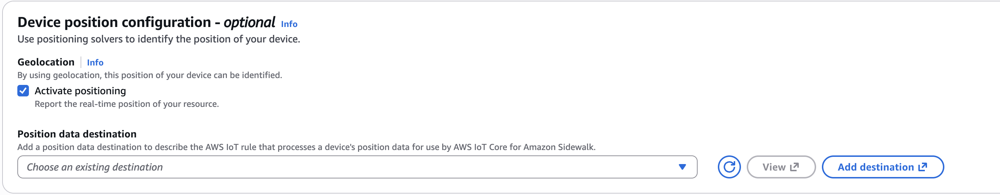
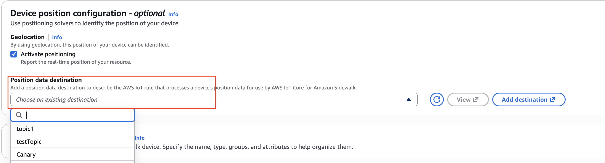
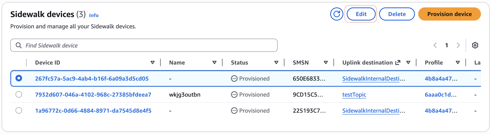

# Configuring the position of Sidewalk devices

When you add your device to AWS IoT Core for Amazon Sidewalk, you can enable positioning and specify
a destination for the location data. After you configure your device position, you can
retrieve the location data using the AWS IoT Wireless API, the AWS CLI, or by
subscribing to an MQTT topic.

You can configure the position of your devices using the AWS Management Console, the
AWS IoT Wireless API, or the AWS CLI.

## Uplink message from AWS IoT Core for Amazon Sidewalk to rules engine

You can subscribe to an MQTT topic to receive location data as it becomes
available from your Sidewalk device. This method allows you to process
location data in real-time using AWS IoT rules.

1. ###### Create a destination for location data

Create a destination with an AWS IoT rule that processes location data.
For information about creating destinations, see [Add a destination for your Sidewalk end device](iot-sidewalk-qsg-destination.md "iot-sidewalk-qsg-destination.md"). 2. ###### Subscribe to the MQTT topic

Go to the AWS IoT console, then navigate to **Test** > the
[MQTT test client](https://console.aws.amazon.com/iot/home#/test "https://console.aws.amazon.com/iot/home#/test").
Enter the topic name that you specified in your location destination rule
(for example, `project/sensor/location`),
and then choose **Subscribe**. 3. ###### View location messages

When your device sends location data, you'll see messages published to
the topic. The following shows an example of a location message:

**Contents of deviceposition.json**

```
{
    "coordinates": [
        `11.11`,
        `22.22`,
        `33.33`
    ],
    "WirelessDeviceId": `"a1b2c3d4-5e6f-7a8b-9c0d-ef1234abcd56"`,
    "type": "Point",
    "properties": {
        "measurementType": `"GNSS" | "Wi-Fi" | "BLE"`,
        "horizontalAccuracy": `16`,
        "verticalAccuracy": `17.2`,
        "timestamp": `"2026-01-01T00:00:00Z"`
    }
}
```

###### Note

The coordinates (position information for a device in GeoJSON format)
are ordered as `[longitude, latitude, altitude]`, and altitude is optional if vertical accuracy information is unavailable.
Please see more details on [Resolved location metadata parameters](#sidewalk-location-devices-metadata "#sidewalk-location-devices-metadata").

## Configuring the position of your devices using the console

To configure and manage the position of your Sidewalk devices by using the
AWS Management Console, first sign in to the console and then go to the [Sidewalk devices
hub](https://console.aws.amazon.com/iot/home#/wireless/devices?tab=sidewalk "https://console.aws.amazon.com/iot/home#/wireless/devices?tab=sidewalk").

###### Add position information

To create a new Sidewalk device with location capabilities:

1. Go to the [Sidewalk devices hub](https://console.aws.amazon.com/iot/home#/wireless/devices?tab=sidewalk "https://console.aws.amazon.com/iot/home#/wireless/devices?tab=sidewalk") and choose **Provision device**.
2. In the **Specify device details** section, enter the device name, choose a device profile, and specify the uplink destination name.
3. In the **Geolocation** section, select **Activate positioning** to enable location capabilities for the device.

 4. In the **Position data destination** field, select the name of the destination where location data will be sent.

 5. Complete the remaining steps to create your device, and then choose **Create**.

###### Update an existing device to enable location

To enable location capabilities for an existing Sidewalk device:

1. Go to the [Sidewalk devices hub](https://console.aws.amazon.com/iot/home#/wireless/devices?tab=sidewalk "https://console.aws.amazon.com/iot/home#/wireless/devices?tab=sidewalk").
2. Choose the device that you want to update to view its details.

 3. In the device details page, select **Activate positioning** to enable location capabilities. 4. In the **Position data destination** field, select the name of the destination where location data will be sent. 5. Choose **Save** to apply the changes.

## Configuring the position of your devices using the API or CLI

You can enable positioning, specify position information, and retrieve the device
position using the AWS IoT Wireless API or the AWS CLI.

###### Important

The API actions [UpdatePosition](../apireference/API_UpdatePosition.md "../apireference/API_UpdatePosition.md"), [GetPosition](../apireference/API_GetPosition.md "../apireference/API_GetPosition.md"), [PutPositionConfiguration](../apireference/API_PutPositionConfiguration.md "../apireference/API_PutPositionConfiguration.md"), [GetPositionConfiguration](../apireference/API_GetPositionConfiguration.md "../apireference/API_GetPositionConfiguration.md"), and [ListPositionConfigurations](../apireference/API_ListPositionConfigurations.md "../apireference/API_ListPositionConfigurations.md") are no longer supported. Calls to update
and retrieve the position information should use the [GetResourcePosition](../apireference/API_GetResourcePosition.md "../apireference/API_GetResourcePosition.md") and [UpdateResourcePosition](../apireference/API_UpdateResourcePosition.md "../apireference/API_UpdateResourcePosition.md") API operations instead.

### Enable positioning (API)

You can enable positioning when creating a new Sidewalk
device or when updating an existing device.

###### Create a new device with positioning enabled

To create a new Sidewalk device with positioning enabled, use the
[`CreateWirelessDevice`](../apireference/API_CreateWirelessDevice.md "../apireference/API_CreateWirelessDevice.md") API operation. Set
`Positioning` to `"Enabled"` and provide the
location destination name in the `Sidewalk.Positioning`
parameter.

**Sample CreateWirelessDevice request**

```
POST /wireless-devices HTTP/1.1
Content-type: application/json

{
    "Type": "Sidewalk",
    "Name": `"sidewalk_device"`,
    "DestinationName": `"UplinkDestination"`,
    "Positioning": "Enabled",
    "Sidewalk": {
        "DeviceProfileId": `"12345678-a1b2-3c45-67d8-e90fa1b2c34d"`,
        "Positioning": {
            "DestinationName": `"LocationDestination"`
        }
    }
}
```

###### Update an existing device to enable positioning

To enable positioning for an existing Sidewalk device, use the
[`UpdateWirelessDevice`](../apireference/API_UpdateWirelessDevice.md "../apireference/API_UpdateWirelessDevice.md") API operation. Set
`Positioning` to `"Enabled"` and provide the
location destination name.

**Sample UpdateWirelessDevice request**

```
PATCH /wireless-devices/`{Id}` HTTP/1.1
Content-type: application/json

{
    "Positioning": "Enabled",
    "Sidewalk": {
        "Positioning": {
            "DestinationName": `"LocationDestination"`
        }
    }
}
```

###### Note

This command returns no response body (`204 No Content`).
To verify that positioning was enabled, use the
`GetWirelessDevice` API operation or the
`get-wireless-device` CLI command.

### Enable positioning (CLI)

You can enable location capabilities using the AWS CLI when creating a new device or updating an existing device.

###### Create a new device with location enabled

To create a Sidewalk device with location enabled, use the [`CreateWirelessDevice`](../apireference/API_CreateWirelessDevice.md "../apireference/API_CreateWirelessDevice.md") API operation or the [`create-wireless-device`](../../../cli/latest/reference/iotwireless/create-wireless-device.md "../../../cli/latest/reference/iotwireless/create-wireless-device.md") CLI command with the `--positioning` parameter set to `Enabled`.

```
aws iotwireless create-wireless-device \
    --type "Sidewalk" \
    --name `"sidewalk_device"` \
    --destination-name `"UplinkDestination"` \
    --positioning "Enabled" \
    --sidewalk DeviceProfileId=`"12345678-a1b2-3c45-67d8-e90fa1b2c34d"`,Positioning={DestinationName=`"LocationDestination"`}
```

###### Update an existing device to enable location

To enable location for an existing Sidewalk device, use the [`UpdateWirelessDevice`](../apireference/API_UpdateWirelessDevice.md "../apireference/API_UpdateWirelessDevice.md") API operation or the [`update-wireless-device`](../../../cli/latest/reference/iotwireless/update-wireless-device.md "../../../cli/latest/reference/iotwireless/update-wireless-device.md") CLI command.

```
aws iotwireless update-wireless-device \
    --id `"a1b2c3d4-5e6f-7a8b-9c0d-ef1234abcd56"` \
    --positioning "Enabled" \
    --sidewalk Positioning={DestinationName=`"LocationDestination"`}
```

### Update position information

To update the position information for a given wireless device, specify the
coordinates using the [UpdateResourcePosition](../apireference/API_UpdateResourcePosition.md "../apireference/API_UpdateResourcePosition.md") API operation or the [update-resource-position](../../../cli/latest/reference/iotwireless/update-resource-position.md "../../../cli/latest/reference/iotwireless/update-resource-position.md") CLI command. Specify
`WirelessDevice` as the `ResourceType`, the ID of the
wireless device to be updated as the `ResourceIdentifier`, and the
position information as a GeoJSON payload.

**Sample of the UpdateResourcePosition API operation**

```
PATCH /resource-positions/`ResourceIdentifier`?resourceType=WirelessDevice HTTP/1.1
{
    "coordinates": [
        `33.33`,
        `-22.22`,
        `11.11`
    ],
    "type": "Point"
}
```

**Sample of the update-resource-position CLI command**

```
echo '{"coordinates": [33.33, -22.22, 11.11], "type": "Point"}' > /tmp/position.json
aws iotwireless update-resource-position \
    --resource-type WirelessDevice \
    --resource-id `"a1b2c3d4-5e6f-7a8b-9c0d-ef1234abcd56"` \
    --geo-json-payload fileb:///tmp/position.json
```

After updating the position, the following message will be published to
your location destination topic. Note that `measurementType` is set to
`"UserInput"` to indicate the position was set manually.

The following shows the contents of the `deviceposition.json` file,
which is the uplink message from AWS IoT Core for Amazon Sidewalk to rules engine.

**Contents of deviceposition.json**

```
{
    "coordinates": [
        `33.33`,
        `-22.22`,
        `11.11`
    ],
    "WirelessDeviceId": `"a1b2c3d4-5e6f-7a8b-9c0d-ef1234abcd56"`,
    "type": "Point",
    "properties": {
        "measurementType": "UserInput",
        "horizontalAccuracy": 0,
        "verticalAccuracy": 0,
        "timestamp": `"2026-01-01T00:00:00Z"`
    }
}
```

###### Note

This command returns no response body (`204 No Content`).
To verify the updated position, use the `GetResourcePosition` API operation.

### Get position information

To get the position information for a given wireless device, use the [GetResourcePosition](../apireference/API_GetResourcePosition.md "../apireference/API_GetResourcePosition.md") API operation or the [get-resource-position](../../../cli/latest/reference/iotwireless/get-resource-position.md "../../../cli/latest/reference/iotwireless/get-resource-position.md") CLI command. Specify
`WirelessDevice` as the `resourceType` and provide
the ID of the wireless device as the `resourceIdentifier`.

**Sample of the GetResourcePosition API operation**

```
GET /resource-positions/`ResourceIdentifier`?resourceType=WirelessDevice HTTP/1.1
```

**Sample of the get-resource-position CLI command**

```
aws iotwireless get-resource-position \
    --resource-type WirelessDevice \
    --resource-id `"a1b2c3d4-5e6f-7a8b-9c0d-ef1234abcd56"` \
    /dev/stdout
```

###### Note

This command returns the position information of your wireless device as a GeoJSON payload (`200 OK`).

The contents of the `get-resource-position-api-response.json` file
includes the position coordinates, geolocation type, and properties such as measurement type, accuracy,
and the timestamp when the device position was resolved. The wireless device ID is
not included in the API response.

**Contents of get-resource-position-api-response.json**

```
{
    "coordinates": [
        `33.33`,
        `-22.22`,
        `11.11`
    ],
    "type": "Point",
    "properties": {
        "measurementType": `"GNSS" | "Wi-Fi" | "BLE" | "UserInput"`,
        "horizontalAccuracy": `16`,
        "verticalAccuracy": `17.2`,
        "timestamp": `"Thu Jan 01 00:00:00 UTC 2026"`
    }
}
```

## Resolved location metadata parameters

The following table shows a definition of the different parameters in the
resolved location metadata.

| Sidewalk resolved location metadata parameters | Parameter                                                                                                                                                                                                                      | Description | Type |
| ---------------------------------------------- | ------------------------------------------------------------------------------------------------------------------------------------------------------------------------------------------------------------------------------ | ----------- | ---- |
| `coordinates`                                  | The resolved coordinates of the Sidewalk device.<br>Coordinates are ordered as `[longitude, latitude, altitude]`.                                                                                                              | Array       |
| `WirelessDeviceId`                             | The identifier of the wireless device that sends the<br>location uplink data.                                                                                                                                                  | String      |
| `type`                                         | GeoJSON type. Currently supports the `"Point"` type.                                                                                                                                                                           | String      |
| `measurementType`                              | The measurement type for resolved location metadata.<br>For Sidewalk devices, the supported values are<br>`"GNSS"`, `"Wi-Fi"`, and `"BLE"`.<br>If triggered by update-resource-position API or CLI, it would be `"UserInput"`. | String      |
| `horizontalAccuracy`                           | The horizontal accuracy of the resolved position, in meters.                                                                                                                                                                   | Number      |
| `verticalAccuracy`                             | The vertical accuracy of the resolved position, in meters.                                                                                                                                                                     | Number      |
| `timestamp`                                    | The timestamp when the Sidewalk device location was resolved.                                                                                                                                                                  | Timestamp   |
