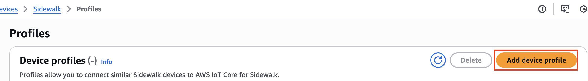

# Creating device profiles with factory

support

Before you can bulk provision your Amazon Sidewalk devices, you must create a device
profile and then contact the Amazon Sidewalk support team to request factory support for it.
The Amazon Sidewalk team will then update your device profile with a new device attestation
key (DAK) and add factory support to it. Sidewalk devices that use this profile
are then qualified to be used with AWS IoT Core for Amazon Sidewalk, and can be onboarded for bulk
provisioning.

The following steps show you how to create a factory-supported device profile.

1. ###### Create a device profile

First create a device profile. When you create a profile, specify a name and
optional tags as name-value pairs. For more information about the parameters
required, and creating and using profiles, see [How to create and add your device](iot-sidewalk-create-device.md#iot-sidewalk-device-how "iot-sidewalk-create-device.md#iot-sidewalk-device-how"). 2. ###### Obtain factory support for the profile

Then obtain factory support for your device profile so that devices that use
this profile can be qualified. For qualification, create a ticket with the
Amazon Sidewalk team. Once confirmed by the team, you'll receive an ApId (advertised
product ID), and your profile will be updated with a factory-issued DAK.
Sidewalk end devices that use this profile will be qualified.
You can create a device profile either using the AWS IoT console, the AWS IoT Core for Amazon Sidewalk API
operations, or the AWS CLI.

###### Topics

- [Create a profile (console)](#provision-profile-console "#provision-profile-console")
- [Create a profile (CLI)](#provision-profile-cli "#provision-profile-cli")
- [Next steps](#provision-profile-next "#provision-profile-next")

## Create a profile (console)

To create a device profile using the AWS IoT console, go to the [Sidewalk
tab of the Profiles hub](https://console.aws.amazon.com/iot/home#/wireless/profiles?tab=sidewalk "https://console.aws.amazon.com/iot/home#/wireless/profiles?tab=sidewalk") and choose **Create
profile**.



To create a profile, specify the following fields, and then choose
**Submit**.

- ###### Name

Enter a **Name** for your profile.

- ###### Tags

Enter optional tags as name-value pairs to help you more easily
identify your profile. Tags also make it easier to track billing
charges.

###### View profile information and qualify profiles

You'll see the profile that you created in the [Profiles hub](https://console.aws.amazon.com/iot/home#/wireless/profiles?tab=sidewalk "https://console.aws.amazon.com/iot/home#/wireless/profiles?tab=sidewalk"). Choose
the profile to view its details. You'll see information about:

- The device profile name and unique identifier, and any optional tags you
  specified as name value pairs.
- The application server public key and device type ID of the
  profile.
- The qualification status, which indicates that you're using a device
  profile that is not factory supported. To qualify your device profile so
  that it's factory supported, contact Amazon Sidewalk Support.
- The device attestation key (DAK) information. Once your device profile is
  qualified, a new DAK will be issued and your profile will be updated
  automatically with the new DAK information.

## Create a profile (CLI)

To create a device profile, use the [`CreateDeviceProfile`](../apireference/API_CreateDeviceProfile.md "../apireference/API_CreateDeviceProfile.md") API operation or the [`create-device-profile`](../../../cli/latest/reference/create-device-profile.md "../../../cli/latest/reference/create-device-profile.md") CLI command. For example, the
following command creates a profile for your Sidewalk end device.

```
aws iotwireless create-device-profile \
                --name `"sidewalk_device_profile"`
                --sidewalk {}
```

Running this command returns the profile details, which include the Amazon
Resource Name (ARN) and the ID of the profile.

```
{
    "DeviceProfileArn": "arn:aws:iotwireless:us-east-1:`123456789012`:DeviceProfile/`12345678-a1b2-3c45-67d8-e90fa1b2c34d`",
    "DeviceProfileId": "`12345678-a1b2-3c45-67d8-e90fa1b2c34d`"
}
```

###### View profile information and qualify profiles

Use the [`GetDeviceProfile`](../apireference/API_GetDeviceProfile.md "../apireference/API_GetDeviceProfile.md") API operation or the [`get-device-profile`](../../../cli/latest/reference/get-device-profile.md "../../../cli/latest/reference/get-device-profile.md") CLI command to get information
about your device profile that you added to your account for AWS IoT Core for Amazon Sidewalk. To
retrieve information about your device profile, specify the profile ID. The API
will then return information about the device profile matching the specified
identifier.

The following shows an example CLI command:

```
aws iotwireless get-device-profile \
    --id "`12345678-234a-45bc-67de-e8901234f0a1`" > `device_profile.json`
```

Running this command returns the parameters of your device profile, the
application server public key, the `DeviceTypeId`, `ApId`,
qualification status, and the `DAKCertificate` information.

In this example, the qualification status and DAK information indicate that your
device profile is not qualified. To qualify your profile, contact Amazon Sidewalk
Support, and your profile will be issued a new DAK with no device limit.

```
{
    "Arn": "arn:aws:iotwireless:`us-east-1`:`123456789012`:DeviceProfile/`12345678-a1b2-3c45-67d8-e90fa1b2c34d`",
    "Id": "`12345678-a1b2-3c45-67d8-e90fa1b2c34d`",
    "Name": `"Sidewalk_profile"`,
    "LoRaWAN": null,
    "Sidewalk":
    {
        "ApplicationServerPublicKey": "`a123b45c6d78e9f012a34cd5e6a7890b12c3d45e6f78a1b234c56d7e890a1234`",
        "DAKCertificateMetadata": [
            {
                "DeviceTypeId": "`fe98`",
                "CertificateId": `"43564A6D2D50524F544F54595045"`,
                "FactorySupport": false,
                "MaxAllowedSignature": 1000
            }
        ],
        "QualificationStatus": false
    }
}
```

Once the Amazon Sidewalk Support team confirms this information, you'll receive the
APID and a factory-supported DAK, as shown in the following example.

###### Note

The `MaxAllowedSignature` of `-1` indicates that the DAK
doesn't have any device limit. For information about the DAK parameters, see
[DAKCertificateMetadata](../apireference/API_DAKCertificateMetadata.md "../apireference/API_DAKCertificateMetadata.md").

```
{
    "Arn": "arn:aws:iotwireless:`us-east-1`:`123456789012`:DeviceProfile/`12345678-a1b2-3c45-67d8-e90fa1b2c34d`",
    "Id": "`12345678-a1b2-3c45-67d8-e90fa1b2c34d`",
    "Name": `"Sidewalk_profile"`,
    "LoRaWAN": null,
    "Sidewalk":
    {
        "ApplicationServerPublicKey": "`a123b45c6d78e9f012a34cd5e6a7890b12c3d45e6f78a1b234c56d7e890a1234`",
        "DAKCertificateMetadata": [
            {
                "ApId": "`GZBd`",
                "CertificateId": "`43564A6D2D50524F544F54595045`",
                "FactorySupport": true,
                "MaxAllowedSignature": -1
            }
        ],
        "QualificationStatus": true
    }
}
```

## Next steps

Now that you've created a device profile which has a factory-supported DAK,
provide the YubiHSM key that you obtain from the team to your manufacturer. Your
devices will then be manufactured in the factory and a control log information will
then be passed to Amazon Sidewalk, which contains the serial numbers (SMSN) of the
devices. For more information about this workflow, see [Manufacturing Amazon Sidewalk
devices](https://docs.sidewalk.amazon/manufacturing/ "https://docs.sidewalk.amazon/manufacturing/") in the _Amazon Sidewalk
documentation_.

You can then bulk provision your Sidewalk devices by providing
AWS IoT Core for Amazon Sidewalk the serial numbers of the devices to be onboarded. When
AWS IoT Core for Amazon Sidewalk receives the control log, it compares the serial numbers in the
control log with the serial numbers that you provided. If the serial numbers match,
the import task starts onboarding your devices to AWS IoT Core for Amazon Sidewalk. For more
information, see [Provisioning Sidewalk devices
using import tasks](sidewalk-provision-bulk-import.md "sidewalk-provision-bulk-import.md").
