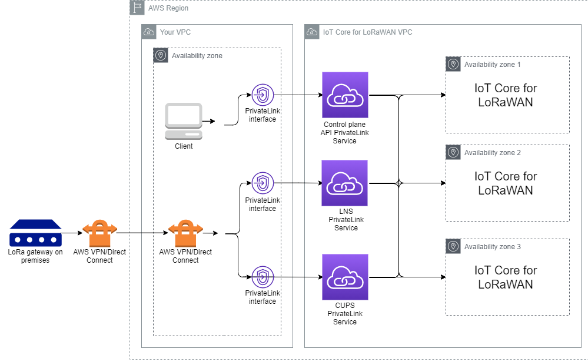

# AWS IoT Core for LoRaWAN and interface VPC endpoints

(AWS PrivateLink)

You can connect directly to AWS IoT Core for LoRaWAN through [Interface VPC endpoints
(AWS PrivateLink)](../../../vpc/latest/privatelink/vpce-interface.md "../../../vpc/latest/privatelink/vpce-interface.md") in your Virtual Private Cloud (VPC) instead of connecting over
the public internet. When you use a VPC interface endpoint, communication between your VPC
and AWS IoT Core for LoRaWAN is conducted entirely and securely within the AWS network.

AWS IoT Core for LoRaWAN supports Amazon Virtual Private Cloud interface endpoints that are powered by AWS PrivateLink.
Each VPC endpoint is represented by one or more [Elastic Network Interfaces](../../../AWSEC2/latest/UserGuide/using-eni.md "../../../AWSEC2/latest/UserGuide/using-eni.md") with
private IP addresses in your VPC subnets. For more information, see [Interface VPC endpoints (AWS PrivateLink)](../../../vpc/latest/userguide/vpce-interface.md "../../../vpc/latest/userguide/vpce-interface.md")
in the _Amazon VPC User Guide_.

###### Note

AWS IoT Core for LoRaWAN support both IPv6 and IPv4 address formats when communicating with
the interface VPC endpoints using AWS PrivateLink. See [AWS services
that support IPv6](../../../general/latest/gr/aws-ipv6-support.md#ipv6-service-support "../../../general/latest/gr/aws-ipv6-support.md#ipv6-service-support").

For more information about VPC and endpoints, see [What is
Amazon VPC](../../../vpc/latest/userguide/what-is-amazon-vpc.md#what-is-privatelink "../../../vpc/latest/userguide/what-is-amazon-vpc.md#what-is-privatelink").

For more information about AWS PrivateLink, see [AWS PrivateLink and VPC
endpoints](../../../vpc/latest/privatelink/endpoint-services-overview.md "../../../vpc/latest/privatelink/endpoint-services-overview.md").

## Considerations for AWS IoT Wireless VPC

endpoints

Before you set up an interface VPC endpoint for AWS IoT Wireless, ensure that you review
[Interface endpoint properties and limitations](../../../vpc/latest/userguide/vpce-interface.md#vpce-interface-limitations "../../../vpc/latest/userguide/vpce-interface.md#vpce-interface-limitations") in the
_Amazon VPC User Guide_.

AWS IoT Wireless supports making calls to all of its API actions from your VPC. VPC endpoint
policies are not supported for AWS IoT Wireless. By default, full access to AWS IoT Wireless is
allowed through the endpoint. For more information, see [Controlling access to services with
VPC endpoints](../../../vpc/latest/userguide/vpc-endpoints-access.md "../../../vpc/latest/userguide/vpc-endpoints-access.md") in the _Amazon VPC User Guide_.

## AWS IoT Core for LoRaWAN privatelink

architecture

The following diagram shows the privatelink architecture of AWS IoT Core for LoRaWAN. The
architecture uses a Transit Gateway and Route 53 Resolver to share the AWS PrivateLink interface endpoints
between your VPC, the AWS IoT Core for LoRaWAN VPC, and an on-premises environment. You'll find a
more detailed architecture diagram when setting up the connection to the VPC interface
endpoints.

## AWS IoT Core for LoRaWAN endpoints

AWS IoT Core for LoRaWAN has three public endpoints. Each public endpoint has a corresponding VPC
interface endpoint. The public endpoints can be classified into control plane and data
plane endpoints. For information about these endpoints, see [AWS IoT Core for LoRaWAN API
endpoints](../../../general/latest/gr/iot-core.md#iot-wireless_region "../../../general/latest/gr/iot-core.md#iot-wireless_region").

- ###### Control plane API endpoints

You can use control plane API endpoints to interact with the
AWS IoT Wireless APIs. These endpoints can be accessed from a client that
is hosted in your Amazon VPC by using AWS PrivateLink.

- ###### Data plane API endpoints

Data plane API endpoints are LoRaWAN Network Server (LNS) and
Configuration and Update Server (CUPS) endpoints that you can use to
interact with the AWS IoT Core for LoRaWAN LNS and
CUPS
endpoints. These endpoints can be accessed from your LoRa
gateways on premises by using AWS VPN or AWS Direct Connect. You get
these endpoints when onboarding your gateway to AWS IoT Core for LoRaWAN. For more
information, see [Add a gateway to AWS IoT Core for LoRaWAN](lorawan-onboard-gateway-add.md "lorawan-onboard-gateway-add.md").

###### Topics

- [Onboard AWS IoT Core for LoRaWAN control plane
  API endpoint](lorawan-onboard-control-endpoint.md "lorawan-onboard-control-endpoint.md")
- [Onboard AWS IoT Core for LoRaWAN data plane API
  endpoints](onboard-lns-cups-endpoints.md "onboard-lns-cups-endpoints.md")
