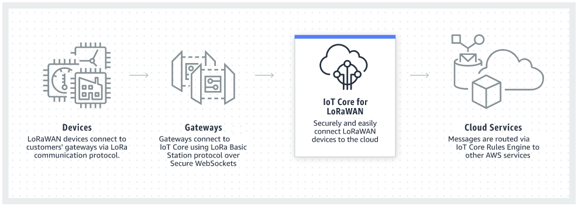

# What is AWS IoT Core for LoRaWAN?

AWS IoT Core for LoRaWAN replaces a private LoRaWAN network server (LNS) by connecting your LoRaWAN
devices and gateways to AWS. Using the AWS IoT rules engine, you can route messages received from
LoRaWAN devices, where they can be formatted and sent to other AWS IoT services. To secure device
communications with AWS IoT, AWS IoT Core for LoRaWAN uses X.509 certificates.

AWS IoT Core for LoRaWAN manages the service and device policies that AWS IoT Core requires to communicate
with the LoRaWAN gateways and devices. AWS IoT Core for LoRaWAN also manages the destinations that describe
the AWS IoT rules that send device data to other services.

The following topics will provide more information about the LoRaWAN technology and
AWS IoT Core for LoRaWAN.

###### Topics

- [What is LoRaWAN?](#what-is-lorawan "#what-is-lorawan")
- [How AWS IoT Core for LoRaWAN works](#how-iot-lorawan-works "#how-iot-lorawan-works")
- [Get started using AWS IoT Core for LoRaWAN](#lorawan-get-started-resources "#lorawan-get-started-resources")
- [AWS IoT Core for LoRaWAN resources](#iot-lorawan-resources "#iot-lorawan-resources")

## What is LoRaWAN?

The [LoRa Alliance](https://lora-alliance.org/about-lorawan "https://lora-alliance.org/about-lorawan") describes
LoRaWAN as, _"a Low Power, Wide Area (LPWA) networking protocol designed
to wirelessly connect battery operated ‘things’ to the internet in regional, national or global
networks, and targets key Internet of Things (IoT) requirements such as bi-directional
communication, end-to-end security, mobility and localization services."_.

###### Topics

- [LoRa and LoRaWAN](#lora-and-lorawan "#lora-and-lorawan")
- [Characteristics of LoRaWAN technology](#lorawan-characteristics "#lorawan-characteristics")
- [LoRaWAN protocol versions](#lorawan-versions "#lorawan-versions")
- [Learn more about LoRaWAN](#lorawan-learn-more "#lorawan-learn-more")

### LoRa and LoRaWAN

The LoRaWAN protocol is a Low Power Wide Area Networking (LPWAN) communication protocol
that functions on LoRa.

LoRaWAN has been recognized as an international standard for low power wide area
networking. For more information, see [LoRAWAN formally recognized as ITU internationl standard](https://lora-alliance.org/lora-alliance-press-release/lorawan-formally-recognized-as-itu-international-standard-for-low-power-wide-area-networking/ "https://lora-alliance.org/lora-alliance-press-release/lorawan-formally-recognized-as-itu-international-standard-for-low-power-wide-area-networking/"). The LoRaWAN specification
is open so anyone can set up and operate a LoRa network.

LoRa is a wireless audio frequency technology that operates in a license-free radio
frequency spectrum. LoRa is a physical layer protocol that uses spread spectrum modulation and
supports long-range communication at the cost of a narrow bandwidth. It uses a narrow band
waveform with a central frequency to send data, which makes it robust to interference.

### Characteristics of LoRaWAN technology

- Long range communication up to 10 miles in line of sight.
- Long battery duration of up to 10 years. For enhanced battery life, you can operate your
  devices in class A or class B mode, which requires increased downlink latency.
- Low cost for devices and maintenance.
- License-free radio spectrum but region-specific regulations apply.
- Low power but has a limited payload size of 51 bytes to 241 bytes depending on the data
  rate. The data rate can be 0,3 Kbit/s – 27 Kbit/s data rate with a 222 maximal payload
  size.

### LoRaWAN protocol versions

LoRa Alliance specifies the LoRaWAN protocol using LoRaWAN specification documents. To
account for the region-specific regulations, the LoRa Alliance also publishes regional
parameter documents. For more information, see [LoRaWAN
regional parameters and specifications](https://lora-alliance.org/resource_hub/rp2-102-lorawan-regional-parameters/ "https://lora-alliance.org/resource_hub/rp2-102-lorawan-regional-parameters/").

The initial release of LoRaWAN is version 1.0. Additional versions released are 1.0.1,
1.0.2, 1.0.3, 1.0.4, and 1.1. Versions 1.0.1-1.0.4 are commonly referred to as 1.0.x.

### Learn more about LoRaWAN

The following links contain helpful information about the LoRaWAN technology and about
LoRa Basics Station, which is the software that runs on your LoRaWAN gateways for connecting
end devices to AWS IoT Core for LoRaWAN.

- ###### [LoRaWAN recognized as ITU International Standard](https://lora-alliance.org/lora-alliance-press-release/lorawan-formally-recognized-as-itu-international-standard-for-low-power-wide-area-networking/ "https://lora-alliance.org/lora-alliance-press-release/lorawan-formally-recognized-as-itu-international-standard-for-low-power-wide-area-networking/")

LoRaWAN has been formally documented as an international standard by ITU for low power
wide area networking. The standard is titled Recommendation ITU-T Y.4480 “Low power protocol
for wide area wireless networks”.

- ###### [The Things Fundamentals
  on LoRaWAN](https://www.thethingsnetwork.org/docs/lorawan/ "https://www.thethingsnetwork.org/docs/lorawan/")

The Things Fundamentals on LoRaWAN contains an introductory video that covers the
fundamentals of LoRaWAN and a series of chapters that'll help you learn about LoRa and
LoRaWAN.

- ###### [What is
  LoRaWAN](https://lora-alliance.org/resource_hub/what-is-lorawan/ "https://lora-alliance.org/resource_hub/what-is-lorawan/")

LoRa Alliance provides a technical overview of LoRa and LoRaWAN, including a summary of
the LoRaWAN specifications in different Regions.

- ###### [LoRa
  Basics Station](https://lora-developers.semtech.com/resources/tools/lora-basics/ "https://lora-developers.semtech.com/resources/tools/lora-basics/")

Semtech Corporation provides helpful concepts about LoRa basics for gateways and end
nodes. LoRa Basics Station, an open source software that runs on your LoRaWAN gateway, is
maintained and distributed through Semtech Corporation's [GitHub](https://github.com/lorabasics/basicstation "https://github.com/lorabasics/basicstation") repository. You can also
learn about the LNS and CUPS protocols that describe how to exchange LoRaWAN data and
perform configuration updates.

- ###### [LoRaWAN
  regional parameters and specifications](https://lora-alliance.org/resource_hub/rp2-102-lorawan-regional-parameters/ "https://lora-alliance.org/resource_hub/rp2-102-lorawan-regional-parameters/")

RP002-1.0.2 document includes support for all versions of the LoRaWAN Layer 2
specification.It includes information about the LoRaWAN specifications and regional
parameters, and the different LoRaWAN versions.

## How AWS IoT Core for LoRaWAN works

The LoRaWAN network architecture is deployed
in
a star of stars topology in which gateways relay
information between end devices and the LoRaWAN network server (LNS). The following shows how a
LoRaWAN device interacts with AWS IoT Core for LoRaWAN. It also shows how AWS IoT Core for LoRaWAN acts as an LNS and
communicates with other AWS services in the AWS Cloud.

LoRaWAN devices communicate with AWS IoT Core through LoRaWAN gateways. AWS IoT Core for LoRaWAN manages
the service and device policies that AWS IoT Core requires to manage and communicate with the
LoRaWAN gateways and devices. AWS IoT Core for LoRaWAN also manages the destinations that describe the
AWS IoT rules that send device data to other services.

## Get started using AWS IoT Core for LoRaWAN

The following steps show an overview of how you can get started using AWS IoT Core for LoRaWAN.

1. ###### Select the wireless devices and LoRaWAN gateways that you'll need.

The [AWS
Partner Device Catalog](https://devices.amazonaws.com/search?page=1&sv=iotclorawan "https://devices.amazonaws.com/search?page=1&sv=iotclorawan") contains gateways and developer kits that are qualified for
use with AWS IoT Core for LoRaWAN. For more information, see [Using qualified gateways from the AWS
Partner Device Catalog](lorawan-manage-gateways.md#lorawan-qualified-gateways "lorawan-manage-gateways.md#lorawan-qualified-gateways"). 2. ###### Add your wireless devices and LoRaWAN gateways to AWS IoT Core for LoRaWAN.

[Connecting gateways and devices to
AWS IoT Core for LoRaWAN](lorawan-getting-started.md "lorawan-getting-started.md") gives
you information about how to describe your resources and add your wireless devices and
LoRaWAN gateways to AWS IoT Core for LoRaWAN. You'll also learn how to configure the other AWS IoT Core for LoRaWAN
resources that you'll need to manage these devices and send their data to AWS
services. 3. ###### Complete your AWS IoT Core for LoRaWAN solution.

Start with [our sample
AWS IoT Core for LoRaWAN solution](https://github.com/aws-samples/aws-iot-core-lorawan "https://github.com/aws-samples/aws-iot-core-lorawan") and make it yours.

## AWS IoT Core for LoRaWAN resources

The following resources will help you learn more about AWS IoT Core for LoRaWAN and how to get
started.

- ###### [Getting Started with
  AWS IoT Core for LoRaWAN](https://www.youtube.com/watch?v=6-ZrdRjqdTk/ "https://www.youtube.com/watch?v=6-ZrdRjqdTk/")

The following video describes how AWS IoT Core for LoRaWAN works and walks you through the process
of adding LoRaWAN gateways from the AWS Management Console.

- ###### [AWS IoT Core for LoRaWAN
  workshop](https://iotwireless.workshop.aws/en/ "https://iotwireless.workshop.aws/en/")

The workshop covers fundamentals of LoRaWAN technology and its implementation with
AWS IoT Core for LoRaWAN. You can also use the workshop to walk through labs that show how to connect
your gateway and device to AWS IoT Core for LoRaWAN for building a sample IoT solution.

- ###### [Implementing Low-Power Wide-Area Network (LPWAN) Solutions with AWS IoT](https://d1.awsstatic.com/whitepapers/LPWAN-connectivity-with-AWS-IoT.pdf "https://d1.awsstatic.com/whitepapers/LPWAN-connectivity-with-AWS-IoT.pdf")

This paper provides you with a decision framework to help you decide if LPWAN is the
right choice for your IoT use case, provides an overview of LPWAN connectivity technologies
and their capabilities, and provides implementation guidelines.
