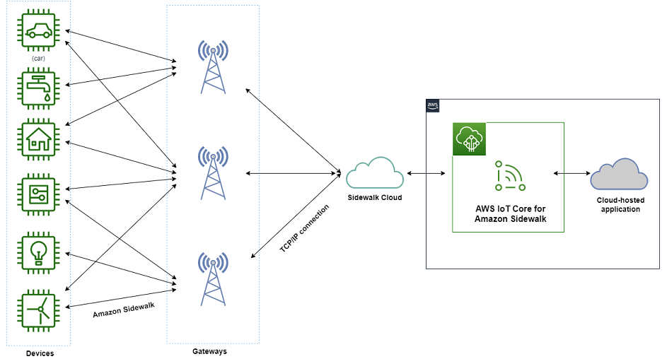

# What is AWS IoT Core for Amazon Sidewalk?

With AWS IoT Core for Amazon Sidewalk, you can onboard your Amazon Sidewalk end devices to AWS IoT and manage
and monitor them. It also manages the destinations that send device data to other
AWS services.

The following topics will help you learn about Amazon Sidewalk and AWS IoT Core for Amazon Sidewalk.

###### Topics

- [What is Amazon Sidewalk?](#amazon-sidewalk-overview "#amazon-sidewalk-overview")
- [How AWS IoT Core for Amazon Sidewalk works](#iot-sidewalk-works "#iot-sidewalk-works")
- [Get started using AWS IoT Core for Amazon Sidewalk](#sidewalk-doc-using "#sidewalk-doc-using")
- [Learn more about AWS IoT Core for Amazon Sidewalk](#iot-sidewalk-learn-more "#iot-sidewalk-learn-more")

## What is Amazon Sidewalk?

### Features of Amazon Sidewalk

The following are features of Amazon Sidewalk.

- Amazon Sidewalk creates a low-bandwidth network using Sidewalk gateways
  (including Ring and select Echo devices) which share a portion of their
  internet bandwidth. This bandwidth is used to connect your
  Sidewalk-enabled devices to the Amazon Sidewalk network using the
  AWS IoT Core for Amazon Sidewalk service.
- Amazon Sidewalk offers a secure networking mechanism with multiple layers
  of encryption and security.
- Amazon Sidewalk offers a simple mechanism to enable or disable
  participation in Sidewalk.

### Amazon Sidewalk concepts

The following are some key concepts of Amazon Sidewalk.

**Sidewalk gateways**

[Sidewalk gateways](https://docs.sidewalk.amazon/introduction/sidewalk-gateways "https://docs.sidewalk.amazon/introduction/sidewalk-gateways"), or Amazon Sidewalk bridges, route
data between your Sidewalk end devices and the cloud.
Gateways are Amazon devices, such as the Echo device or the Ring
Floodlight Cam, that support SubG-CSS (asynchronous, LDR), SubG-FSK
(synchronous, HDR), or Bluetooth LE for Sidewalk
communication. Sidewalk gateways share a portion of your
internet bandwidth with the Sidewalk community to provide
connectivity to a group of Sidewalk-enabled devices.

**Sidewalk end devices**

Sidewalk end devices roam on Amazon Sidewalk by connecting to
Sidewalk gateways. The end devices are low-bandwidth,
low-power smart products, such as Sidewalk-enabled lights or
door locks.

###### Note

Certain Sidewalk gateways can also act as end
devices.

**Sidewalk Network Server**

The Sidewalk Network Server, operated by Amazon, verifies
the incoming packets and routes uplink and downlink messages to the
desired destination, while keeping the Sidewalk network
time-synchronized.

### Learn more about Amazon Sidewalk

For more information about Amazon Sidewalk, see the following web pages:

- [Amazon Sidewalk](https://www.amazon.com/Amazon-Sidewalk/b?ie=UTF8&node=21328123011 "https://www.amazon.com/Amazon-Sidewalk/b?ie=UTF8&node=21328123011")
- [Amazon Sidewalk
  documentation](https://docs.sidewalk.amazon/introduction/ "https://docs.sidewalk.amazon/introduction/")
- [AWS IoT Core for Amazon Sidewalk](https://aws.amazon.com/iot-core/sidewalk/ "https://aws.amazon.com/iot-core/sidewalk/")

## How AWS IoT Core for Amazon Sidewalk works

With AWS IoT Core for Amazon Sidewalk, you can onboard your Amazon Sidewalk end devices to AWS IoT and
manage and monitor them. It also manages the destinations that send device data to
other AWS services

AWS IoT Core for Amazon Sidewalk provides the cloud services that you can use to connect your
Sidewalk end devices to the AWS Cloud and use other AWS services. You can
also use AWS IoT Core for Amazon Sidewalk to manage your Sidewalk devices, and monitor and
build applications on them.

Sidewalk end devices communicate with AWS IoT Core through Sidewalk
gateways. AWS IoT Core for Amazon Sidewalk manages the service and device policies that AWS IoT Core
requires to manage and communicate with the Sidewalk end devices and
gateways. It also manages the destinations that send device data to other
AWS services.

## Get started using AWS IoT Core for Amazon Sidewalk

You can use the AWS IoT console, the AWS IoT Core for Amazon Sidewalk API, or the AWS CLI to create and
onboard Sidewalk end devices and connect them to the Sidewalk network.
For information about getting started with Amazon Sidewalk and onboarding end devices to
AWS IoT, see the following topics.

- ###### [Get started using AWS IoT Core for Amazon Sidewalk](sidewalk-getting-started.md "sidewalk-getting-started.md")

This topic walks through the prerequisites for onboarding your
Sidewalk end devices, illustrates the workflow using a sensor
monitoring application, and provides an overview of how to onboard your
device using AWS CLI commands.

- ###### [Connecting to AWS IoT Core for Amazon Sidewalk](iot-sidewalk-onboard.md "iot-sidewalk-onboard.md")

This section describes the different steps in the onboarding workflow
introduction, and walks through onboarding your end devices using the
console, and the API operations. You'll also connect your device and
view messages that are exchanged between your device and
AWS IoT Core for Amazon Sidewalk.

- ###### [Bulk provisioning devices with
  AWS IoT Core for Amazon Sidewalk](sidewalk-bulk-provisioning.md "sidewalk-bulk-provisioning.md")

This section provides a detailed step-by-step tutorial for bulk
provisioning your Sidewalk end devices using AWS IoT Core for Amazon Sidewalk.
You'll learn the bulk provisioning workflow, and how to onboard a large
number of Sidewalk devices.

## Learn more about AWS IoT Core for Amazon Sidewalk

For more information about AWS IoT Core for Amazon Sidewalk, see the following web pages:

- [Amazon Sidewalk](https://www.amazon.com/Amazon-Sidewalk/b?ie=UTF8&node=21328123011 "https://www.amazon.com/Amazon-Sidewalk/b?ie=UTF8&node=21328123011")
- [Amazon Sidewalk
  documentation](https://docs.sidewalk.amazon/introduction/ "https://docs.sidewalk.amazon/introduction/")
- [AWS IoT Core for Amazon Sidewalk](https://aws.amazon.com/iot-core/sidewalk/ "https://aws.amazon.com/iot-core/sidewalk/")
