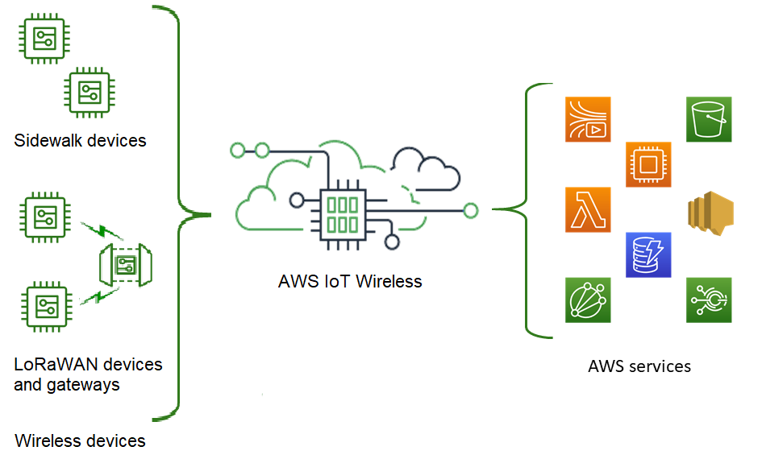

# What is AWS IoT Wireless?

AWS IoT Wireless is a managed cloud service that simplifies the process of connecting
wireless devices to the cloud, enabling seamless data transmission and remote management. This
service supports a wide range of wireless protocols, including LoRaWAN and Sidewalk, ensuring
compatibility with diverse IoT devices and applications.

AWS IoT Wireless provides the cloud services that connect your wireless devices to other devices
and AWS Cloud services. By connecting your devices to AWS IoT Wireless, you can integrate your
devices into AWS IoT-based solutions. Using AWS IoT Wireless, you can onboard both LoRaWAN and
Sidewalk devices to AWS IoT. These wireless devices use the Low Power Wide Area Networking
(LPWAN) communication protocol to communicate with AWS IoT.

## Features of AWS IoT Wireless

AWS IoT Wireless provides the following features:

### Onboard LoRaWAN and Sidewalk devices

You can onboard both LoRaWAN and Sidewalk devices to AWS IoT Wireless.

- ###### AWS IoT Core for LoRaWAN

To onboard your LoRaWAN devices and gateways to AWS IoT Wireless, use AWS IoT Core for LoRaWAN. It is a
fully managed LoRaWAN network server (LNS) that eliminates the need for you to set up and
operate a private LNS. AWS IoT Core for LoRaWAN provides gateway management using the Configuration and
Update Server (CUPS) and Firmware Updates Over-The-Air (FUOTA) capabilities. For more
information, see [What is AWS IoT Core for LoRaWAN?](what-is-iot-lorawan.md "what-is-iot-lorawan.md").

- ###### AWS IoT Core for Amazon Sidewalk

To onboard your Sidewalk devices to AWS IoT Wireless, you can use the capabilities offered by
AWS IoT Core for Amazon Sidewalk. [Amazon Sidewalk](https://www.amazon.com/Amazon-Sidewalk/b?ie=UTF8&node=21328123011 "https://www.amazon.com/Amazon-Sidewalk/b?ie=UTF8&node=21328123011") is a shared network that connects devices such as Amazon Echo, Ring
security cams, outdoor lights, and can support other Sidewalk devices in your
community. For more information, see [What is AWS IoT Core for Amazon Sidewalk?](what-is-iot-sidewalk.md "what-is-iot-sidewalk.md").

### Integration with AWS IoT Core

You can use the following capabilities offered by the AWS IoT Wireless integration with
AWS IoT Core:

- ###### Associate devices with an AWS IoT thing

You can associate your wireless devices and gateways to an AWS IoT _thing_, which helps you store a representation of your device on the Cloud. You
can use things in AWS IoT to more easily search and manage your devices, and access other
AWS IoT Core features. For more information, see [Managing devices with
AWS IoT](../../../iot/latest/developerguide/iot-thing-management.md "../../../iot/latest/developerguide/iot-thing-management.md") in the _AWS IoT Core developer guide_.

- ###### Use AWS IoT rules to route messages

You can use the rules feature of AWS IoT to route messages to over 20 AWS and
third-party services, which enables your devices to interact with other AWS services and
applications. Uplink messages that are sent from your devices to the cloud can be routed to
these services and other applications. For more information, see [AWS IoT rules](../../../iot/latest/developerguide/iot-rules.md "../../../iot/latest/developerguide/iot-rules.md") in the
_AWS IoT Core developer guide_.

## For first-time users of AWS IoT Wireless

If you are a first-time user of AWS IoT Wireless, we recommend that you begin by reading the
following sections:

- ###### [What is AWS IoT Core for LoRaWAN?](what-is-iot-lorawan.md "what-is-iot-lorawan.md")

This section gives an overview of the LoRaWAN technology and how AWS IoT Core for LoRaWAN works.
It also provides resources to help you learn more.

- ###### [What is AWS IoT Core for Amazon Sidewalk?](what-is-iot-sidewalk.md "what-is-iot-sidewalk.md")

This section gives an overview of the Amazon Sidewalk technology and how AWS IoT Core for Amazon Sidewalk works.
It also provides resources to help you learn more.

- ###### [Get started using AWS IoT Core for Amazon Sidewalk](sidewalk-getting-started.md "sidewalk-getting-started.md")

Read this section to learn about using AWS IoT Core for Amazon Sidewalk and how to onboard your Amazon Sidewalk
devices.

- ###### [Connecting gateways and devices to
  AWS IoT Core for LoRaWAN](lorawan-getting-started.md "lorawan-getting-started.md")

Next, you can learn more about how to onboard your LoRaWAN devices by using the console
and the API.

## Related services

- ###### [Amazon CloudWatch](../../../AmazonCloudWatch/latest/monitoring/WhatIsCloudWatch.md "../../../AmazonCloudWatch/latest/monitoring/WhatIsCloudWatch.md")

After you onboard your LoRaWAN or Sidewalk devices to AWS IoT Wireless, you
can use Amazon CloudWatch to log and monitor your wireless devices and gateways in real time. To
monitor your LoRaWAN devices and gateways, you can also use network analyzer, which reduces
the time it takes to set up a connection and start receiving trace messages.

- ###### [AWS IoT Core](../../../iot/latest/developerguide/what-is-aws-iot.md "../../../iot/latest/developerguide/what-is-aws-iot.md")

You can also use the AWS IoT Core integration to connect to AWS services that can be
accessed from the rules engine. For more information, see [_AWS services used by the rules engine_](../../../iot/latest/developerguide/aws-iot-learn-more.md#aws-iot-learn-more-server "../../../iot/latest/developerguide/aws-iot-learn-more.md#aws-iot-learn-more-server").

## Accessing AWS IoT Wireless

You can use the console, the API, or the CLI to onboard both your LoRaWAN and
Sidewalk devices.

- ###### Using the AWS IoT console

To onboard your wireless devices, use the [AWS IoT Wireless](https://console.aws.amazon.com/iot/home#/wireless/landing "https://console.aws.amazon.com/iot/home#/wireless/landing") page of
the AWS Management Console.

- ###### Using the AWS IoT Wireless API

You can onboard both Sidewalk and LoRaWAN devices to the AWS Cloud by using
the [AWS IoT Wireless](../apireference.md "../apireference.md") APIs which are part of the
AWS IoT Core service. These AWS IoT Wireless APIs are also supported by the AWS SDK. For more
information, see [AWS SDKs and
Toolkits](https://aws.amazon.com/developer/tools/ "https://aws.amazon.com/developer/tools/").

- ###### Using the AWS CLI

You can use the AWS CLI to run commands for onboarding and managing your LoRaWAN and
Amazon Sidewalk devices. For more information, see [AWS IoT Wireless CLI reference](../../../cli/latest/reference/iotwireless/index.md "../../../cli/latest/reference/iotwireless/index.md").

## Quotas for AWS IoT Wireless

Your AWS account has default quotas, formerly referred to as limits, for each AWS service.
Unless otherwise noted, each quota is Region-specific. You can request increases for some
quotas, and other quotas cannot be increased.

To view the quotas for AWS IoT Wireless, open the [Service Quotas console](https://console.aws.amazon.com/servicequotas/home "https://console.aws.amazon.com/servicequotas/home"). In the navigation pane, choose **AWS services** and
select **AWS IoT Wireless**.

To request a quota increase, see [Requesting a Quota Increase](../../../servicequotas/latest/userguide/request-quota-increase.md "../../../servicequotas/latest/userguide/request-quota-increase.md") in the _Service Quotas User Guide_.
If the quota is not yet available in Service Quotas, use the [limit increase form](https://console.aws.amazon.com/support/home#/case/create?issueType=service-limit-increase "https://console.aws.amazon.com/support/home#/case/create?issueType=service-limit-increase").

AWS IoT Wireless has quotas for:

- AWS IoT Core for LoRaWAN quotas that apply to device data that is transmitted between the
  devices
- AWS IoT Wireless API operations that apply to both LoRaWAN and Sidewalk devices.

For more information, see [AWS IoT Core for LoRaWAN
quotas](../../../general/latest/gr/iot-core.md#wireless-limits "../../../general/latest/gr/iot-core.md#wireless-limits") in the _AWS General Reference_.
