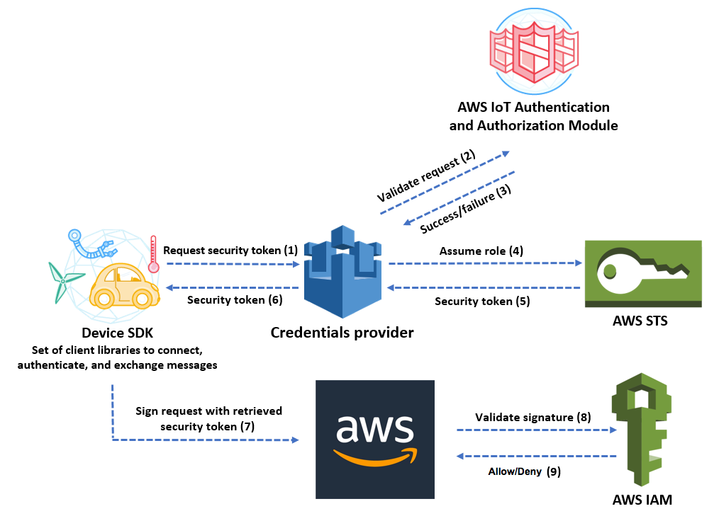

# Authorizing direct calls to AWS services

using AWS IoT Core credential provider

Devices can use X.509 certificates to connect to AWS IoT Core using TLS mutual
authentication protocols. Other AWS services do not support certificate-based
authentication, but they can be called using AWS credentials in [AWS Signature Version 4
format](../../../general/latest/gr/signature-version-4.md "../../../general/latest/gr/signature-version-4.md"). The [Signature Version 4 algorithm](../../../AmazonS3/latest/API/sig-v4-authenticating-requests.md "../../../AmazonS3/latest/API/sig-v4-authenticating-requests.md") normally requires the caller to have an
access key ID and a secret access key. AWS IoT Core has a credentials provider that allows
you to use the built-in [X.509 certificate](x509-client-certs.md "x509-client-certs.md") as
the unique device identity to authenticate AWS requests. This eliminates the need to
store an access key ID and a secret access key on your device.

The credentials provider authenticates a caller using an X.509 certificate and issues
a temporary, limited-privilege security token. The token can be used to sign and
authenticate any AWS request. This way of authenticating your AWS requests requires
you to create and configure an [AWS Identity and Access Management
(IAM) role](../../../service-authorization/latest/reference/id_roles.md "../../../service-authorization/latest/reference/id_roles.md") and attach appropriate IAM policies to the role so that the
credentials provider can assume the role on your behalf. For more information about
AWS IoT Core and IAM, see [Identity and access management for AWS IoT](security-iam.md "security-iam.md").

AWS IoT requires devices to send the [Server Name Indication
(SNI) extension](https://www.rfc-editor.org/rfc/rfc3546#section-3.1 "https://www.rfc-editor.org/rfc/rfc3546#section-3.1") to the Transport Layer Security (TLS) protocol and provide
the complete endpoint address in the `host_name` field. The
`host_name` field must contain the endpoint you are calling, and it must
be:

- The `endpointAddress` returned by `aws iot describe-endpoint --endpoint-type
 iot:CredentialProvider`.
  Connections attempted by devices without the correct `host_name` value will
  fail.

The following diagram illustrates the credentials provider workflow.



1. The AWS IoT Core device makes an HTTPS request to the credentials provider for a
   security token. The request includes the device X.509 certificate for
   authentication.
2. The credentials provider forwards the request to the AWS IoT Core authentication
   and authorization module to validate the certificate and verify that the device
   has permission to request the security token.
3. If the certificate is valid and has permission to request a security token,
   the AWS IoT Core authentication and authorization module returns success.
   Otherwise, it sends an exception to the device.
4. After successfully validating the certificate, the credentials provider
   invokes the [AWS Security Token Service (AWS STS)](../../../STS/latest/APIReference/Welcome.md "../../../STS/latest/APIReference/Welcome.md") to
   assume the IAM role that you created for it.
5. AWS STS returns a temporary, limited-privilege security token to the credentials
   provider.
6. The credentials provider returns the security token to the device.
7. The device uses the security token to sign an AWS request with AWS
   Signature Version 4.
8. The requested service invokes IAM to validate the signature and authorize
   the request against access policies attached to the IAM role that you created
   for the credentials provider.
9. If IAM validates the signature successfully and authorizes the request, the
   request is successful. Otherwise, IAM sends an exception.
   The following section describes how to use a certificate to get a security token. It
   is written with the assumption that you have already [registered a device](register-device.md "register-device.md") and [created and
   activated your own certificate](device-certs-your-own.md "device-certs-your-own.md") for it.

## How to use a certificate to get

a security token

1. Configure the IAM role that the credentials provider assumes on behalf
   of your device. Attach the following trust policy to the role.

```
`{
 "Version":"2012-10-17",
 "Statement": {
 "Effect": "Allow",
 "Principal": {"Service": "credentials.iot.amazonaws.com"},
 "Action": "sts:AssumeRole"
 }
}`

```

For each AWS service that you want to call, attach an access policy to
the role. The credentials provider supports the following policy
variables:

    * `credentials-iot:ThingName`
    * `credentials-iot:ThingTypeName`
    * `credentials-iot:AwsCertificateId`

When the device provides the thing name in its request to an AWS
service, the credentials provider adds
`credentials-iot:ThingName` and
`credentials-iot:ThingTypeName` as context variables to the
security token. The credentials provider provides
`credentials-iot:AwsCertificateId` as a context variable even
if the device doesn't provide the thing name in the request. You pass the
thing name as the value of the `x-amzn-iot-thingname` HTTP
request header.

These three variables work for IAM policies only, not AWS IoT Core
policies. 2. Make sure that the user who performs the next step (creating a role alias)
has permission to pass the newly created role to AWS IoT Core. The following
policy gives both `iam:GetRole` and `iam:PassRole`
permissions to an AWS user. The `iam:GetRole` permission allows
the user to get information about the role that you've just created. The
`iam:PassRole` permission allows the user to pass the role to
another AWS service.

```
`{
 "Version":"2012-10-17",
 "Statement": {
 "Effect": "Allow",
 "Action": [
 "iam:GetRole",
 "iam:PassRole"
 ],
 "Resource": "arn:aws:iam::`123456789012`:role/`your role name`"
 }
}`

```

3. Create an AWS IoT Core role alias. The device that is going to make direct
   calls to AWS services must know which role ARN to use when connecting to
   AWS IoT Core. Hard-coding the role ARN is not a good solution because it
   requires you to update the device whenever the role ARN changes. A better
   solution is to use the `CreateRoleAlias` API to create a role
   alias that points to the role ARN. If the role ARN changes, you simply
   update the role alias. No change is required on the device. This API takes
   the following parameters:

`roleAlias`

Required. An arbitrary string that identifies the role alias.
It serves as the primary key in the role alias data model. It
contains 1-128 characters and must include only alphanumeric
characters and the =, @, and - symbols. Uppercase and lowercase
alphabetic characters are allowed. Role alias names are case sensitive.

`roleArn`

Required. The ARN of the role to which the role alias
refers.

`credentialDurationSeconds`

Optional. How long (in seconds) the credential is valid. The
minimum value is 900 seconds (15 minutes). The maximum value is
43,200 seconds (12 hours). The default value is 3,600 seconds (1
hour).

###### Important

The AWS IoT Core Credential Provider can issue a credential
with a maximum lifetime is 43,200 seconds (12 hours). Having
the credential be valid for up to 12 hours can help reduce
the number of calls to the credential provider by caching
the credential longer.

The `credentialDurationSeconds` value must be
less than or equal to the maximum session duration of the
IAM role that the role alias references. For more
information, see [Modifying a role maximum session duration (AWS API)](../../../IAM/latest/UserGuide/roles-managingrole-editing-api.md#roles-modify_max-session-duration-api "../../../IAM/latest/UserGuide/roles-managingrole-editing-api.md#roles-modify_max-session-duration-api") from the AWS
Identity and Access Management User Guide.

For more information about this API, see [CreateRoleAlias](../apireference/API_CreateRoleAlias.md "../apireference/API_CreateRoleAlias.md"). 4. Attach a policy to the device certificate. The policy attached to the
device certificate must grant the device permission to assume the role. You
do this by granting permission for the
`iot:AssumeRoleWithCertificate` action to the role alias, as
in the following example.

```
`{
 "Version":"2012-10-17",
 "Statement": [
 {
 "Effect": "Allow",
 "Action": "iot:AssumeRoleWithCertificate",
 "Resource": "arn:aws:iot:`us-east-1`:`123456789012`:rolealias/your role alias"
 }
 ]
}`

```

5.  Make an HTTPS request to the credentials provider to get a security token.
    Supply the following information:

        * *Certificate*: Because this is an HTTP request
         over TLS mutual authentication, you must provide the certificate and
         the private key to your client while making the request. Use the
         same certificate and private key you used when you registered your
         certificate with AWS IoT Core.


        To make sure your device is communicating with AWS IoT Core (and not
         a service impersonating it), see [Server
         Authentication](x509-client-certs.md#server-authentication "x509-client-certs.md#server-authentication"), follow the links to download the
         appropriate CA certificates, and then copy them to your
         device.
        * *RoleAlias*: The name of the role alias that
         you created for the credentials provider. Role alias names are case sensitive and must match the role alias created in AWS IoT Core.
        * *ThingName*: The thing name that you created
         when you registered your AWS IoT Core thing. This is passed as the
         value of the `x-amzn-iot-thingname` HTTP header. This
         value is required only if you are using thing attributes as policy
         variables in AWS IoT Core or IAM policies.


        ###### Note

        The *ThingName* that you provide in
         `x-amzn-iot-thingname` must match the name of the
         AWS IoT Thing resource assigned to a cert. If it doesn't match, a
         403 error is returned.

    Run the following command in the AWS CLI to obtain the credentials provider
    endpoint for your AWS account. For more information about this API, see
    [DescribeEndpoint](../apireference/API_DescribeEndpoint.md "../apireference/API_DescribeEndpoint.md"). For FIPS-enabled endpoints, see
    [AWS IoT Core - credential provider endpoints](iot-connect-fips.md#iot-connect-fips-credential "iot-connect-fips.md#iot-connect-fips-credential").

```
aws iot describe-endpoint --endpoint-type iot:CredentialProvider
```

The following JSON object is sample output of the
**describe-endpoint** command. It contains the
`endpointAddress` that you use to request a security
token.

```
{
    "endpointAddress": "`your_aws_account_specific_prefix`.credentials.iot.`your region`.amazonaws.com"
}
```

Use the endpoint to make an HTTPS request to the credentials provider to
return a security token. The following example command uses
`curl`, but you can use any HTTP client.

###### Note

The _roleAlias_ name is case sensitive and must match the role alias created in AWS IoT.

```
curl --cert `your certificate` --key `your private key` -H "x-amzn-iot-thingname: `your thing name`" --cacert AmazonRootCA1.pem https://`your endpoint` /role-aliases/`your role alias`/credentials
```

This command returns a security token object that contains an
`accessKeyId`, a `secretAccessKey`, a
`sessionToken`, and an expiration. The following JSON object
is sample output of the `curl` command.

```

    {"credentials":{"accessKeyId":"`access key`","secretAccessKey":"`secret access key`","sessionToken":"`session token`","expiration":"2018-01-18T09:18:06Z"}}

```

You can then use the `accessKeyId`,
`secretAccessKey`, and `sessionToken` values to
sign requests to AWS services. For an end-to-end demonstration, see [How to Eliminate the Need for Hard-Coded AWS Credentials in Devices
by Using the AWS IoT Credential Provider](https://aws.amazon.com/blogs/security/how-to-eliminate-the-need-for-hardcoded-aws-credentials-in-devices-by-using-the-aws-iot-credentials-provider/ "https://aws.amazon.com/blogs/security/how-to-eliminate-the-need-for-hardcoded-aws-credentials-in-devices-by-using-the-aws-iot-credentials-provider/") blog post on the
_AWS Security Blog_.
