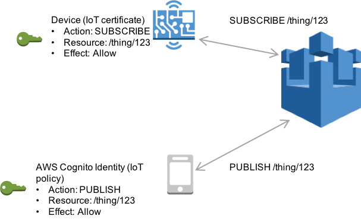

# Amazon Cognito identities

Amazon Cognito Identity enables you to create temporary, limited privilege AWS credentials for
use in mobile and web applications. When you use Amazon Cognito Identity, create identity pools that
create unique identities for your users and authenticate them with identity
providers like Login with Amazon, Facebook, and Google. You can also use Amazon Cognito
identities with your own developer authenticated identities. For more information,
see [Amazon Cognito Identity](../../../cognito/latest/developerguide/cognito-identity.md "../../../cognito/latest/developerguide/cognito-identity.md").

To use Amazon Cognito Identity, define an Amazon Cognito identity pool that is associated with an IAM
role. The IAM role is associated with an IAM policy that grants identities from
your identity pool permission to access AWS resources like calling AWS
services.

Amazon Cognito Identity creates unauthenticated and authenticated identities. Unauthenticated
identities are used for guest users in a mobile or web application who want to use
the app without signing in. Unauthenticated users are granted only those permissions
specified in the IAM policy associated with the identity pool.

When you use authenticated identities, in addition to the IAM policy attached to
the identity pool, you must attach an AWS IoT policy to an Amazon Cognito Identity. To attach an AWS IoT
policy, use the [AttachPolicy](../apireference/API_AttachPolicy.md "../apireference/API_AttachPolicy.md") API and give permissions to an individual user of your
AWS IoT application. You can use the AWS IoT policy to assign fine-grained permissions
for specific customers and their devices.

Authenticated and unauthenticated users are different identity types. If you don't
attach an AWS IoT policy to the Amazon Cognito Identity, an authenticated user fails authorization in
AWS IoT and doesn't have access to AWS IoT resources and actions. For more information
about creating policies for Amazon Cognito identities, see [Publish/Subscribe policy examples](pub-sub-policy.md "pub-sub-policy.md") and [Authorization with Amazon Cognito identities](cog-iot-policies.md "cog-iot-policies.md").

