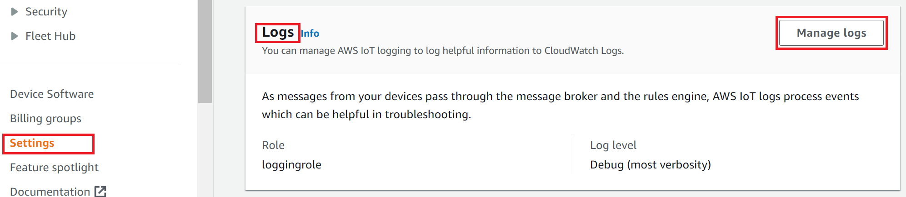
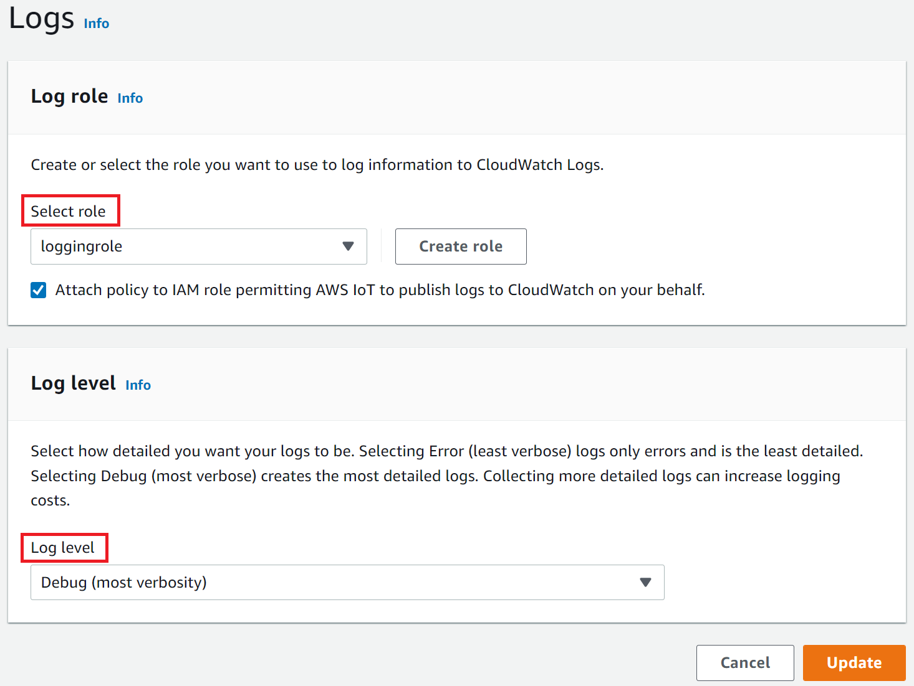

# Configure AWS IoT logging

You must enable logging by using the AWS IoT console, CLI, or API before you can monitor and
log AWS IoT activity.

You can enable logging for all of AWS IoT or only specific thing groups. You can configure
AWS IoT logging by using the AWS IoT console, CLI, or API; however, you must use the CLI or API to
configure logging for specific thing groups.

When considering how to configure your AWS IoT logging, the default logging configuration
determines how AWS IoT activity will be logged unless specified otherwise. Starting out, you
might want to obtain detailed logs with a default [log level](#log-level "#log-level")
of `INFO` or `DEBUG`. After reviewing the initial logs, you can change
the default log level to a less verbose level such as `WARN` or `ERROR`
and set a more verbose resource-specific log level on resources that might need more
attention. Log levels can be changed whenever you want.

This topic covers cloud-side logging in AWS IoT. For information on device-side logging and
monitoring, see [Upload device-side
logs to CloudWatch](upload-device-logs-to-cloudwatch.md "upload-device-logs-to-cloudwatch.md").

For information on logging and monitoring AWS IoT Greengrass, see [Logging and monitoring in
AWS IoT Greengrass](../../../greengrass/v2/developerguide/logging-and-monitoring.md "../../../greengrass/v2/developerguide/logging-and-monitoring.md"). As of June 30, 2023, the AWS IoT Greengrass Core software has migrated to
AWS IoT Greengrass Version 2.

## Configure logging role and

policy

Before you can enable logging in AWS IoT, you must create an IAM role and a policy that
gives AWS permission to monitor AWS IoT activity on your behalf. You can also generate an
IAM role with the policies needed in the [Logs section of the AWS IoT
console](https://console.aws.amazon.com/iot/home#/settings/logging "https://console.aws.amazon.com/iot/home#/settings/logging").

###### Note

Before enabling AWS IoT logging, ensure you understand the CloudWatch Logs access
permissions. Users with access to CloudWatch Logs can see debugging information from your devices.
For more information, see [Authentication and Access Control for Amazon CloudWatch Logs](../../../AmazonCloudWatch/latest/monitoring/auth-and-access-control-cw.md "../../../AmazonCloudWatch/latest/monitoring/auth-and-access-control-cw.md").

If you expect high traffic patterns in AWS IoT Core due to load testing, consider turning
off IoT logging to prevent throttling. If high traffic is detected, our service may
disable logging in your account.

The following shows how to create a logging role and policy for AWS IoT Core resources.

### Create a logging role

To create a logging role, open the [Roles hub of the IAM console](https://console.aws.amazon.com/iam/home#/roles "https://console.aws.amazon.com/iam/home#/roles") and choose **Create
role**.

1. Under **Select trusted entity**, choose **AWS
   Service**. Then choose **IoT** under **Use
   case**. If you don't see **IoT**, enter and search
   **IoT** from the **Use cases for other AWS
   services:** drop-down menu. Select **Next**.
2. On the **Add permissions** page, you will see the policies that
   are automatically attached to the service role. Choose
   **Next**.
3. On the **Name, review, and create** page, enter a **Role
   name** and **Role description** for the role, then choose
   **Create role**.
4. In the list of **Roles**, find the role you created, open it, and
   copy the **Role ARN** (`logging-role-arn`)
   to use when you [Configure default logging in the AWS IoT
   (console)](#configure-logging-console "#configure-logging-console").

### Logging role policy

The following policy documents provide the role policy and trust policy that allow
AWS IoT to submit log entries to CloudWatch on your behalf. If you also allowed AWS IoT Core for LoRaWAN to
submit log entries, you'll see a policy document created for you that logs both
activities.

###### Note

These documents were created for you when you created the logging role. The
documents have variables, ``${partition}`,`
``${region}``, and
 ``${accountId}``, that you must replace with
your values.

Role policy:

```
`{
 "Version":"2012-10-17",
 "Statement": [
 {
 "Effect": "Allow",
 "Action": [
 "logs:CreateLogGroup",
 "logs:CreateLogStream",
 "logs:PutLogEvents",
 "logs:PutMetricFilter",
 "logs:PutRetentionPolicy",
 "iot:GetLoggingOptions",
 "iot:SetLoggingOptions",
 "iot:SetV2LoggingOptions",
 "iot:GetV2LoggingOptions",
 "iot:SetV2LoggingLevel",
 "iot:ListV2LoggingLevels",
 "iot:DeleteV2LoggingLevel"
 ],
 "Resource": [
 "arn:aws:logs:us-east-1:123456789012:log-group:AWSIotLogsV2:*"
 ]
 }
 ]
}`

```

Trust policy to log only AWS IoT Core activity:

```
`{
 "Version":"2012-10-17",
 "Statement": [
 {
 "Sid": "",
 "Effect": "Allow",
 "Principal": {
 "Service": "iot.amazonaws.com"
 },
 "Action": "sts:AssumeRole"
 }
 ]
}`

```

## Configure default logging in the AWS IoT

(console)

This section describes how use the AWS IoT console to configure logging for all of AWS IoT.
To configure logging for only specific thing groups, you must use the CLI or API. For
information about configuring logging for specific thing groups, see [Configure resource-specific logging in AWS IoT
(CLI)](#fine-logging-cli "#fine-logging-cli").

###### To use the AWS IoT console to configure default logging for all of AWS IoT

1. Sign in to the AWS IoT console. For more information, see [Open the AWS IoT console](setting-up.md#iot-console-signin "setting-up.md#iot-console-signin").
2. In the left navigation pane, choose **Settings**. In the
   **Logs** section of the **Settings** page, choose
   **Manage logs**.

The **Logs** page displays the logging role and level of verbosity
used by all of AWS IoT.

 3. On the **Logs** page, choose **Select role** to
specify a role that you created in [Create a logging role](#create-logging-role "#create-logging-role"), or **Create Role** to create a
new role to use for logging.

 4. Choose the **Log level** that describes the [level of detail](#log-level "#log-level") of the log
entries that you want to appear in the CloudWatch logs. 5. Choose **Update** to save your changes.

After you've enabled logging, visit [Viewing AWS IoT logs in the CloudWatch console](cloud-watch-logs.md#viewing-logs "cloud-watch-logs.md#viewing-logs") to learn more about viewing the log entries.

## Configure default logging in AWS IoT (CLI)

This section describes how to configure global logging for AWS IoT by using the
CLI.

###### Note

You need the Amazon Resource Name (ARN) of the role that you want to use. If you need
to create a role to use for logging, see [Create a logging role](#create-logging-role "#create-logging-role") before continuing.

The principal used to call the API must have [Passing role permissions](pass-role.md "pass-role.md") for your logging role.

You can also perform this procedure with the API by using the methods in the AWS API
that correspond to the CLI commands shown here.

###### To use the CLI to configure default logging for AWS IoT

1. Use the [**set-v2-logging-options**](https://awscli.amazonaws.com/v2/documentation/api/latest/reference/iot/set-v2-logging-options.html "https://awscli.amazonaws.com/v2/documentation/api/latest/reference/iot/set-v2-logging-options.html") command to set the logging
   options for your account.

```
aws iot set-v2-logging-options \
    --role-arn `logging-role-arn` \
    --default-log-level `log-level`
```

where:

**--role-arn**

The role ARN that grants AWS IoT permission to write to your logs in
CloudWatch Logs.

**--default-log-level**

The [log level](#log-level "#log-level") to
use. Valid values are: `ERROR`, `WARN`, `INFO`,
`DEBUG`, or `DISABLED`

**--no-disable-all-logs**

An optional parameter that enables all AWS IoT logging. Use this parameter to
enable logging when it is currently disabled.

**--disable-all-logs**

An optional parameter that disables all AWS IoT logging. Use this parameter to
disable logging when it is currently enabled. 2. Use the [**get-v2-logging-options**](https://awscli.amazonaws.com/v2/documentation/api/latest/reference/iot/get-v2-logging-options.html "https://awscli.amazonaws.com/v2/documentation/api/latest/reference/iot/get-v2-logging-options.html") command to get your current
logging options.

```
aws iot get-v2-logging-options
```

After you've enabled logging, visit [Viewing AWS IoT logs in the CloudWatch console](cloud-watch-logs.md#viewing-logs "cloud-watch-logs.md#viewing-logs") to learn more about viewing the log entries.

###### Note

AWS IoT continues to support older commands (**set-logging-options** and
**get-logging-options**) to set and get global logging on your account.
Be aware that when these commands are used, the resulting logs contain plain-text, rather
than JSON payloads and logging latency is generally higher. No further improvements will
be made to the implementation of these older commands. We recommend that you use the "v2"
versions to configure your logging options and, when possible, change legacy applications
that use the older versions.

## Configure resource-specific logging in AWS IoT

(CLI)

This section describes how to configure resource-specific logging for AWS IoT by using the
CLI. Resource-specific logging allows you to specify a logging level for a specific [thing group](thing-groups.md "thing-groups.md").

Thing groups can contain other thing groups to create a hierarchical relationship. This
procedure describes how to configure the logging of a single thing group. You can apply this
procedure to the parent thing group in a hierarchy to configure the logging for all thing
groups in the hierarchy. You can also apply this procedure to a child thing group to
override the logging configuration of its parent.

A thing can be a member of a thing group. This membership allows the thing to inherit
configurations, policies, and settings applied to the thing group. Thing groups are used to
manage and apply settings to multiple things collectively, rather than dealing with each
thing individually. When your client ID matches the thing name, AWS IoT Core will automatically
associate the client session with the corresponding thing resource. This allows the client
session to inherit the configurations and settings applied to the thing groups to which the
thing belongs, including the logging levels. If your client ID doesn't match the thing
name, you can enable the exclusive thing attachment to establish the association. For more
information, see [Associating an AWS IoT thing to an MQTT client
connection](exclusive-thing.md "exclusive-thing.md").

In addition to thing groups, you can also log targets such as a device's client ID,
source IP, and principal ID.

###### Note

You need the Amazon Resource Name (ARN) of the role you want to use. If you need to
create a role to use for logging, see [Create a logging role](#create-logging-role "#create-logging-role") before continuing.

The principal used to call the API must have [Passing role permissions](pass-role.md "pass-role.md") for your logging role.

You can also perform this procedure with the API by using the methods in the AWS API
that correspond to the CLI commands shown here.

###### To use the CLI to configure resource-specific logging for AWS IoT

1. Use the [**set-v2-logging-options**](https://awscli.amazonaws.com/v2/documentation/api/latest/reference/iot/set-v2-logging-options.html "https://awscli.amazonaws.com/v2/documentation/api/latest/reference/iot/set-v2-logging-options.html") command to set the logging
   options for your account.

```
aws iot set-v2-logging-options \
    --role-arn `logging-role-arn` \
    --default-log-level `log-level`
```

where:

**--role-arn**

The role ARN that grants AWS IoT permission to write to your logs in
CloudWatch Logs.

**--default-log-level**

The [log level](#log-level "#log-level") to
use. Valid values are: `ERROR`, `WARN`, `INFO`,
`DEBUG`, or `DISABLED`

**--no-disable-all-logs**

An optional parameter that enables all AWS IoT logging. Use this parameter to
enable logging when it is currently disabled.

**--disable-all-logs**

An optional parameter that disables all AWS IoT logging. Use this parameter to
disable logging when it is currently enabled. 2. Use the [**set-v2-logging-level**](https://awscli.amazonaws.com/v2/documentation/api/latest/reference/iot/set-v2-logging-level.html "https://awscli.amazonaws.com/v2/documentation/api/latest/reference/iot/set-v2-logging-level.html") command to configure
resource-specific logging for a thing group.

```
aws iot set-v2-logging-level \
              --log-target targetType=THING_GROUP,targetName=`thing_group_name` \
              --log-level `log_level`
```

**--log-target**

The type and name of the resource for which you are configuring logging. The
`target_type` value must be one of: `THING_GROUP` |
`CLIENT_ID` | `SOURCE_IP` | `PRINCIPAL_ID`. The
log-target parameter value can be text, as shown in the preceding command example,
or a JSON string, such as the following example.

```
aws iot set-v2-logging-level \
              --log-target '{"targetType": "THING_GROUP","targetName": "`thing_group_name`"}' \
              --log-level `log_level`
```

**--log-level**

The logging level used when generating logs for the specified resource. Valid
values are: **DEBUG**, **INFO**,
**ERROR**, **WARN**, and
**DISABLED**.

```
aws iot set-v2-logging-level \
              --log-target targetType=CLIENT_ID,targetName=`ClientId1` \
              --log-level `DEBUG`
```

3. Use the [**list-v2-logging-levels**](https://awscli.amazonaws.com/v2/documentation/api/latest/reference/iot/list-v2-logging-levels.html "https://awscli.amazonaws.com/v2/documentation/api/latest/reference/iot/list-v2-logging-levels.html") command to list the currently
   configured logging levels.

```
aws iot list-v2-logging-levels
```

4. Use the [**delete-v2-logging-level**](https://awscli.amazonaws.com/v2/documentation/api/latest/reference/iot/delete-v2-logging-level.html "https://awscli.amazonaws.com/v2/documentation/api/latest/reference/iot/delete-v2-logging-level.html") command to delete a
   resource-specific logging level, such as the following examples.

```
aws iot delete-v2-logging-level \
              --target-type "THING_GROUP" \
              --target-name "`thing_group_name`"
```

```
aws iot delete-v2-logging-level \
              --target-type=CLIENT_ID
              --target-name=`ClientId1`
```

**--targetType**

The `target_type` value must be one of: `THING_GROUP` |
`CLIENT_ID` | `SOURCE_IP` |
`PRINCIPAL_ID`.

**--targetName**

The name of the thing group for which to remove the logging level.

After you've enabled logging, visit [Viewing AWS IoT logs in the CloudWatch console](cloud-watch-logs.md#viewing-logs "cloud-watch-logs.md#viewing-logs") to learn more about viewing the log entries.

## Log levels

These log levels determine the events that are logged and apply to default and
resource-specific log levels.

ERROR

Any error that causes an operation to fail.

Logs include ERROR information only.

WARN

Anything that can potentially cause inconsistencies in the system, but might not
cause the operation to fail.

Logs include ERROR and WARN information.

INFO

High-level information about the flow of things.

Logs include INFO, ERROR, and WARN information.

DEBUG

Information that might be helpful when debugging a problem.

Logs include DEBUG, INFO, ERROR, and WARN information.

DISABLED

All logging is disabled.
