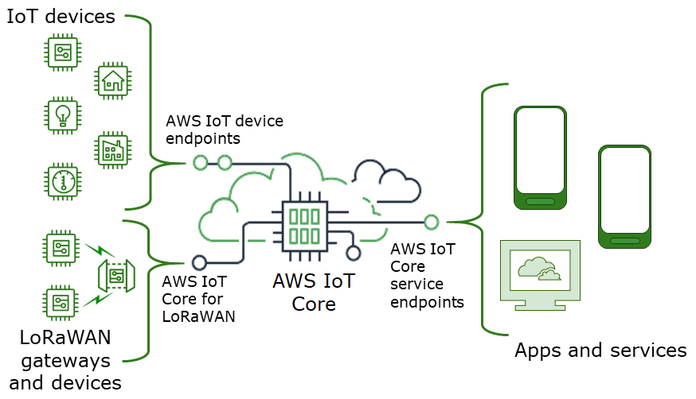

# Connect to AWS IoT Core

AWS IoT Core supports connections with IoT devices, wireless gateways, services, and apps.
Devices connect to AWS IoT Core so they can send data to and receive data from AWS IoT services
and other devices. Apps and other services also connect to AWS IoT Core to control and manage
the IoT devices and process the data from your IoT solution. This section describes how to
choose the best way to connect and communicate with AWS IoT Core for each aspect of your IoT
solution.


There are several ways to interact with AWS IoT. Apps and services can use the [AWS IoT Core - control plane endpoints](#iot-service-endpoint-intro "#iot-service-endpoint-intro") and
devices can connect to AWS IoT Core by using the [AWS IoT device endpoints](#iot-device-endpoint-intro "#iot-device-endpoint-intro") or [AWS IoT Core for LoRaWAN Regions and endpoints](../../../iot-wireless/latest/developerguide/iot-lorawan.md#connect-iot-lorawan-regions-endpoints "../../../iot-wireless/latest/developerguide/iot-lorawan.md#connect-iot-lorawan-regions-endpoints").

## AWS IoT Core - control plane endpoints

The **AWS IoT Core - control plane** endpoints provide access to
functions that control and manage your AWS IoT solution.

- ###### Endpoints

The **AWS IoT Core - control plane** and **AWS IoT Core Device Advisor control plane** endpoints are
Region specific and are listed in [AWS IoT Core Endpoints and
Quotas](../../../general/latest/gr/iot-core.md "../../../general/latest/gr/iot-core.md"). The formats of the endpoints are as follows.

| Endpoint purpose                                      | Endpoint format                                                                                                                                                                      | Serves                                                                                                                                                                         |
| ----------------------------------------------------- | ------------------------------------------------------------------------------------------------------------------------------------------------------------------------------------ | ------------------------------------------------------------------------------------------------------------------------------------------------------------------------------ |
| **AWS IoT Core - control plane**                      | [AWS IoT Control Plane endpoints](../../../general/latest/gr/iot-core.md#iot-core-control-plane-endpoints "../../../general/latest/gr/iot-core.md#iot-core-control-plane-endpoints") | [AWS IoT Control Plane API](../apireference/API_Operations_AWS_IoT.md "../apireference/API_Operations_AWS_IoT.md")                                                             |
| **AWS IoT Core Device Advisor<br>• control<br>plane** | `api.iotdeviceadvisor.`aws-region`.amazonaws.com`                                                                                                                                    | [AWS IoT Core Device Advisor Control Plane API](../apireference/API_Operations_AWS_IoT_Core_Device_Advisor.md "../apireference/API_Operations_AWS_IoT_Core_Device_Advisor.md") |

    + **IPv4 endpoints** — IPv4 endpoints support only IPv4 traffic,
     and are available for all Regions.


    IPv4 endpoints use the following naming convention:


    ```
    iot.`aws-region`.amazonaws.com
    ```

    For example the IPv4 endpoint name for the us-east-1 Region is `iot.us-east-1.amazonaws.com`.
    + **Dual-stack (IPv4 and IPv6) endpoints** — Dual-stack endpoints support both
     IPv4 and IPv6 traffic. When a request is made to a dual-stack endpoint, the endpoint URL resolves to an
     IPv6 or an IPv4 address, depending on the protocol used by the network and client.


    Dual-stack endpoints use the following naming convention:


    ```
    iot.`aws-region`.api.aws
    ```

    For example the dual-stack endpoint name for the us-east-1 Region is `iot.us-east-1.api.aws`.

- ###### SDKs and tools

The [AWS SDKs](https://aws.amazon.com/tools/#SDKs "https://aws.amazon.com/tools/#SDKs")
provide language-specific support for the AWS IoT Core APIs, and the APIs of
other AWS services. The [AWS Mobile
SDKs](https://aws.amazon.com/tools/#Mobile_SDKs "https://aws.amazon.com/tools/#Mobile_SDKs") provide app developers with platform-specific support for
the AWS IoT Core API, and other AWS services on mobile devices.

The [AWS CLI](https://aws.amazon.com/cli/ "https://aws.amazon.com/cli/") provides
command-line access to the functions provided by the AWS IoT service endpoints.
[AWS Tools for
PowerShell](https://aws.amazon.com/powershell/ "https://aws.amazon.com/powershell/") provides tools to manage AWS services and resources in
the PowerShell scripting environment.

- ###### Authentication

The service endpoints use IAM users and AWS credentials to
authenticate users.

- ###### Learn more

For more information and links to SDK references, see [Connect to AWS IoT Core service endpoints](iot-connect-service.md "iot-connect-service.md").

## AWS IoT device endpoints

The AWS IoT device endpoints support communication between your IoT devices and
AWS IoT.

- ###### Endpoints

The device endpoints support AWS IoT Core and AWS IoT Device Management functions. They are
specific to your AWS account and you can see what they are by using the
**[describe-endpoint](https://awscli.amazonaws.com/v2/documentation/api/latest/reference/iot/describe-endpoint.html "https://awscli.amazonaws.com/v2/documentation/api/latest/reference/iot/describe-endpoint.html")** command.

| Endpoint purpose                                 | Endpoint format                                                                                                                                                | Serves                                                                                                                                                  |
| ------------------------------------------------ | -------------------------------------------------------------------------------------------------------------------------------------------------------------- | ------------------------------------------------------------------------------------------------------------------------------------------------------- |
| **AWS IoT Core - data plane**                    | See [AWS IoT device data and service<br>endpoints](iot-connect-devices.md#iot-connect-device-endpoints "iot-connect-devices.md#iot-connect-device-endpoints"). | [AWS IoT Data Plane API](../apireference/API_Operations_AWS_IoT_Data_Plane.md "../apireference/API_Operations_AWS_IoT_Data_Plane.md")                   |
| **AWS IoT Device Management - jobs data**        | See [AWS IoT device data and service<br>endpoints](iot-connect-devices.md#iot-connect-device-endpoints "iot-connect-devices.md#iot-connect-device-endpoints"). | [AWS IoT Jobs Data Plane API](../apireference/API_Operations_AWS_IoT_Jobs_Data_Plane.md "../apireference/API_Operations_AWS_IoT_Jobs_Data_Plane.md")    |
| **AWS IoT Device Advisor<br>• data<br>plane**    | See [Configure your device](device-advisor-setting-up.md#da-configure-device "device-advisor-setting-up.md#da-configure-device").                              | Not applicable                                                                                                                                          |
| **AWS IoT Device Management - secure tunneling** | `api.tunneling.iot.`aws-region`.amazonaws.com`                                                                                                                 | [AWS IoT Secure Tunneling API](../apireference/API_Operations_AWS_IoT_Secure_Tunneling.md "../apireference/API_Operations_AWS_IoT_Secure_Tunneling.md") |

If you are using dual-stack endpoints (IPv4 and IPv6) for data plane
operations, use the `iot:Data-ATS` endpoint type.
`iot:Jobs` can be used for IPv4 only. For more information about
these endpoints and the functions that they support, see [AWS IoT device data and service
endpoints](iot-connect-devices.md#iot-connect-device-endpoints "iot-connect-devices.md#iot-connect-device-endpoints").

- ###### SDKs

The [AWS IoT Device SDKs](iot-connect-devices.md#iot-connect-device-sdks "iot-connect-devices.md#iot-connect-device-sdks") provide
language-specific support for the Message Queueing Telemetry Transport
(MQTT) and WebSocket Secure (WSS) protocols, which devices use to
communicate with AWS IoT. [AWS Mobile SDKs](iot-connect-service.md#iot-connect-mobile-sdks "iot-connect-service.md#iot-connect-mobile-sdks") also provide support for MQTT
device communications, AWS IoT APIs, and the APIs of other AWS services on
mobile devices.

- ###### Authentication

The device endpoints use X.509 certificates or AWS IAM users with
credentials to authenticate users.

- ###### Learn more

For more information and links to SDK references, see [AWS IoT Device SDKs](iot-connect-devices.md#iot-connect-device-sdks "iot-connect-devices.md#iot-connect-device-sdks").

## AWS IoT Core for LoRaWAN gateways and devices

AWS IoT Core for LoRaWAN connects wireless gateways and devices to AWS IoT Core.

- ###### Endpoints

AWS IoT Core for LoRaWAN manages the gateway connections to account and
Region-specific AWS IoT Core endpoints. Gateways can connect to your account's
Configuration and Update Server (CUPS) endpoint that AWS IoT Core for LoRaWAN
provides.

| Endpoint purpose                       | Endpoint format                                                            | Serves                                                                                                 |
| -------------------------------------- | -------------------------------------------------------------------------- | ------------------------------------------------------------------------------------------------------ |
| Configuration and Update Server (CUPS) | ``account-specific-prefix`.cups.lorawan.`aws-region`.amazonaws.com:443`    | Gateway communication with the Configuration and Update<br>Server provided by AWS IoT Core for LoRaWAN |
| LoRaWAN Network Server (LNS)           | ``account-specific-prefix`.gateway.lorawan.`aws-region`.amazonaws.com:443` | Gateway communication with the LoRaWAN Network Server<br>provided by AWS IoT Core for LoRaWAN          |

- ###### SDKs

The AWS IoT Wireless API that AWS IoT Core for LoRaWAN is built on is supported by
the AWS SDK. For more information, see [AWS SDKs and
Toolkits](https://aws.amazon.com/getting-started/tools-sdks/ "https://aws.amazon.com/getting-started/tools-sdks/").

- ###### Authentication

AWS IoT Core for LoRaWAN device communications use X.509 certificates to secure
communications with AWS IoT.

- ###### Learn more

For more information about configuring and connecting wireless devices,
see [AWS IoT Core for LoRaWAN Regions and endpoints](../../../iot-wireless/latest/developerguide/lorawan-getting-started.md "../../../iot-wireless/latest/developerguide/lorawan-getting-started.md").
